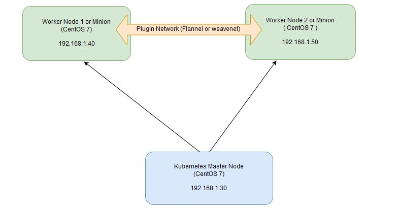

## How to Install Kubernetes (k8s) 1.7 on CentOS 7 / RHEL 7

Kubernetes is a **cluster** and **orchestration** engine for docker containers. In other words Kubernetes is  an open source software or tool which is used to orchestrate and manage docker containers in cluster environment. Kubernetes is also known as k8s and it was developed by Google and donated to “Cloud Native Computing foundation”

In Kubernetes setup we have one master node and multiple nodes. Cluster nodes is known as worker node or Minion. From the master node we manage the cluster and its nodes using ‘**kubeadm**‘ and ‘**kubectl**‘  command.

Kubernetes can be installed and deployed using following methods:

- Minikube ( It is a single node kubernetes cluster)
- Kops ( Multi node kubernetes setup into AWS )
- Kubeadm ( Multi Node Cluster in our own premises)

In this article we will install latest version of Kubernetes 1.7 on CentOS 7 / RHEL 7 with kubeadm utility. In my setup I am taking three CentOS 7 servers with minimal installation. One server will acts master node and rest two servers will be minion or worker nodes.

[](https://www.linuxtechi.com/wp-content/uploads/2017/09/Kubernetes-settup-Diagram.jpg)

#### On the Master Node following components will be installed

- **API Server**  – It provides kubernetes API using Jason / Yaml over http, states of API objects are stored in etcd
- **Scheduler**  – It is a program on master node which performs the scheduling tasks like launching containers in worker nodes based on resource availability
- **Controller Manager** – Main Job of Controller manager is to monitor replication controllers and create pods to maintain desired state.
- **etcd** – It is a Key value pair data base. It stores configuration data of cluster and cluster state.
- **Kubectl utility** – It is a command line utility which connects to API Server on port 6443. It is used by administrators to create pods, services etc.

#### On Worker Nodes following components will be installed

- **Kubelet** – It is an agent which runs on every worker node, it connects to docker  and takes care of creating, starting, deleting containers.
- **Kube-Proxy** – It routes the traffic to appropriate containers based on ip address and port number of the incoming request. In other words we can say it is used for port translation.
- **Pod** – Pod can be defined as a multi-tier or group of containers that are deployed on a single worker node or docker host.

### Installations Steps of Kubernetes 1.7 on CentOS 7 / RHEL 7

**Perform the following steps on Master Node**

#### Step 1: Disable SELinux & setup firewall rules

Login to your kubernetes master node and set the hostname and disable selinux using following commands

```
~]# hostnamectl set-hostname 'k8s-master'
~]# exec bash
~]# setenforce 0
~]# sed -i --follow-symlinks 's/SELINUX=enforcing/SELINUX=disabled/g' /etc/sysconfig/selinux
```

Set the following firewall rules.

```
[root@k8s-master ~]# firewall-cmd --permanent --add-port=6443/tcp
[root@k8s-master ~]# firewall-cmd --permanent --add-port=2379-2380/tcp
[root@k8s-master ~]# firewall-cmd --permanent --add-port=10250/tcp
[root@k8s-master ~]# firewall-cmd --permanent --add-port=10251/tcp
[root@k8s-master ~]# firewall-cmd --permanent --add-port=10252/tcp
[root@k8s-master ~]# firewall-cmd --permanent --add-port=10255/tcp
[root@k8s-master ~]# firewall-cmd --reload
[root@k8s-master ~]# modprobe br_netfilter
[root@k8s-master ~]# echo '1' > /proc/sys/net/bridge/bridge-nf-call-iptables
```

**Note:** In case you don’t have your own dns server then update /etc/hosts file on master and worker nodes

```
192.168.1.30 k8s-master
192.168.1.40 worker-node1
192.168.1.50 worker-node2
```

#### Step 2: Configure Kubernetes Repository

Kubernetes packages are not available in the default CentOS 7 & RHEL 7 repositories, Use below command to configure its package repositories.

```
[root@k8s-master ~]# cat <<EOF > /etc/yum.repos.d/kubernetes.repo
> [kubernetes]
> name=Kubernetes
> baseurl=https://packages.cloud.google.com/yum/repos/kubernetes-el7-x86_64
> enabled=1
> gpgcheck=1
> repo_gpgcheck=1
> gpgkey=https://packages.cloud.google.com/yum/doc/yum-key.gpg
>         https://packages.cloud.google.com/yum/doc/rpm-package-key.gpg
> EOF [root@k8s-master ~]#
```

#### Step 3: Install Kubeadm and Docker

Once the package repositories are configured, run the beneath command to install kubeadm and docker packages.

```
[root@k8s-master ~]# yum install kubeadm docker -y
```

Start and enable kubectl and docker service

```
[root@k8s-master ~]# systemctl restart docker && systemctl enable docker
[root@k8s-master ~]# systemctl  restart kubelet && systemctl enable kubelet
```

#### Step 4: Initialize Kubernetes Master with ‘kubeadm init’

Run the beneath command to  initialize and setup kubernetes master.

```
[root@k8s-master ~]# kubeadm init
```

Output of above command would be something like below

[](https://www.linuxtechi.com/wp-content/uploads/2017/09/kubeadm-init-output.jpg)

As we can see in the output that kubernetes master has been initialized successfully. Execute the beneath commands to use the cluster as root user.

```
[root@k8s-master ~]# mkdir -p $HOME/.kube
[root@k8s-master ~]# cp -i /etc/kubernetes/admin.conf $HOME/.kube/config
[root@k8s-master ~]# chown $(id -u):$(id -g) $HOME/.kube/config
```

#### Step 5: Deploy pod network to the cluster

Try to run below commands to get status of cluster and pods.

[](https://www.linuxtechi.com/wp-content/uploads/2017/09/kubectl-get-nodes.jpg)

To make the cluster status ready and kube-dns status running, deploy the pod network so that containers of different host communicated each other.  POD network is the overlay network between the worker nodes.

Run the beneath command to deploy network.

```
[root@k8s-master ~]# export kubever=$(kubectl version | base64 | tr -d '\n')
[root@k8s-master ~]# kubectl apply -f "https://cloud.weave.works/k8s/net?k8s-version=$kubever"
serviceaccount "weave-net" created
clusterrole "weave-net" created
clusterrolebinding "weave-net" created
daemonset "weave-net" created
[root@k8s-master ~]#
```

Now run the following commands to verify the status

```
[root@k8s-master ~]# kubectl get nodes
NAME         STATUS    AGE       VERSION
k8s-master   Ready     1h        v1.7.5
[root@k8s-master ~]# kubectl  get pods  --all-namespaces
NAMESPACE     NAME                                 READY     STATUS    RESTARTS   AGE
kube-system   etcd-k8s-master                      1/1       Running   0          57m
kube-system   kube-apiserver-k8s-master            1/1       Running   0          57m
kube-system   kube-controller-manager-k8s-master   1/1       Running   0          57m
kube-system   kube-dns-2425271678-044ww            3/3       Running   0          1h
kube-system   kube-proxy-9h259                     1/1       Running   0          1h
kube-system   kube-scheduler-k8s-master            1/1       Running   0          57m
kube-system   weave-net-hdjzd                      2/2       Running   0          7m
[root@k8s-master ~]#
```

Now let’s add worker nodes to the Kubernetes master nodes.

### Perform the following steps on each worker node

#### Step 1: Disable SELinux & configure firewall rules on both the nodes

Before disabling SELinux set the hostname on the both nodes as ‘worker-node1’ and ‘worker-node2’ respectively

```
~]# setenforce 0
~]# sed -i --follow-symlinks 's/SELINUX=enforcing/SELINUX=disabled/g' /etc/sysconfig/selinux
~]# firewall-cmd --permanent --add-port=10250/tcp
~]# firewall-cmd --permanent --add-port=10255/tcp
~]# firewall-cmd --permanent --add-port=30000-32767/tcp
~]# firewall-cmd --permanent --add-port=6783/tcp
~]# firewall-cmd  --reload
~]# echo '1' > /proc/sys/net/bridge/bridge-nf-call-iptables
```

#### Step 2: Configure Kubernetes Repositories on both worker nodes

```
~]# cat <<EOF > /etc/yum.repos.d/kubernetes.repo
> [kubernetes]
> name=Kubernetes
> baseurl=https://packages.cloud.google.com/yum/repos/kubernetes-el7-x86_64
> enabled=1
> gpgcheck=1
> repo_gpgcheck=1
> gpgkey=https://packages.cloud.google.com/yum/doc/yum-key.gpg
>         https://packages.cloud.google.com/yum/doc/rpm-package-key.gpg
> EOF
```

#### Step 3: Install kubeadm and docker package on both nodes

```
[root@worker-node1 ~]# yum  install kubeadm docker -y
[root@worker-node2 ~]# yum  install kubeadm docker -y
```

Start and enable docker service

```
[root@worker-node1 ~]# systemctl restart docker && systemctl enable docker
[root@worker-node2 ~]# systemctl restart docker && systemctl enable docker
```

#### Step 4: Now Join worker nodes to master node

To join worker nodes to Master node, a token is required. Whenever kubernetes master initialized , then in the output we get command and token.  Copy that command and run on both nodes.

```
[root@worker-node1 ~]# kubeadm join --token a3bd48.1bc42347c3b35851 192.168.1.30:6443
```

Output of above command would be something like below

[](https://www.linuxtechi.com/wp-content/uploads/2017/09/kubeadm-node1.jpg)

```
[root@worker-node2 ~]# kubeadm join --token a3bd48.1bc42347c3b35851 192.168.1.30:6443
```

Output would be something like below

[](https://www.linuxtechi.com/wp-content/uploads/2017/09/kubeadm-join-node2.jpg)

Now verify Nodes status from master node using kubectl command

```
[root@k8s-master ~]# kubectl get nodes
NAME           STATUS    AGE       VERSION
k8s-master     Ready     2h        v1.7.5
worker-node1   Ready     20m       v1.7.5
worker-node2   Ready     18m       v1.7.5
[root@k8s-master ~]#
```

As we can see master and worker nodes are in ready status. This concludes that kubernetes 1.7 has been installed successfully and also we have successfully joined two worker nodes.  Now we can create pods and services.

Please share your feedback and comments in case this article helps you to install latest version of kubernetes 1.7