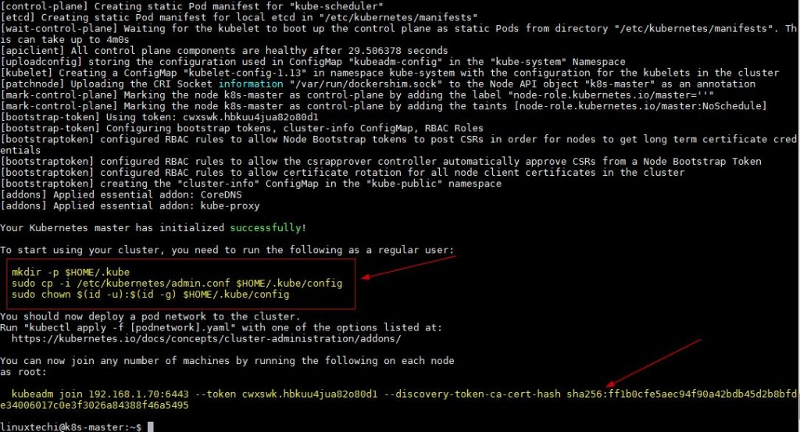
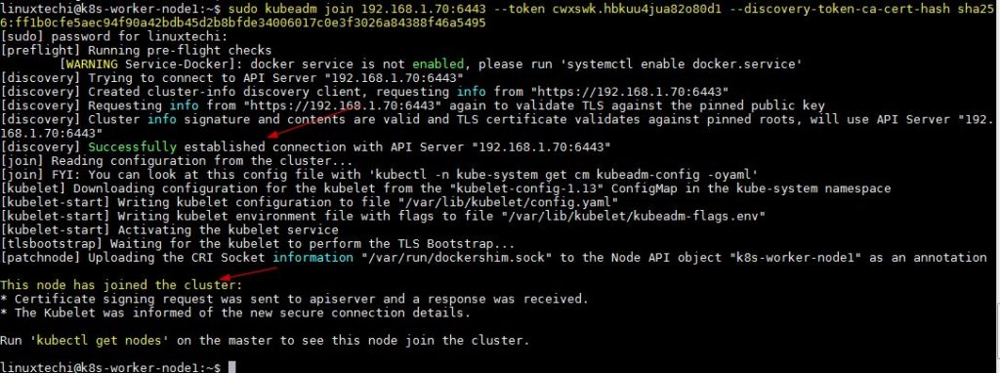
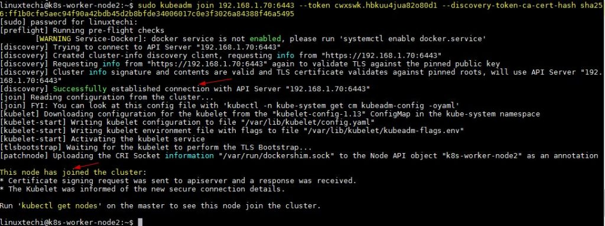
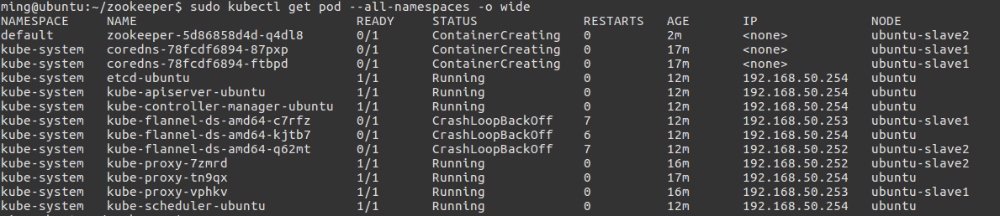

## Install and Configure Kubernetes (k8s) 1.13 on Ubuntu 18.04 LTS / Ubuntu 18.10

**Kubernetes** is a free and open source container orchestration tool. It is used to deploy container based applications automatically in cluster environment, apart from this it also used to manage **Docker containers** across the kubernetes cluster hosts. Kubernetes is also Known as **K8s**.

In this article I will demonstrate how to install and configure two node **Kubernetes** (1.13) using **kubeadm** on Ubuntu 18.04 / 18.10 systems. Following are the details of my lab setup:

I will be using three Ubuntu 18.04 LTS system, where one system will act as **Kubernetes Master Node** and other two nodes will act as **Slave nod**e and will join the Kubernetes cluster. I am assuming minimal 18.04 LTS is installed on these three systems.

- Kubernetes Master Node – (Hostname: k8s-master , IP : 192.168.1.70, OS : Minimal Ubuntu 18.04 LTS)
- Kubernetes Slave Node 1 – (Hostname: k8s-worker-node1, IP: 192.168.1.80 , OS : Minimal Ubuntu 18.04 LTS)
- Kubernetes Slave Node 2 – (Hostname: k8s-worker-node2, IP: 192.168.1.90 , OS : Minimal Ubuntu 18.04 LTS)

**Note:** Kubernetes Slave Node is also known as Worker Node

Let’s jump into the k8s installation and configuration steps.

#### Step:1) Set Hostname and update hosts file

Login to the master node and configure its hostname using the hostnamectl command

```
linuxtechi@localhost:~$ sudo hostnamectl set-hostname "k8s-master"
linuxtechi@localhost:~$ exec bash
linuxtechi@k8s-master:~$
```

Login to Slave / Worker Nodes and configure their hostname respectively using the hostnamectl command,

```
linuxtechi@localhost:~$ sudo hostnamectl set-hostname k8s-worker-node1
linuxtechi@localhost:~$ exec bash
linuxtechi@k8s-worker-node1:~$

linuxtechi@localhost:~$ sudo hostnamectl set-hostname k8s-worker-node2
linuxtechi@localhost:~$ exec bash
linuxtechi@k8s-worker-node2:~$
```

Add the following lines in /etc/hosts file on all three systems,

```
192.168.1.70     k8s-master
192.168.1.80     k8s-worker-node1
192.168.1.90     k8s-worker-node2
```

#### Step:2) Install and Start Docker Service on Master and Slave Nodes

Run the below apt-get command to install Docker on Master node,

```
linuxtechi@k8s-master:~$ sudo apt-get install docker.io -y
```

Run the below apt-get command to install docker on slave nodes,

```
linuxtechi@k8s-worker-node1:~$ sudo apt-get install docker.io -y
linuxtechi@k8s-worker-node2:~$ sudo apt-get install docker.io -y
```

Once the Docker packages are installed on all the three systems , start and enable the docker service using below systemctl commands, these commands needs to be executed on master and slave nodes.

```
~$ sudo systemctl start docker
~$ sudo systemctl enable docker
Synchronizing state of docker.service with SysV service script with /lib/systemd/systemd-sysv-install.
Executing: /lib/systemd/systemd-sysv-install enable docker
~$
```

Use below docker command to verify which Docker version has been installed on these systems,

```
~$ docker --version
Docker version 18.06.1-ce, build e68fc7a
~$
```

#### Step:3) Configure Kubernetes Package Repository on Master & Slave Nodes

**Note:** All the commands in this step are mandate to run on master and slave nodes

Let’s first install some required packages, run the following commands on all the nodes including master node

```
~$ sudo apt-get install apt-transport-https curl -y
```

Now add Kubernetes package repository key using the following command,

```
:~$ curl -s https://packages.cloud.google.com/apt/doc/apt-key.gpg | sudo apt-key add
OK
```

**改为阿里地址：curl -s https://mirrors.aliyun.com/kubernetes/apt/doc/apt-key.gpg | sudo apt-key add**

Now configure Kubernetes repository using below apt commands, at this point of time Ubuntu 18.04 (bionic weaver) Kubernetes package repository is not available, so we will be using Xenial Kubernetes package repository.

```
:~$ sudo apt-add-repository "deb http://apt.kubernetes.io/ kubernetes-xenial main"
```

**改为阿里地址：apt-add-repository "deb https://mirrors.aliyun.com/kubernetes/apt/ kubernetes-xenial main"**

#### Step:4) Disable Swap and Install Kubeadm on all the nodes

**Note:** All the commands in this step are mandate to run on master and slave nodes

Kubeadm is one of the most common method used to deploy kubernetes cluster or in other words we can say it used to deploy multiple nodes on a kubernetes cluster.

As per the Kubernetes Official web site, it is recommended to disable swap on all the nodes including master node.

Run the following command to disable swap temporary,

```
:~$ sudo swapoff -a
```

For permanent swap disable, comment out swapfile or swap partition entry in the /etc/fstab file.

Now Install Kubeadm package on all the nodes including master.

```
:~$ sudo apt-get install kubeadm -y
```

Once kubeadm packages are installed successfully, verify the kubeadm version using beneath command.

```
:~$ kubeadm version
kubeadm version: &version.Info{Major:"1", Minor:"13", GitVersion:"v1.13.2", GitCommit:"cff46ab41ff0bb44d8584413b598ad8360ec1def", GitTreeState:"clean", BuildDate:"2019-01-10T23:33:30Z", GoVersion:"go1.11.4", Compiler:"gc", Platform:"linux/amd64"}
:~$
```

#### Step:5) Initialize and Start Kubernetes Cluster on Master Node using Kubeadm

Use the below kubeadm command on Master Node only to initialize Kubernetes

```sh
linuxtechi@k8s-master:~$ sudo kubeadm init --pod-network-cidr=172.168.10.0/24
## 注意：如果使用flannel网络，其实pod-network-cidr必须设置为：10.244.0.0/16，原因可以参考kube-flannel.yml文件内容
```

```sh
## 报错无法pull image，原因是google k8s镜像网站不通
## 解决方法：docker search缺少的镜像，然后pull，然后tag改名，并删除无用的原tag，举例如下：
docker pull mirrorgooglecontainers/kube-apiserver:v1.14.3
docker tag mirrorgooglecontainers/kube-apiserver:v1.14.3 k8s.gcr.io/kube-apiserver:v1.14.3
docker rmi mirrorgooglecontainers/kube-apiserver:v1.14.3

## 另一个更简单的方法：
linuxtechi@k8s-master:~$ sudo kubeadm init --pod-network-cidr=10.244.0.0/16 --image-repository registry.aliyuncs.com/google_containers
```


In the above command you can use the same pod network or choose your own pod network that suits to your environment. Once the command is executed successfully, we will get the output something like below,

[](https://www.linuxtechi.com/wp-content/uploads/2019/01/Kubeadm-Command-Output-Ubuntu18.jpg)

Above output confirms that Master node has been initialized successfully, so to start the cluster run the beneath commands one after the another,

```
linuxtechi@k8s-master:~$  mkdir -p $HOME/.kube
linuxtechi@k8s-master:~$ sudo cp -i /etc/kubernetes/admin.conf $HOME/.kube/config
linuxtechi@k8s-master:~$ sudo chown $(id -u):$(id -g) $HOME/.kube/config
linuxtechi@k8s-master:~$
```

Verify the status of master node using the following command,

```
linuxtechi@k8s-master:~$ kubectl get nodes
NAME         STATUS     ROLES    AGE   VERSION
k8s-master   NotReady   master   18m   v1.13.2
linuxtechi@k8s-master:~$
```

As we can see in the above command output that our master node is not ready because as of now we have not deployed any pod.

Let’s deploy the pod network, Pod network is the network through which our cluster nodes will communicate with each other. We will deploy **Flannel** as our pod network, Flannel will provide the **overlay network** between cluster nodes.

#### Step:6) Deploy Flannel as Pod Network from Master node and verify pod namespaces

Execute the following **kubectl** command to deploy pod network from master node

```sh
linuxtechi@k8s-master:~$ sudo kubectl apply -f https://raw.githubusercontent.com/coreos/flannel/master/Documentation/kube-flannel.yml
```

Output of above command should be something like below

```sh
clusterrole.rbac.authorization.k8s.io/flannel created
clusterrolebinding.rbac.authorization.k8s.io/flannel created
serviceaccount/flannel created
configmap/kube-flannel-cfg created
daemonset.extensions/kube-flannel-ds-amd64 created
daemonset.extensions/kube-flannel-ds-arm64 created
daemonset.extensions/kube-flannel-ds-arm created
daemonset.extensions/kube-flannel-ds-ppc64le created
daemonset.extensions/kube-flannel-ds-s390x created
linuxtechi@k8s-master:~$
```

Now verify the master node status and pod namespaces using kubectl command,

```sh
## 需要等几分钟，才会变为Ready状态
linuxtechi@k8s-master:~$ sudo  kubectl get nodes
NAME         STATUS   ROLES    AGE   VERSION
k8s-master   Ready    master   78m   v1.13.2
linuxtechi@k8s-master:~$

## 需要等几分钟，才会全部变为Running状态
linuxtechi@k8s-master:~$ sudo  kubectl get pods --all-namespaces
NAMESPACE     NAME                                 READY   STATUS    RESTARTS   AGE
kube-system   coredns-86c58d9df4-px4sj             1/1     Running   0          79m
kube-system   coredns-86c58d9df4-wzdzk             1/1     Running   0          79m
kube-system   etcd-k8s-master                      1/1     Running   1          79m
kube-system   kube-apiserver-k8s-master            1/1     Running   1          79m
kube-system   kube-controller-manager-k8s-master   1/1     Running   1          79m
kube-system   kube-flannel-ds-amd64-9tn8z          1/1     Running   0          14m
kube-system   kube-proxy-cjzz2                     1/1     Running   1          79m
kube-system   kube-scheduler-k8s-master            1/1     Running   1          79m
linuxtechi@k8s-master:~$
```

As we can see in the above output our master node status has changed to “**Ready**” and all the namespaces of pod are in running state, so this confirms that our master node is in healthy state and ready to form a cluster.

#### Step:7) Add Slave or Worker Nodes to the Cluster

**Note:** In Step 5, kubeadm command output we got complete command which we will have to use on slave or worker node to join a cluster

Login to first slave node (k8s-worker-node1) and run the following command to join the cluster,

```
linuxtechi@k8s-worker-node1:~$ sudo kubeadm join 192.168.1.70:6443 --token cwxswk.hbkuu4jua82o80d1 --discovery-token-ca-cert-hash sha256:ff1b0cfe5aec94f90a42bdb45d2b8bfde34006017c0e3f3026a84388f46a5495
```

Output of above command should be something like this,

[](https://www.linuxtechi.com/wp-content/uploads/2019/01/kubeadm-join-command-output-worker-node1.jpg)

Similarly run the same kubeadm join command on the second worker node,

```
linuxtechi@k8s-worker-node2:~$ sudo kubeadm join 192.168.1.70:6443 --token cwxswk.hbkuu4jua82o80d1 --discovery-token-ca-cert-hash sha256:ff1b0cfe5aec94f90a42bdb45d2b8bfde34006017c0e3f3026a84388f46a5495
```

Output of above should be something like below,

[](https://www.linuxtechi.com/wp-content/uploads/2019/01/kubeadm-join-command-output-worker-node2.jpg)

Now go to master node and run below command to check master and slave node status

```
linuxtechi@k8s-master:~$ kubectl get nodes
NAME               STATUS   ROLES    AGE    VERSION
k8s-master         Ready    master   100m   v1.13.2
k8s-worker-node1   Ready    <none>   10m    v1.13.2
k8s-worker-node2   Ready    <none>   4m6s   v1.13.2
linuxtechi@k8s-master:~$
```

Above command confirm that we have successfully added our two worker nodes in the cluster and their state is Ready.This concludes that we have successfully installed and configured two node Kubernetes cluster on Ubuntu 18.04 systems.

Read More on: [**Deploy Pod, Replication Controller and Service in Kubernetes**](https://www.linuxtechi.com/deploy-pod-replication-controller-service-kubernetes-1-7-on-centos-7/)

### 网友问题：

如果使用Kubeadm安装K8s集群，在安装flannel网络插件后，发现pod: kube-flannel-ds 一直是CrashLoopBackOff



而且使用命令`sudo kubectl --namespace kube-system logs kube-flannel-ds-amd64-c7rfz`有类似的错误：

则可能是安装Kubeadm Init的时候，没有增加 `--pod-network-cidr 10.244.0.0/16`参数。

注意，安装Flannel时，`kubectl create -f https://raw.githubusercontent.com/coreos/flannel/master/Documentation/kube-flannel.yml`如果yml中的`"Network": "10.244.0.0/16"`和`--pod-network-cidr`不一样，就修改成一样的。不然可能会使得Node间Cluster IP不通。

一旦不小心犯了这个错误，解决方法如下：

```sh
execute Kubeadm reset on master and nodes.
execute etcdctl rm --recursive registry reset data in etcd.  ## 未找到这个命令，不执行也可
rm -rf /var/lib/cni on master and nodes
rm -rf /run/flannel on master and nodes
rm -rf /etc/cni on master and nodes
ifconfig cni0 down on master and nodes
brctl delbr cni0 on master and nodes
rm -rf /var/lib/etcd    ## 我遇到了这个问题

## 执行完以上步骤后，重新执行：
kubeadm init  && kubeadm join
```

