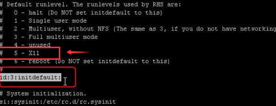

如果[Linux系统](https://www.baidu.com/s?wd=Linux%E7%B3%BB%E7%BB%9F&tn=SE_PcZhidaonwhc_ngpagmjz&rsv_dl=gh_pc_zhidao)安装有[图形界面](https://www.baidu.com/s?wd=%E5%9B%BE%E5%BD%A2%E7%95%8C%E9%9D%A2&tn=SE_PcZhidaonwhc_ngpagmjz&rsv_dl=gh_pc_zhidao)的情况下，启动linux后在终端下输入：

```basic
startx

#即可进入X11的桌面图形操作模式
```


希望每次进入Linux都自动进入桌面模式，需要修改inittab文件。

```basic
vi /etc/inittab 
#找到id:3:initdefault: 
#按i键进入编辑模式，将3改为5，然后按esc退出编辑，输入 ：qw 保存。

#centos7该方法不起作用，正确方式：
systemctl set-default graphical.target
```



如果系统没有安装图像界面，需要yum安装[图形界面](https://www.baidu.com/s?wd=%E5%9B%BE%E5%BD%A2%E7%95%8C%E9%9D%A2&tn=SE_PcZhidaonwhc_ngpagmjz&rsv_dl=gh_pc_zhidao)：

```basic
yum groupinstall "X Window System"
#安装GNOME桌面环境 
yum groupinstall "GNOME Desktop Environment"
#安装KDE桌面环境（KDE和GNOME任选其一都行）
yum groupinstall "KDE (K Desktop Environment)"
#安装后，按照上面方法开启桌面模式即可。
```

