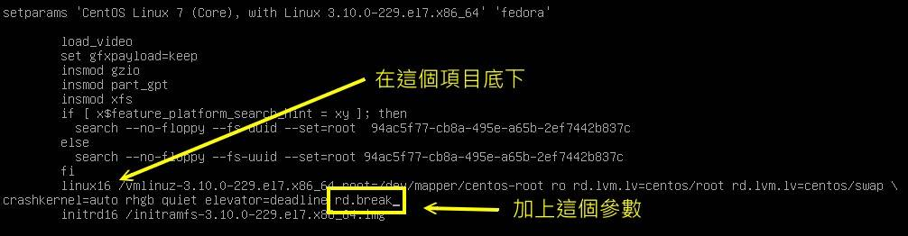
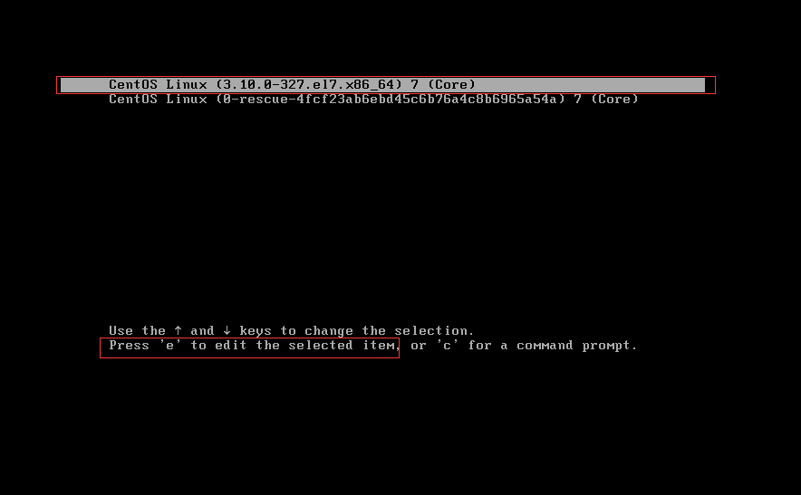
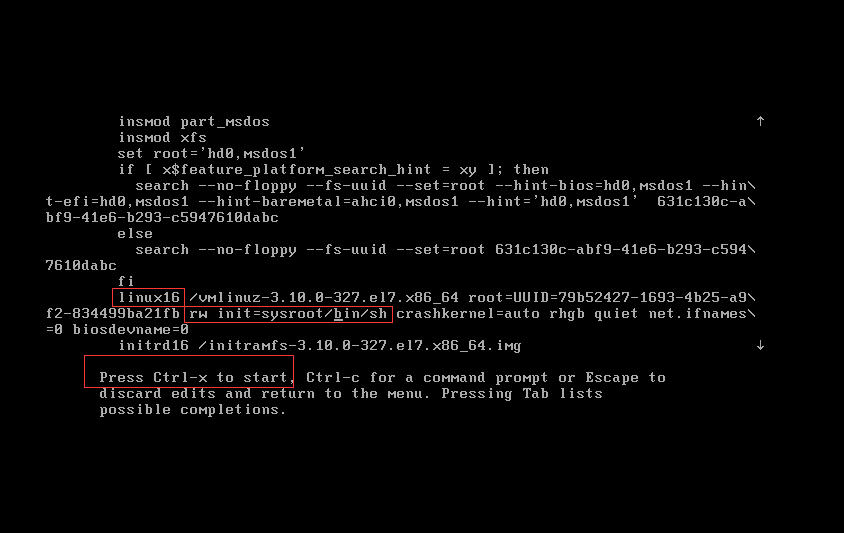
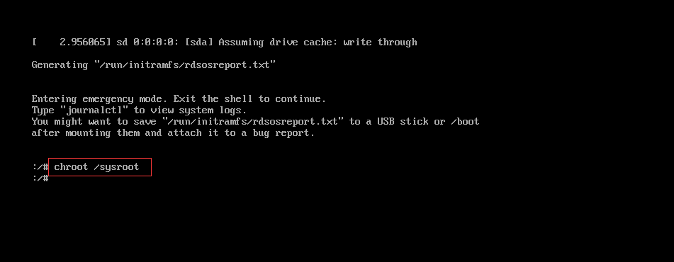
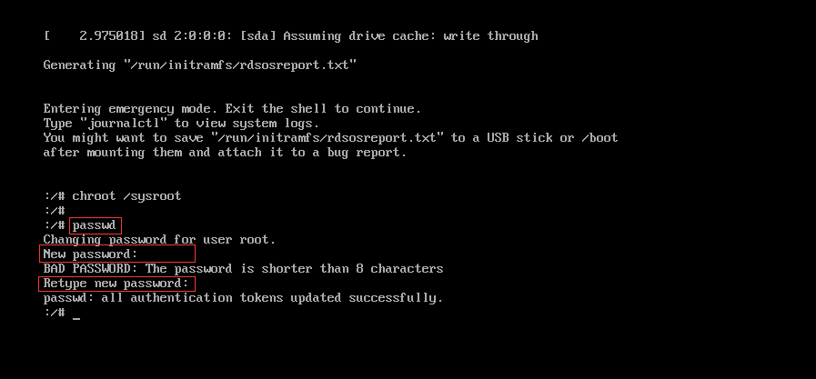
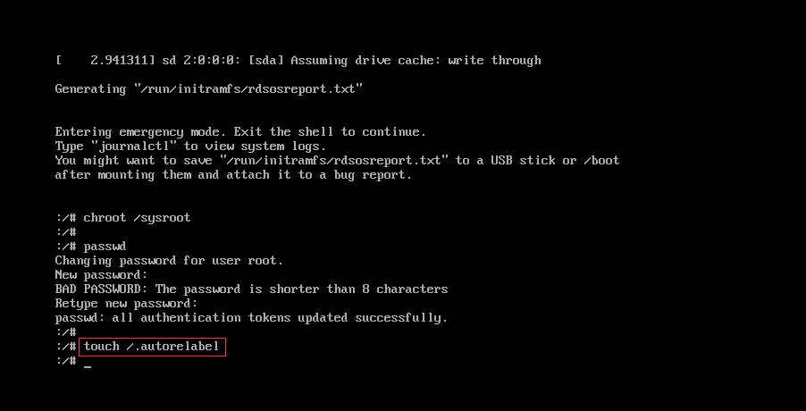
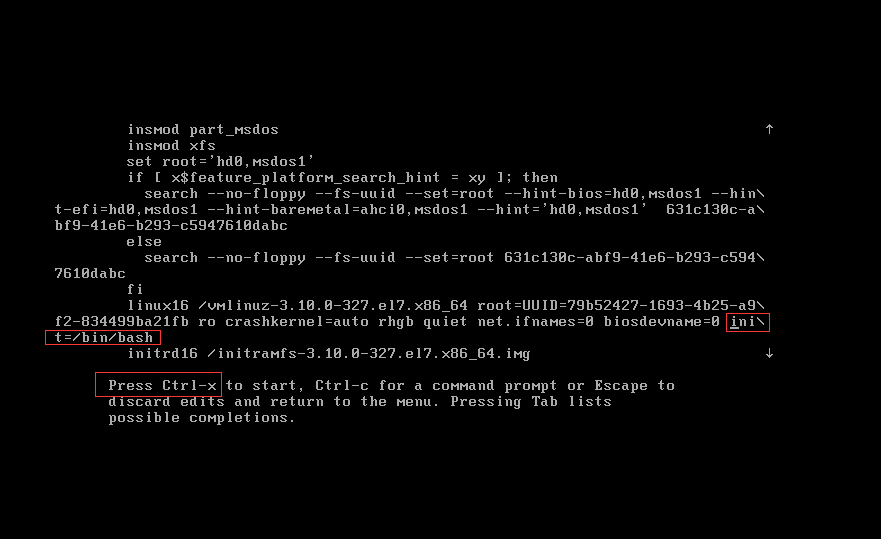
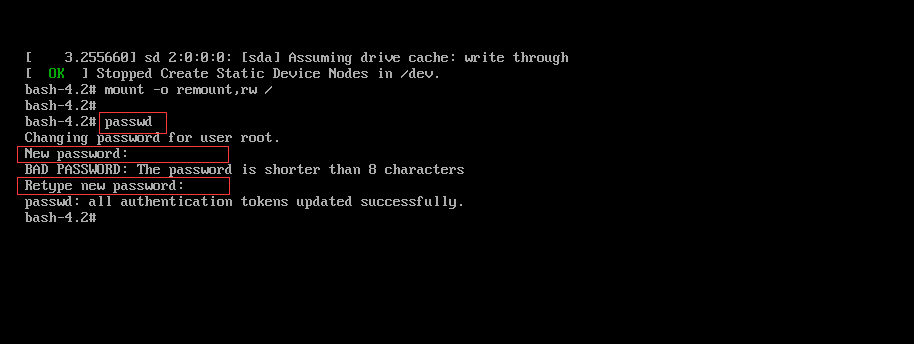
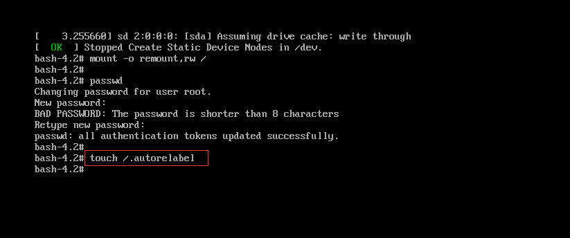
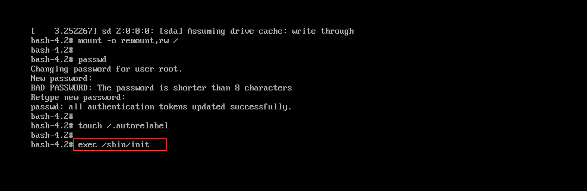

## CentOS7可靠的办法（鸟哥）

大家都知道鸟哥的记忆力不佳，容易忘东忘西的，那如果连 root 的密码都忘记了，怎么办？ 其实在 Linux 环境中 root 密码忘记时还是可以救回来的！只要能够进入并且挂载 / ， 然后重新设置一下 root 的密码，就救回来啦！

只是新版的 systemd 的管理机制中，默认的 rescue 模式是无法直接取得 root 权限的喔！还是得要使用 root 的密码才能够登陆 rescure 环境耶！ 天哪！那怎办？没关系，还是有办法滴～通过一个名为“ rd.break ”的核心参数来处理即可喔！只是需要注意的是， rd.break 是在 Ram Disk 里面的操作系统状态，因此你不能直接取得原本的 linux 系统操作环境。所以，还需要 chroot 的支持！ 更由于 SELinux 的问题，你可能还得要加上某些特殊的流程才能顺利的搞定 root 密码的救援喔！

现在就让我们来实作一下吧！（1）按下 systemctl reboot 来重新开机，（2）进入到开机画面，在可以开机的菜单上按下 e 来进入编辑模式， 然后就在 linux16 的那个核心项目上面使用这个参数来处理：

图19.4.1、通过 rd.break 尝试救援 root 密码

改完之后按下 [crtl]+x 开始开机，开机完成后屏幕会出现如下的类似画面，此时请注意，你应该是在 RAM Disk 的环境，并不是原本的环境， 因此根目录下面的东西跟你原本的系统无关喔！而且，你的系统应该会被挂载到 /sysroot 目录下，因此，你得要这样作：

```sh
Generating "/run/initramfs/rdsosreport.txt"

Enter emergency mode. Exit the shell to continue.
Type "journalctl" to view system logs.
You might want to save "/run/initramfs/rdsosreport.txt" to a USB stick or /boot
after mounting them and attach it to a bug report.

switch_root:/#         # 无须输入密码即可取得 root 权限！
switch_root:/# mount   # 检查一下挂载点！一定会发现 /sysroot 才是对的！
.....（前面省略）.....
/dev/mapper/centos-root on /sysroot type xfs （ro,relatime,attr,inode64,noquota）

switch_root:/# mount -o remount,rw /sysroot  # 要先让它挂载成可读写！
switch_root:/# chroot /sysroot               # 实际切换了根目录的所在！取回你的环境了！

sh-4.2# echo "your_root_new_pw" &#124; passwd --stdin root
sh-4.2# touch /.autorelabel                  # 很重要！变回 SELinux 的安全本文～
sh-4.2# exit

switch_root:/# reboot 
```

上述的流程你应该没啥大问题才对～比较不懂的，应该是 （1）chroot 是啥？ （2）为何需要 /.autorelabel 这个文件？

- chroot 目录：代表将你的根目录“暂时”切换到 chroot 之后所接的目录。因此，以上表为例，那个 /sysroot 将会被暂时作为根目录， 而我们知道那个目录其实就是最原先的系统根目录，所以你当然就能够用来处理你的文件系统与相关的帐号管理啰！
- 为何需要 /.autorelabel：在 rd.break 的 RAM Disk 环境下，系统是没有 SELinux 的，而你刚刚更改了 /etc/shadow （因为改密码啊！）， 所以“这个文件的 SELinux 安全本文的特性将会被取消”喔！如果你没有让系统于开机时自动的回复 SELinux 的安全本文， 你的系统将产生“无法登陆”的问题 （在 SELinux 为 Enforcing 的模式下！）加上 /.autorelabel 就是要让系统在开机的时候自动的使用默认的 SELinux type 重新写入 SELinux 安全本文到每个文件去！。

不过加上 /.autorelabel 之后，系统在开机就会重新写入 SELinux 的 type 到每个文件，因此会花不少的时间喔！如果你不想要花太多时间， 还有个方法可以处理：

- 在 rd.break 模式下，修改完 root 密码后，将 /etc/selinux/config 内的 SELinux 类型改为 permissive
- 重新开机后，使用 root 的身份下达“ restorecon -Rv /etc ”仅修改 /etc 下面的文件；
- 重新修改 /etc/selinux/config 改回 enforcing ，然后“ setenforce 1 ”即可！

## 其他方法

CentOS 7的root密码找回与5，6有所不同，因为7采用GRUB2为启动，忘记密码是无法通过单用户模式重置root密码，下面具体介绍两个大招，帮你轻松重置root密码。


**修改大法第一招**


开机按“esc”

选择“CentOS Linux (3.10.0-327.......) ”按“e”键进入




将光标移动到“linux16”开头的行，找到“ro”改为“rw init=sysroot/bin/sh”





按“Ctrl+x”执行

进入后输“chroot /sysroot”




输入“passwd”

根据提示输入2次新密码




输入“touch /.autorelabel”更新系统信息





输入“exit”或按“Ctrl+d”退出

输入“reboot”重启


**修改大法第二招**


开机按“esc”

选择“CentOS Linux (3.10.0-327.......) ”按“e”键进入


将光标移动到“linux16”开头的行，在行尾添加“init=/bin/bash”





按“Ctrl+x”执行


挂载文件系统为可写


输入“passwd”

根据提示输入2次新密码





输入“touch /.autorelabel”更新系统信息





输入“exec /sbin/init”正常启动系统





## 单用户模式

一.进入单用户模式
1. 重起电脑， 进入内核选择界面 按上下避免自动进入。
2. 选择要内核并按下 e键
3. 找到LANG=en_US.UTF-8这一行或者倒数二行。
4. 在尾部添加 空格 single
5. 使用ctrl+x重启即可
6. 进入模式后输入root密码登录

二.修改密码
1.输入 sudo passwd 当时设置的账号名

2.输入密码，最好避免使用大写，二次输入密码

3.reboot 重启,再次尝试。