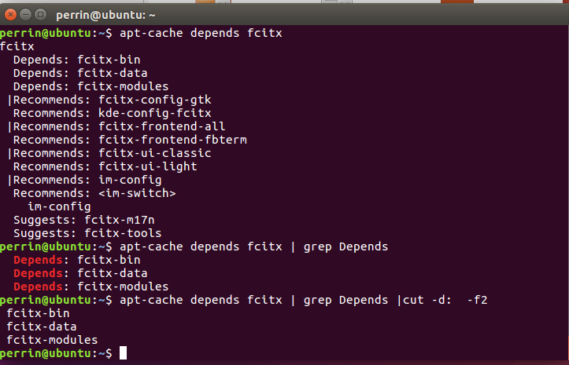

## apt一键下载所有依赖的包

无外网的局域网安装软件一个烦人的事件就是明明安装包下好了，但有时候就是安装不上，因为缺少相应依赖的包。

那么如何将一个软件依赖的包、库之类的下载下来呢。 
这里就用到apt的相关功能。

## 方法

首先，找包。找到依赖的包用apt-cache depends packname来获取。 
其次，下载。用apt-get install dependpackname –reinstall -d来下载所依赖的包。 -d是表示只下载。 
再次，批量安装。用shell命令组合来一键下载所有所依赖的包。

```
#有些包名中有<>符号，用tr将其删除
sudo apt-get install --reinstall -d `apt-cache depends packname | grep depends | cut -d: f2 |tr -d "<>"`
1
2
```

注意上面命令中反引号。 即 ` 。

## 示例

比如要找到fcitx所依赖的包。 


apt-cache depends 会列出3类包。如果只想安装Depends的，用grep过滤下。如果想提取出包的名字，用cut做一个分割。

剩下的就是调用下载相应包的指令了。 
是不是感觉很简单。 
：）

## 进阶，下载所依赖的包所依赖的包。。。

比如A依赖B，B又依赖C，那如何递归呢。此时就需要一个脚本文件，用函数来实现了。 
递归3次下载所依赖包的脚本如下：

```shell
#!/bin/bash

logfile=/home/perrin/Desktop/log
ret=""
function getDepends()
{
   echo "fileName is" $1>>$logfile
   # use tr to del < >
   ret=`apt-cache depends $1|grep Depends |cut -d: -f2 |tr -d "<>"`
   echo $ret|tee  -a $logfile
}
# 需要获取其所依赖包的包
libs="gnome-shell"                  # 或者用$1，从命令行输入库名字

# download libs dependen. deep in 3
i=0
while [ $i -lt 3 ] ;
do
    let i++
    echo $i
    # download libs
    newlist=" "
    for j in $libs
    do
        added="$(getDepends $j)"
        newlist="$newlist $added"
        apt install $added --reinstall -d -y
    done

    libs=$newlist
done
```