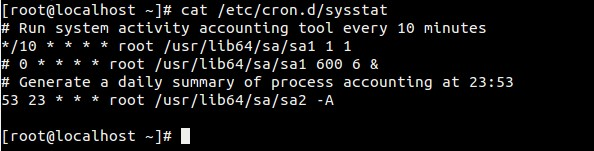
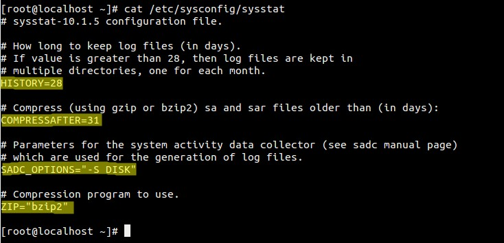
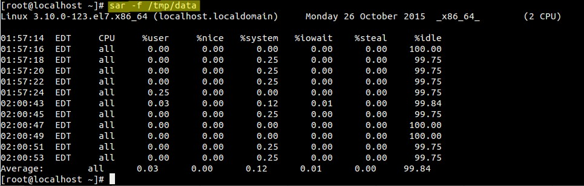
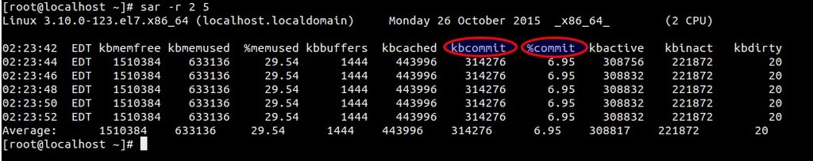
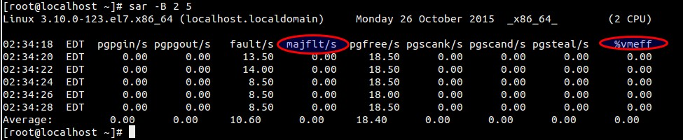
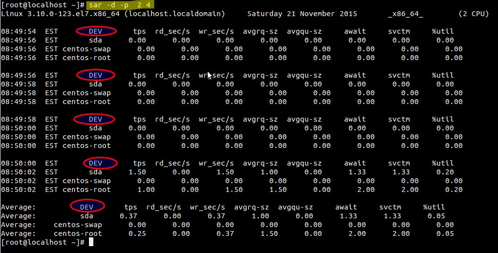
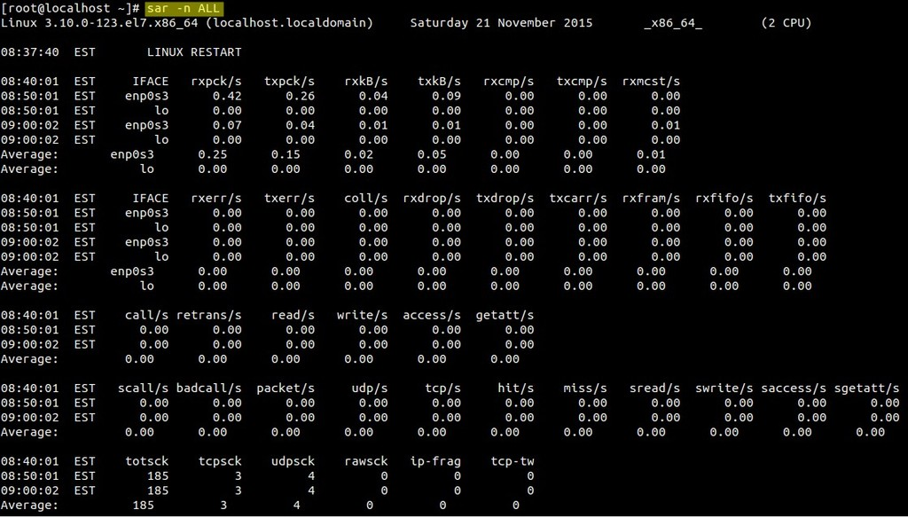
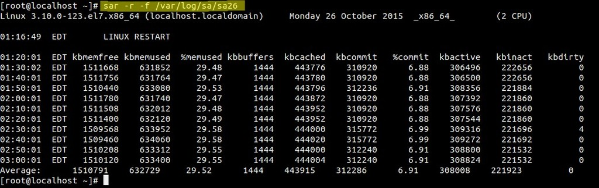

# Generate CPU, Memory and I/O report using SAR command

# 使用SAR命令生成CPU、内存、IO报告


**SAR** stands for System Activity Report, as its name suggest sar command is used to collect,report & save **CPU**, **Memory**, **I/O** usage in Unix like operating system. SAR command produce the reports on the fly and can also save the reports in the log files as well.

In this article we will discuss different examples of SAR Command in CentOS  7 & RHEL 7, in case sar is not installed on your system then use the below command to install it.

```sh
[root@localhost ~]# yum install sysstat
```

Start the **sadc** (system activity data collector) service(**sysstat**) so that it saves the reports in log file “/**var/log/sa/saDD**”  where DD represents Current day and already existing files will be archived.

```sh
[root@localhost ~]# systemctl start sysstat
[root@localhost ~]# systemctl enable sysstat
```

It collects the data every 10 minutes and generate its report daily. Below crontab file is responsible for collecting and generating reports.

[](https://www.linuxtechi.com/wp-content/uploads/2015/11/sar-crontab-file2.jpg)

Below is the Config File of SysStat ( sar command ).

[](https://www.linuxtechi.com/wp-content/uploads/2015/11/sysstat-config-file.jpg)

#### Example:1 Generating CPU Report on the Fly 5 times every 2 seconds.

```
[root@localhost ~]# sar 2 5
Linux 3.10.0-123.el7.x86_64 (localhost.localdomain)     Monday 26 October 2015     _x86_64_    (2 CPU)

01:43:55  EDT     CPU     %user     %nice   %system   %iowait    %steal     %idle
01:43:57  EDT     all      0.00      0.00      0.25      0.00      0.00     99.75
01:43:59  EDT     all      0.00      0.00      0.00      0.00      0.00    100.00
01:44:01  EDT     all      0.00      0.00      0.25      0.00      0.00     99.75
01:44:03  EDT     all      0.00      0.00      0.25      0.25      0.00     99.50
01:44:05  EDT     all      0.00      0.00      0.00      0.00      0.00    100.00
Average:          all      0.00      0.00      0.15      0.05      0.00     99.80
[root@localhost ~]#
```

If the %I/O wait is more than zero for a longer period of time then we can consider there is some bottleneck in I/O system ( Hard disk or Network )

#### Example:2 Saving sar output to a file using -o 

```
[root@localhost ~]# sar 2 5 -o /tmp/data > /dev/null 2>&1
[root@localhost ~]#
```

use “sar -f <file-name>” to display the reports.

```
[root@localhost ~]# sar -f /tmp/data
```

#### [](https://www.linuxtechi.com/wp-content/uploads/2015/11/read-data-file-sar2.jpg)

#### Example:3 Generating Memory Usage report using -r

-r option in the sar command is used to generate memory usage report.

```
[root@localhost ~]# sar -r 2 5
```

[](https://www.linuxtechi.com/wp-content/uploads/2015/11/memory-usage-sar-command1.jpg)

**kbcommit** & **%commit** is the overall memory used including RAM & Swap

#### Example:4 Generating Paging Statistics Report using -B

-B option in the sar command is used to display paging statistics.

```
[root@localhost ~]# sar -B 2 5
```

[](https://www.linuxtechi.com/wp-content/uploads/2015/11/paging-statistics-sar-command1.jpg)

In the report **majflts/s** shows the major faults per second means number of pages loaded into the memory from disk (swap), if its value is higher then we can say that system is running of RAM.

**%vmeff** indicates the number of pages scanned per second, if it’s vaule is 100 % its is consider OK and when it is below 30 % then there is some issue with virtual memory. Zero value indicates that there is no page scanned during that time.

#### Example:5 Generating block device statistics report using -d

-d option in the sar command is used to display the block device statistics report. Using option -p (pretty-print) along with -d make the dev column more readable, example is shown below :

```
[root@localhost ~]# sar -d -p 2 4
```

[](https://www.linuxtechi.com/wp-content/uploads/2015/11/block-device-report-sar-command2.jpg)

#### Example:6 Generating Network statistic report using -n

-n option in the sar command is used to generate network statistic report. Below is the synatx :

\# sar -n {keyword} or {ALL}

Following keywords can be used : DEV, EDEV, NFS, NFSD, SOCK, IP, EIP, ICMP, EICMP, TCP, ETCP, UDP, SOCK6, IP6, EIP6, ICMP6, EICMP6 & UDP6.

To generate all network statistic report use below command :

```
[root@localhost ~]# sar -n ALL
```

[](https://www.linuxtechi.com/wp-content/uploads/2015/11/network-statistics-report-sar-command.jpg)

#### Example:7 Reading SAR log file using -f

As we have discuss that sar logs files are kept under /var/log/sa/saDD, using -f option in sar command we can read the log files.

```
[root@localhost ~]# sar -r -f /var/log/sa/sa26
```

[](https://www.linuxtechi.com/wp-content/uploads/2015/11/reading-sar-log-file2.jpg)