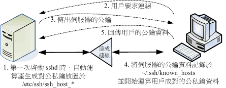

### 节选自《鸟哥Linux私房菜服务器架设篇》

#### SSH 的联机行为简介

1. 服务器建立公钥档: 每一次启动 sshd 服务时，该服务会主动去找 /etc/ssh/ssh_host* 的档案，若系统刚刚安装完成时，由于没有这些公钥档案， 因此 sshd 会主动去计算出这些需要的公钥档案，同时也会计算出服务器自己需要的私钥档; 

2. 客户端主动联机要求: 若客户端想要联机到 ssh 服务器，则需要使用适当的客户端程序来联机，包括 ssh, pietty 等客户端程序; 

3. 服务器传送公钥档给客户端: 接收到客户端的要求后，服务器便将第一个 步骤取得的公钥档案传送给客户端使用 (此时应是明码传送，反正公钥本来就是 给大家使用的!); 

4. 客户端记录/比对服务器的公钥数据及随机计算自己的公私钥: 若客户端第 一次连接到此服务器，则会将服务器的公钥数据记录到客户端的用户家目录内的 ~/.ssh/known_hosts 。若是已经记录过该服务器的公钥数据，则客户端会去比 对此次接收到的与之前的记录是否有差异。若接受此公钥数据， 则开始计算客 户端自己的公私钥数据; 

5. 回传客户端的公钥数据到服务器端: 用户将自己的公钥传送给服务器。此 时服务器:『具有服务器的私钥与客户端的公钥』，而客户端则是: 『具有服 务器的公钥以及客户端自己的私钥』，你会看到，在此次联机的服务器与客户端 的密钥系统 (公钥+私钥) 并不一样，所以才称为非对称式密钥系统喔。 
6. 开始双向加解密: (1)服务器到客户端:服务器传送数据时，拿用户的公钥 加密后送出。客户端接收后，用自己的私钥解密; (2)客户端到服务器:客户端 传送数据时，拿服务器的公钥加密后送出。服务器接收后，用服务器的私钥解密。 

在上述的第 4 步骤中，客户端的密钥是随机运算产生于本次联机当中的，所以你 这次的联机与下次的联机的密钥可能就会不一样啦! 此外在客户端的用户家目录下的 ~/.ssh/known_hosts 会记录曾经联机过的主机的 public key ，用以确认我们是连接 上正确的那部服务器。 