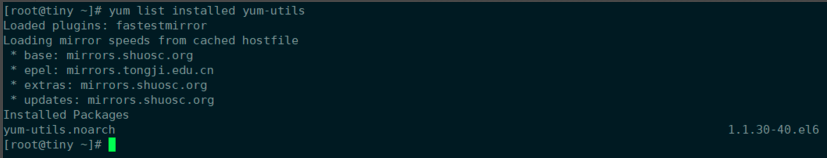
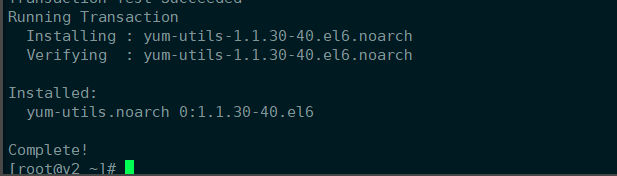
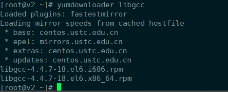
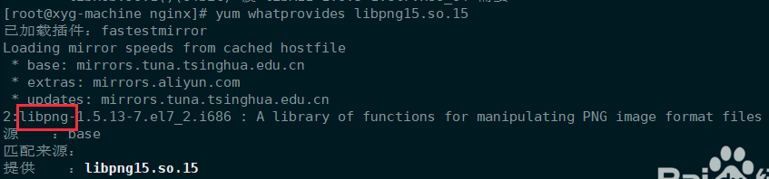

有时候我们在rpm安装软件时候会发现，有时候缺少一些.so的库文件。但是又不知道这个库文件包含在什么安装包中，怎么安装。

需要安装一个工具就是yum-utils

查看是否安装yum-utils包。



显示我的系统已经安装了。如果没有安装执行安装：

```bash
yum -y install yum-utils
```




有一个很好用的命令。比如要下载libgcc的rpm包，可以直接执行：

```shell
yumdownloader libgcc
```

32位和64位全都下载下来了。



我想知道libpng15.so.15是哪个包里面的，就可以i执行命令：

```bash
yum whatprovides libpng15.so.15
```



