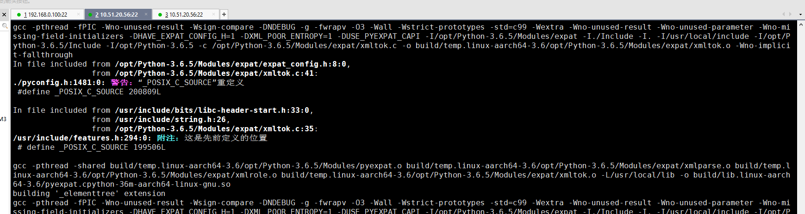

# 安装操作系统

选择带GUI的服务器，右侧选择开发工具和图形管理工具

安装完成后，可能需要修改/etc/resolv.conf，保证能够使用域名访问互联网，例如：ping www.baidu.com

# Python安装

## 下载python源码

```sh
cd /tmp/
wget https://www.python.org/ftp/python/3.6.5/Python-3.6.5.tgz
```

## 安装编译python所需依赖

```sh
yum install gcc
yum install patch
yum install libffi-devel
yum install python-devel
yum install zlib-devel
yum install bzip2-devel
yum install openssl-devel
yum install ncurses-devel
yum install sqlite-devel
yum install readline-devel
yum install tk-devel
yum install gdbm-devel
yum install db4-devel  没有这个包，安装失败
yum install libpcap-devel
yum install xz-devel
```

## 编译并安装

```sh
tar -xvf Python-3.6.5.tgz  ## 解压源码包
cd /tmp/Python-3.6.5       ##进入源码目录
./configure --prefix=/usr/local/python365/   ## 配置
make -j 8
make install                    ## 编译并安装
```

编译时，警告：



## 环境变量配置

```sh
vim /etc/profile
PATH=/usr/local/python365/bin:$PATH
source /etc/profile
```

## 切换默认python版本

### 方法一：

```sh
alias python="/usr/local/python365/bin/python3"
```

### 方法二：

```sh
unlink /usr/bin/python
    ln -s /usr/local/python365/bin/python3 /usr/bin/python
```

## 升级pip3

安装完python3，默认会自带pip3，但是版本较低，使用时会有警告，需要升级，方法如下：

```sh
pip3 install --upgrade pip -i https://pypi.tuna.tsinghua.edu.cn/simple
pip3 -V  ## 验证版本
pip -V   ## 同上 
```

## 安装Python2的pip

方法一：

```sh
yum -y install python2-pip
```

方法二：

```sh
$ curl https://bootstrap.pypa.io/get-pip.py -o get-pip.py   # 下载安装脚本
$ sudo python2 get-pip.py    # 运行安装脚本,用哪个版本的Python运行安装脚本，pip就被关联到哪个版本
```

# paddle安装与验证

```sh
yum install atlas-devel    ## scipy依赖
yum install libjpeg-devel  ## Pillow依赖
pip3 install Cython -i https://pypi.tuna.tsinghua.edu.cn/simple  ## 其他包依赖这个
pip3 install "numpy<=1.18.1" -i https://pypi.tuna.tsinghua.edu.cn/simple  ## 提前安装，不能安装1.19版本，import报错
pip3 install paddlepaddle-0.0.0-cp36-cp36m-linux_aarch64.whl -i https://pypi.tuna.tsinghua.edu.cn/simple
python
>>> import paddle
>>> 
```

## 安装paddle依赖

这一步其实不用执行：

opencv-python<=4.2.0.32
requests>=2.20.0
numpy>=1.13, <=1.16.4 ; python_version<"3.5"
numpy>=1.13 ; python_version>="3.5"
protobuf>=3.1.0
gast==0.3.3
matplotlib<=2.2.4 ; python_version<"3.6"
scipy>=0.19.0, <=1.2.1 ; python_version<"3.5"
nltk>=3.2.2, <=3.4 ; python_version<"3.5"
matplotlib<=3.2.1 ; python_version>="3.6"
scipy<=1.3.1 ; python_version=="3.5"
scipy ; python_version>"3.5"
nltk ; python_version>="3.5"
rarfile
Pillow
graphviz
six
funcsigs
pyyaml
decorator
prettytable
objgraph
astor
pathlib
netifaces
psutil

# 其他依赖安装

## 昆仑卡单测依赖

```sh
pip3 install nose -i https://pypi.mirrors.ustc.edu.cn/simple/
python
>>> import nose
>>> quit()
```

## COCO-API安装

```sh
$ git clone https://github.com/cocodataset/cocoapi.git
$ cd cocoapi/PythonAPI
# 若Cython未安装，请安装Cython
$ pip install Cython
# 安装至全局site-packages
$ make install
# 若您没有权限或更倾向不安装至全局site-packages
$ python setup.py install --user
```

## 安装paddle detection依赖

paddle_detection_requirements.txt：

```tex
tqdm
docstring_parser @ http://github.com/willthefrog/docstring_parser/tarball/master
typeguard ; python_version >= '3.4'
tb-paddle
tb-nightly
```

执行：

```sh
pip install -r paddle_detection_requirements.txt
```

安装时有个警告：

```verilog
    Running setup.py install for grpcio ... done
ERROR: After October 2020 you may experience errors when installing or updating packages. This is because pip will change the way that it resolves dependency conflicts.

We recommend you use --use-feature=2020-resolver to test your packages with the new resolver before it becomes the default.

paddlepaddle 0.0.0 requires setuptools==40.6.2, but you'll have setuptools 50.0.3 which is incompatible.
```

# 附录

## Troubleshooting

### 解决安装scipy失败问题

报错：

```verilog
...
atlas_info:
    customize UnixCCompiler
      libraries lapack_atlas not found in /usr/local/lib64
    customize UnixCCompiler
      libraries f77blas,cblas,atlas not found in /usr/local/lib64
    customize UnixCCompiler
      libraries lapack_atlas not found in /usr/local/lib
...
```

解决：

```sh
yum install atlas-devel
```

### 解决安装Pillow失败问题

报错：

```verilog
Installing collected packages: pillow
  Running setup.py install for pillow ... error
    Complete output from command /usr/bin/python -u -c "import setuptools, token                                                         ...
    running install
    running build
    running build_py
    creating build
    creating build/lib.linux-armv6l-2.7
    creating build/lib.linux-armv6l-2.7/PIL
    copying src/PIL/FtexImagePlugin.py -> build/lib.linux-armv6l-2.7/PIL
    copying src/PIL/PpmImagePlugin.py -> build/lib.linux-armv6l-2.7/PIL
    copying src/PIL/ImageFont.py -> build/lib.linux-armv6l-2.7/PIL
    copying src/PIL/JpegImagePlugin.py -> build/lib.linux-armv6l-2.7/PIL
    copying src/PIL/PsdImagePlugin.py -> build/lib.linux-armv6l-2.7/PIL
   ...

    The headers or library files could not be found for jpeg,
    a required dependency when compiling Pillow from source.
```

解决：

```sh
yum install libjpeg-devel
```

参考：https://stackoverflow.com/questions/54496599/pip-cant-install-pillow

### 解决import numpy失败问题

报错：

原因：pip安装会自动安装最新的1.19版本，这个版本在arm平台上有问题。

解决：安装1.18版本解决

### 解决安装opencv-python失败的问题

参考：

https://my.oschina.net/farces/blog/4278705

https://www.cnblogs.com/dinghongkai/p/10671197.html

没有执行这一步，paddle也安装成功了。

下载源码：

```sh
wget https://github.com/opencv/opencv_contrib/archive/3.4.10.zip
wget https://github.com/opencv/opencv/archive/3.4.10.zip
```

解压到/root/opencv-build,解压后有两个目录：

/root/opencv-build/opencv-3.4.10
/root/opencv-build/opencv_contrib-3.4.10

进入/root/opencv-build/opencv-3.4.10目录开始编译：

```sh
mkdir build
cd build
/usr/bin/cmake -D BUILD_opencv_python3=YES -D CMAKE_BUILD_TYPE=Release -D CMAKE_INSTALL_PREFIX=/usr/local/opencv3.4 -D OPENCV_EXTRA_MODULES=../../opencv_contrib-3.4.10/modules -D PYTHON3_LIBRARIES=/usr/lib64/libpython3.6m.so -D PYTHON3_EXECUTABLE=/usr/local/python365/bin/python3 -D PYTHON3_NUMPY_INCLUDE_DIRS=/usr/local/python365/lib/python3.6/site-packages/numpy/core/include/ -D PYTHON3_PACKAGES_PATH=/usr/local/python365/lib/python3.6/site-packages ..
make -j8
make install
python
>>> import cv2
>>> 
```

## Paddle安装参考

链接: https://pan.baidu.com/s/1MQ13hOQlYpAX-KoMN-3g_A 提取码: 9ijb
基础软件需求文档，以及相关的paddle whl包在这里面，请参考

## 可用的pip国内源

```tex
阿里云 http://mirrors.aliyun.com/pypi/simple/

中国科技大学 https://pypi.mirrors.ustc.edu.cn/simple/

豆瓣(douban) http://pypi.douban.com/simple/

清华大学 https://pypi.tuna.tsinghua.edu.cn/simple/

中国科学技术大学 http://pypi.mirrors.ustc.edu.cn/simple/
```

