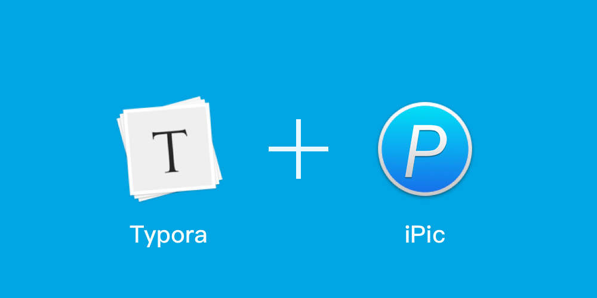
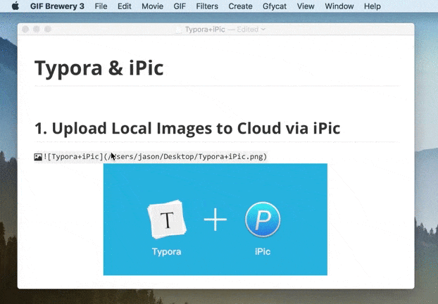
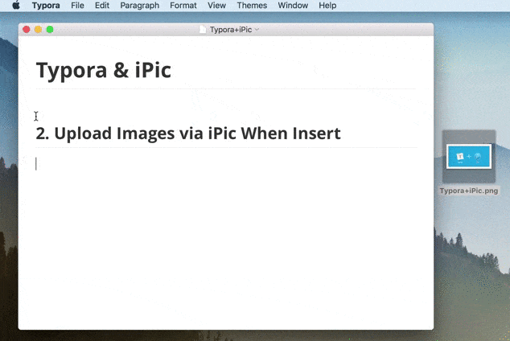

# Typora: 首个集成 iPic 上传服务的 Markdown 编辑器

 发表于 2016-11-09 |  分类于 [iPic](https://toolinbox.net/categories/iPic/)

有了 [iPic](https://toolinbox.net/iPic/) 的加持，[Typora](http://www.typora.io/) 也可以很方便地在 Markdown 中插图。

# 一键上传本地图片

如果已经在 Markdown 中使用的本地图片、需要将其上传至图床，只要一键：

# 插入图片时自动上传至图床

如果在开启此选择，则在插入本地图片时，自动上传至图床、并替换图床链接。

# iPicUploader

[前情回顾](https://toolinbox.net/iPic/iPicUploader.html)

图床神器 iPic 可自动上传图片、保存 Markdown 链接，给你前所未有的插图体验。同时，iPic 开放了自己的上传服务：如果你的 App 也需要上传图片至图床，不需要费时费力接入各个图床，只需要调用 iPic 提供的上传服务即可。

这就是 **iPicUploader** 目前，iPicUploader 已经开源、并发布在 GitHub 中。

[>>> 在 GitHub 中查看 iPicUploader <<<](https://github.com/toolinbox/iPicUploader)

Typora 则是首个接入 iPicUploader 的知名 Markdown 编辑器。

如果你希望 iPic 集成到你现在用的 Markdown 编辑器中，可以联系我、或 Markdown 编辑器的作者，希望 iPic 能让大家更方便地在 Markdown 中插入图片。