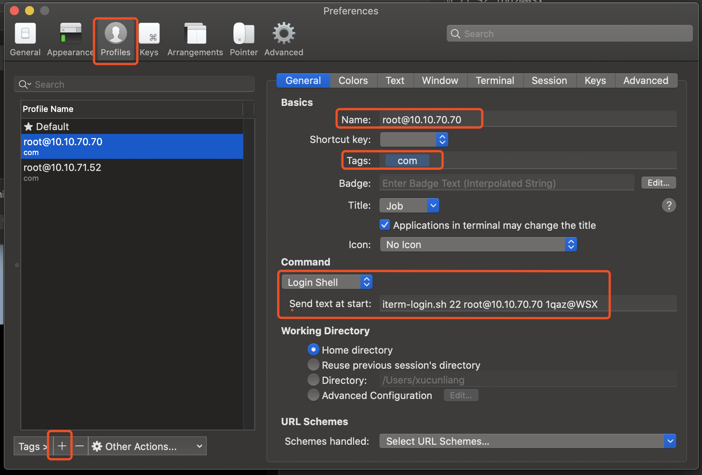
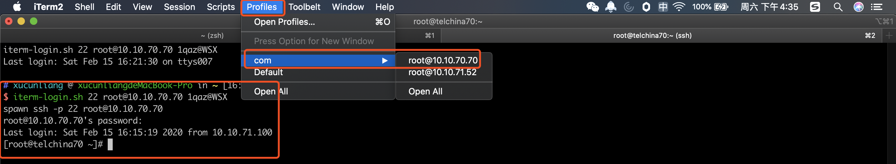

## iTerm2

### 安装

官网下载dmg

### 快捷键

```markdown
Command + N 新建窗口 
Command + T 新建Tab 
Command + D 横向分屏 
Command + Shift + D 纵向分屏 
Command + W 关闭分屏 
Command + 左右方向键 切换Tab 
Command + 上下方向键 上下滚动内容 

ctrl + l 清屏
ctrl + u 清行
ctrl + w 清词
ctrl + a 到行首
ctrl + e 到行尾
```

## zsh

```sh
brew install zsh

zsh --version

chsh -s /bin/zsh
```

## oh-my-zsh

### 安装

##### 1. Clone the repository:

```
git clone https://github.com/ohmyzsh/ohmyzsh.git ~/.oh-my-zsh
```

##### 2. *Optionally*, backup your existing `~/.zshrc` file:

```
cp ~/.zshrc ~/.zshrc.orig
```

##### 3. Create a new zsh configuration file

You can create a new zsh config file by copying the template that we have included for you.

```
cp ~/.oh-my-zsh/templates/zshrc.zsh-template ~/.zshrc
```

##### 4. Change your default shell

```
chsh -s $(which zsh)
```

You must log out from your user session and log back in to see this change.

##### 5. Initialize your new zsh configuration

Once you open up a new terminal window, it should load zsh with Oh My Zsh's configuration.

### 卸载

```sh
uninstall_oh_my_zsh
```

## ssh会话保存

### 编辑~/.ssh/config

```yaml
Host 10.10.50.204-root
    HostName 10.10.50.204
    User root
Host 10.10.50.209-root
    HostName 10.10.50.209
    User root
```

### ssh-copy-id

首先通过ssh-keygen生成本机的公钥和私钥，使用ssh-copy-id将公钥拷贝到远程主机，如下：

```sh
$ ssh-copy-id root@10.10.50.204 
```

### 登录测试

```sh
➜  ~ ssh 10.10.50.204-root
Last login: Fri Feb 14 17:37:51 2020 from 10.30.23.115
[root@telchina204 ~]#
```

## 安装自动补全插件

1. Clone this repository into `$ZSH_CUSTOM/plugins` (by default `~/.oh-my-zsh/custom/plugins`)

   ```
   git clone https://github.com/zsh-users/zsh-autosuggestions ${ZSH_CUSTOM:-~/.oh-my-zsh/custom}/plugins/zsh-autosuggestions
   ```

2. Add the plugin to the list of plugins for Oh My Zsh to load (inside `~/.zshrc`):

   ```
   plugins=(zsh-autosuggestions)
   ```

3. Start a new terminal session.

## 安装语法高亮插件

1. Clone this repository in oh-my-zsh's plugins directory:

   ```
   git clone https://github.com/zsh-users/zsh-syntax-highlighting.git ${ZSH_CUSTOM:-~/.oh-my-zsh/custom}/plugins/zsh-syntax-highlighting
   ```

2. Activate the plugin in `~/.zshrc`:

   ```
   plugins=( [plugins...] zsh-syntax-highlighting)
   ```

3. Restart zsh (such as by opening a new instance of your terminal emulator).

## 自动登录与会话克隆

### 原理

1. 通过expect脚本自动输入密码，从而实现自动登录。

2. 在iterm2中，为每台主机配置一个Profile，Profile中调用expect登录脚本，从而实现了主机连接信息的保存，通过tag实现目录划分。
3. 通过Command + D分屏，即可实现会话的克隆

## 过程

1. 开发expect登录脚本iterm-login.sh：

   ```sh
   #!/usr/bin/expect
   
   set timeout 10
   
   spawn ssh -p [lindex $argv 0] [lindex $argv 1]
   expect {
     "(yes/no)?"
     {send "yes\n";exp_continue}
     "password:"
     {send "[lindex $argv 2]\n"}
   }
   interact
   ```

   ```sh
   $ chmod +x iterm-login.sh
   $ mv iterm-login.sh /usr/local/bin/
   ```

2. 在iterm2中配置Profile：



3. 登录测试：



4. 克隆测试：

Command + D


