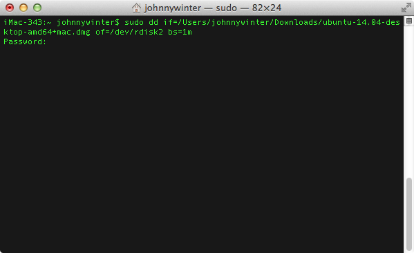

## How to Create a Bootable Ubuntu USB Drive 

### 1. Format a USB Drive 

The first part of the process is to format a USB drive such that it is bootable on a Mac.

Find a USB drive, of 2GB capacity or more, and plug it into the Mac. Launch the **Disk Utility** app which is located in **Applications > Utilities**.

Partition the USB drive

- In the left-hand pane, click on the USB drive to select it
- Click the **Partition** tab
- Select **1 Partition** from the **drop-down menu**
- Enter a name for the drive, in this example **Ubuntu Mac**
- Change the **Format** to **Mac OS Extended (Journaled)**
- Click the **Options** button

Selecting the correct GUID Partition Table option

- Ensure that the **GUID Partition Table** radio button is selected and click **OK**
- Click **Apply**

Advertisement

### 2. Download Ubuntu

Downloading Ubuntu

Open a web browser and navigate to the [Ubuntu download page](http://www.ubuntu.com/download/desktop). 

In the dropdown menu, under **Choose your flavour**, ensure that you select **64-bit Mac (AMD64)** then click the **Download** button.

At the time of writing, the current version of Ubuntu is 14.04 LTS which was released in April 2014.  The LTS denotes that this version is a *Long Term Support* version, in other words this version an LTS version includes updates for new hardware, security patches and updates to the *Ubuntu stack* for a period of five years following the version release. 

### 3. Convert the Downloaded File Format 

It is first necessary to convert the downloaded `.iso` file to a `.img`.  This is done with the `hdiutil` command in **Terminal**.

Using the hdiutil command to convert .iso to .dmg

Open **Terminal** and enter the following command:

| 1    | `hdiutil convert -``format` `UDRW -o ~``/path/to/target``.img ~``/path/to/ubuntu``.iso` |
| ---- | ------------------------------------------------------------ |
|      |                                                              |

Replace the `/path/to/` with the actual path to the files in question, for example:

| 1    | `hdiutil convert -``format` `UDRW -o ~``/Downloads/ubuntu-14``.04-desktop-amd64+mac ~``/Downloads/ubuntu-14``.04-desktop-amd64+mac` |
| ---- | ------------------------------------------------------------ |
|      |                                                              |

**Tip:** OS X may append the file extension `.dmg` to the output file, so you'll end up with `ubuntu-14.04-desktop-i386.img.dmg`

Confirmation of completion of the hdiutil command

### 4. Determine the Device Node for the USB Drive

Determining the USB drive using the diskutil list command

Enter the following command, in **Terminal**, to determine the connected devices:

| 1    | `diskutil list` |
| ---- | --------------- |
|      |                 |

Make a note of the output information.  Then insert the USB drive and run the command again.  Look for the difference and check that the capacity of the new drive matches the USB drive that you have inserted.

Unmounting the USB drive (don't eject it!)

Once you have made a note of the identity of the USB drive, in my case `/dev/disk2`, execute the following command:

| 1    | `diskutil unmountDisk ``/dev/diskN` |
| ---- | ----------------------------------- |
|      |                                     |

Where `N` denotes the node number assigned to the USB drive.  In my example, I run the command:

| 1    | `diskutil unmountDisk ``/dev/disk2` |
| ---- | ----------------------------------- |
|      |                                     |

### 5. Create the Bootable USB Drive 

To create the USB drive, the command `dd` is used to copy and convert a file.  This is a very powerful command and it should be used with care and caution.  

If used incorrectly it is possible to corrupt the the hard drive of a Mac with catastrophic consequences meaning that you will not be able to boot into OS X.  Double-check, and *triple-check,* that you have entered the command correctly.

Be extremely careful when using the sudo dd command

Enter the following command into the command line:

| 1    | `sudo` `dd` `if``=``/path/to/ubuntu-14``.04-desktop-amd64+mac.img.dmg of=``/dev/rdiskN` `bs=1m` |
| ---- | ------------------------------------------------------------ |
|      |                                                              |

In my case, this is:

| 1    | `sudo` `dd` `if``=``/Users/johnnywinter/Downloads/ubuntu-14``.04-desktop-amd64+mac.dmg of=``/dev/rdisk2` `bs=1m` |
| ---- | ------------------------------------------------------------ |
|      |                                                              |

An explanation of the command used is:

- `sudo` means substitute user do and gives you greater privileges to carry out a command that you would normally not be able to execute
- `dd` means convert and copy
- `if` is the input file
- `of` is the output file

It will be necessary to enter the Mac's admin user password in order to proceed with this command, so enter the password at the **Password:** prompt in **Terminal**.  

Note, when you enter the password, you will not see the characters or any asterisks as you might expect.  Though the cursor does not move, **Terminal** is accepting the characters that are being entered.

Once the password has been entered, press the **Enter** key.

It is also important to note that there is no indication or display of progress whilst Terminal executes the command entered.  Sit tight, it will take a few minutes to complete.  Don't be tempted to interrupt the process in any way; be patient and wait for the confirmation from Terminal that the process has completed.

### 6. Prepare to Remove the USB Drive 

It may be that, on completion of the creation of the USB drive, a dialogue box pops up that says **The disk you inserted was not readable by this computer**.  

Don't worry about this warning and don't click on any of the buttons just yet

There are three buttons: **Initialize...**, **Ignore** and **Eject**. Don't click any of them!

Confirmation of completion of the sudo dd command

Instead, return to Terminal where you should see a confirmation that the process has completed. In my example, the confirmation reads:

| 123  | `962+0 records ``in``962+0 records out``1008730112 bytes transferred ``in` `182.599702 secs (5524270 bytes``/sec``)` |
| ---- | ------------------------------------------------------------ |
|      |                                                              |

Ejecting the USB drive from Terminal. Don't eject it any other way

At the command prompt, enter the command:

| 1    | `diskutil ``eject` `/dev/diskN` |
| ---- | ------------------------------- |
|      |                                 |

Where `N` is the node number assigned to the USB drive. In my case it is `disk2`, so the command entered is:

| 1    | `diskutil ``eject` `/dev/disk2` |
| ---- | ------------------------------- |
|      |                                 |

Regarding the dialogue box, click **Ignore** to get rid of it.

It is now safe to remove the USB drive from the Mac.

## Test the Ubuntu USB Drive 

The newly created Ubuntu USB drive is now ready to be inserted into a Mac as a live-drive from which you can run the Ubuntu operating system.

Booting into Ubuntu from the external USB drive

To test Ubuntu Linux on a Mac:

1. insert the USB drive into an available USB port.
2. Reboot, or turn on, the Mac
3. Immediately after the start-up chime press the **Option** key (sometimes marked **alt**)
4. Select the USB drive from which to boot by using the **left and right arrow** and **Enter** keys

## Conclusion

In this tutorial, I have shown you how to download the correct version of Ubuntu Linux to test on a Mac.  I have shown you how to correctly format a USB drive and how to copy Ubuntu to that drive in order to make a bootable live-drive.  

I have also shown you how to boot from the drive, that you have created, to test Ubuntu Linux on a Mac. 

If you want to do more with your Mac, check out some of the [Mac apps](https://codecanyon.net/category/apps/mac)available on Envato Market.

- 
- 
- 