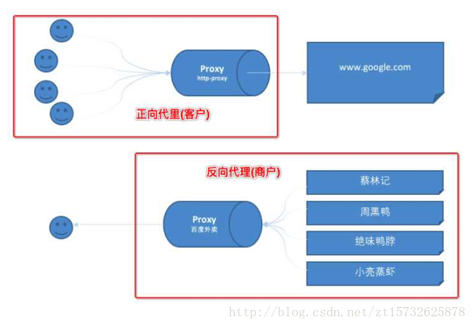

## 什么是代理服务器（Proxy Serve）？

​    提供代理服务的电脑系统或其它类型的网络终端,代替网络用户去取得网络信息。

## 为什么使用代理服务器？

- 提高访问速度 
      由于目标主机返回的数据会存放在代理服务器的硬盘中，因此下一次客户再访问相同的站点数据时，会直接从代理服务器的硬盘中读取，起到了缓存的作用，尤其对于热门网站能明显提高访问速度。
- 防火墙作用 
      由于所有的客户机请求都必须通过代理服务器访问远程站点，因此可以在代理服务器上设限，过滤掉某些不安全信息。同时正向代理中上网者可以隐藏自己的IP,免受攻击。
- 突破访问限制 
      互联网上有许多开发的代理服务器，客户机在访问受限时，可通过不受限的代理服务器访问目标站点，通俗说，我们使用的翻墙浏览器就是利用了代理服务器，可以直接访问外网。

## 正向代理

​     正向代理（forward proxy） ，一个位于客户端和原始服务器之间的服务器，为了从原始服务器取得内容，客户端向代理发送一个请求并制定目标（原始服务器），然后代理向原始服务器转发请求并将获得的内容返回给客户端，客户端才能使用正向代理。我们平时说的代理就是指正向代理。 
​    简单一点：A向C借钱，由于一些情况不能直接向C借钱，于是A想了一个办法，他让B去向C借钱，这样B就代替A向C借钱，A就得到了C的钱，C并不知道A的存在，B就充当了A的代理人的角色。 

## 反向代理

​    反向代理（Reverse Proxy），以代理服务器来接受internet上的连接请求，然后将请求转发给内部网络上的服务器，并将从服务器上得到的结果返回给internet上请求的客户端，此时代理服务器对外表现为一个反向代理服务器。 
​    理解起来有些抽象，可以这么说：A向B借钱，B没有拿自己的钱，而是悄悄地向C借钱，拿到钱之后再交给A,A以为是B的钱，他并不知道C的存在。 

## 正向代理和反向代理的区别

- 位置不同 
  正向代理，架设在客户机和目标主机之间； 
  反向代理，架设在服务器端；
- 代理对象不同 
  正向代理，代理客户端，服务端不知道实际发起请求的客户端； 
  反向代理，代理服务端，客户端不知道实际提供服务的服务端； 
  
  备注：正向代理–HTTP代理为多个人提供翻墙服务；反向代理–百度外卖为多个商户提供平台给某个用户提供外卖服务。
- 用途不同 
  正向代理，为在防火墙内的局域网客户端提供访问Internet的途径； 
  反向代理，将防火墙后面的服务器提供给Internet访问；
- 安全性不同 
  正向代理允许客户端通过它访问任意网站并且隐藏客户端自身，因此必须采取安全措施以确保仅为授权的客户端提供服务； 
  反向代理都对外都是透明的，访问者并不知道自己访问的是哪一个代理。

## 正向代理的应用

​    \1. 访问原来无法访问的资源 
​    \2. 用作缓存，加速访问速度 
​    \3. 对客户端访问授权，上网进行认证 
​    \4. 代理可以记录用户访问记录（上网行为管理），对外隐藏用户信息

## 反向代理的应用

​    \1. 保护内网安全 
​    \2. 负载均衡 
​    \3. 缓存，减少服务器的压力 
​       Nginx作为最近较火的反向代理服务器，安装在目的主机端，主要用于转发客户机请求，后台有多个http服务器提供服务，nginx的功能就是把请求转发给后台的服务器，决定哪台目标主机来处理当前请求。

# 总结

​    正向代理是从客户端的角度出发，服务于特定用户（比如说一个局域网内的客户）以访问非特定的服务；反向代理正好与此相反，从服务端的角度出发，服务于非特定用户（通常是所有用户），已访问特定的服务。 
​     代理的内容先了解到这里，感谢您的阅读，希望提出宝贵意见。