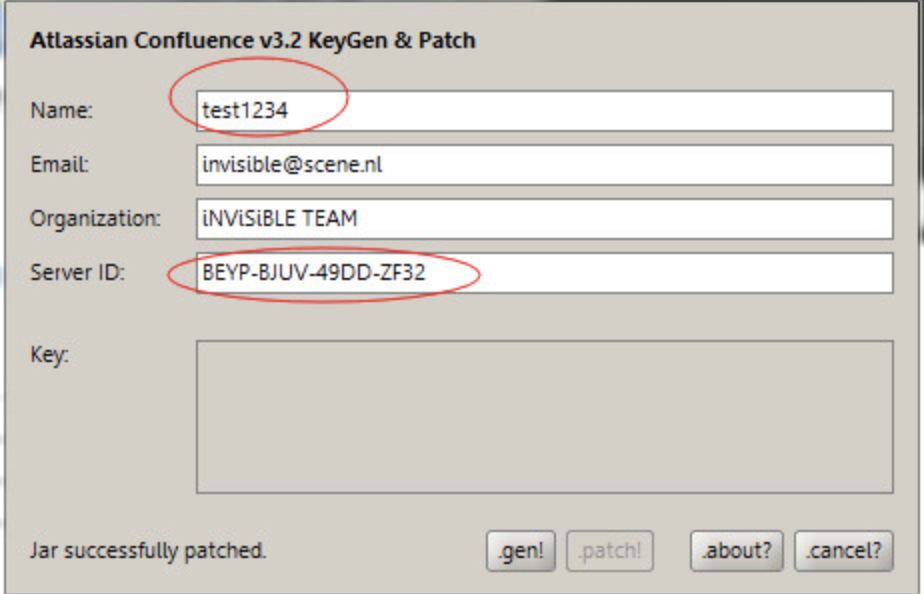

1、迁移安装目录，默认是/opt/atlassian/confluence/

2、迁移数据目录，默认是/var/atlassian/application-data/confluence，具体可以查看./confluence/atlassian-confluence-4.1.5/confluence/WEB-INF/classes/confluence-init.properties

3、创建操作系统用户confluence，将安装目录和数据目录（/var/atlassian/app-data/confluence）的属主改为confluence

4、破解过程，其实是生成confluence.cfg.xml的过程，所以要保证数据目录/var/atlassian/application-data/confluence下没有这个文件，并且confluence用户有写入目录的权限

5、创建confluence数据库、用户和权限，注册过程中会自动建表，注册完成后，把所有77张表清空

6、将原系统的mysql库导出，然后导入到新库

### 破解方法

1. 先启动confluence：sh startup.sh

2. 浏览器访问10.10.50.206:8090，记下页面中的ServerID

3. 停止confluence服务

4. 在个人电脑解压confluence5.1-crack.zip 

5. 使用服务器上的/opt/atlassian/confluence/confluence/WEB-INF/lib/atlassian-extras-2.4.jar 复制出来。替换confluence5.1-crack 中的atlassian-extras-2.4.jar

6. 在个人电脑执行sh keygen.sh

   【1】输Name，及之前记录下来的Server ID，按.patch!  选择需要破解的atlassian-extras-2.4.jar

【2】按.gen!得到key

【3】把破解好的包，复制回去

复制破解后的atlassian-extras-2.4.jar到 “/opt/atlassian/confluence/confluence/WEB-INF/lib/”覆盖原文件。

复制mysql-connector-java-5.1.32-bin.jar 到“/opt/atlassian/confluence/confluence/WEB-INF/lib/”。

service confluence start  #启动Confluence 服务

【4】再次打开网页

\#重新打开网页 http://服务器ip:8090 

\#输了之前得到的key

AAABLA0ODAoPeJxtUMlqwzAQvesrBD0reElpCAiqyDq4tWQTOy09Ks6kFShKkGzT/H3tLBRKbzPz5
i0zD++wwy/a4WiB4/kyTZbxHPO6wUmURCiD0Hpz6szRUX50e9uDawGp/rAFX+43AXygJEbcg56WM
t0BnZgkikm0QCOn022n9AFo+8ufytk4NwPQzvdw3xNSG0uNG0wwWwvPoQUHM2eRGLTtLw50r224K
RRmxAM05xNcHHgppVjznBVoFHIdOD26ie+T8edrsjR9InFCkserwP0ObvvQgVfHHQQaoVoo+lFus
GSvAkuBGa5ZhiumMjZDpf/UzoRrGKPeTG1WhcCNYBLV4AfweUZXZV2SIm8USXNZkQ2v1uiWdkSLP
Lt3/4eret9+6QB/3vkDVBGK6zAuAhUAhQkP6BjBt1iXUkDwInZKoBlbLB4CFQCLf+9VQbn5u30o9
+cvreGuYfYxXw==X02f7