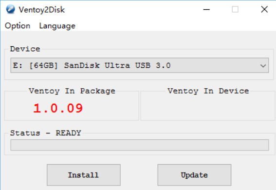

# 神器工具：新一代多系统启动 U 盘装机解决方案

一个 U 盘里面往往只能制作成一个新系统的启动盘，当你要想增加其他系统时，只能通过重新刻录，每次都需要反复这样的操作，是非常花费时间的。

那么，今天给大家推荐一种新的可启动 USB 的解决方案：**多合一启动盘制作工具 —— Ventoy**。

## 什么是Ventoy？

Ventoy 是一个免费制作可启动 U 盘的开源工具，有了 Ventoy 就无需反复格式化 U 盘，只需把 ISO 文件拷贝到 U 盘里面就可以启动了，无需其他操作。

可一次性拷贝多个不同类型的 ISO 文件，在启动 Ventoy 时，将显示一个菜单来进行选择，无差异支持 Legacy BIOS 和 UEFI 模式。

## Ventoy特点

- 开源、使用简单、快速
- 直接从 ISO 文件启动，无需解开
- 支持 Legacy + UEFI 模式（UEFI 模式支持安全启动）
- 支持持久化
- 支持直接启动 WIM 文件
- 支持自动安装部署
- 支持超过 4GB 的 ISO 文件
- 支持保留 ISO 原始的启动菜单
- 支持多种常见的操作系统（Windows、Linux、VMware ESXi 等）
- 支持插件扩展
- 支持启动过程中 U 盘设置写保护
- 支持 ISO 文件显示列表模式和目录模式
- 不影响 U 盘的使用，在升级时数据将不会丢失，无需跟随操作系统的升级而升级

## Ventoy项目地址

https://github.com/ventoy/Ventoy/releases

可以下载Windows和Linux版本的安装包

## Windows安装Ventoy

下载ventoy-1.0.30-windows.zip

执行 **Ventoy2Disk.exe**，选择 U 盘设备，点击**安装**按钮即可。



- Ventoy In Package：当前安装包里面的 Ventoy 版本号；
- Ventoy In Device：U 盘中已安装的 Ventoy 版本号，如果为空则表示未安装过 Ventoy；
- Install：把 Ventoy 安装到 U 盘，只第一次时需要，其他情况只 Update 升级即可；
- Update：升级 U 盘中的 Ventoy 版本，升级不会影响 ISO 文件；

## Linux安装Ventoy

下载 ventoy-1.0.12-linux.tar.gz 安装包，解压之后的目录下执行此脚本。

在终端以 root 用户权限执行如下命令：

```shell
$ sh Ventoy2Disk.sh -i /dev/XXX
```

而对于一些操作系统（ubuntu / deepin）来说， 执行时需在前面加 sudo

```shell
$ sudo sh Ventoy2Disk.sh -i /dev/XXX
```

其中 **/dev/XXX** 是 U 盘对应的设备名，比如：**/dev/sdb**，必须输入正确的设备名，如果输入错误可能会把你的系统盘格式化，因为 Ventoy 不会检查你摄入的设备名是本地磁盘还是 U 盘。

**选项含义：**

- -i：安装 ventoy 到磁盘中 （如果对应磁盘已经安装了 ventoy，则会失败）；
- -I：强制安装 ventoy 到磁盘中；
- -u：升级磁盘中的 ventoy 版本；

> 注意：USB 驱动器将被格式化，安装后所有数据将会丢失。
>
> 只需要安装一次 Ventoy，之后所需要做的就是将 ISO 文件复制到 USB。
>
> 您也可以将其用作普通的 USB 驱动器来存储文件，这将不会影响 Ventoy 的功能。

## 拷贝iso文件

Ventoy 安装完成后，U 盘将会被分为两个区。

第一个分区：将会被默认格式化为 exFAT 格式的文件系统，这个分区你可以存放日常使用的普通文件，当作日常普通 U 盘使用。

当你再次需要制作启动盘时，你只需将 ISO 文件拷贝到此分区中即可。

你也可以将 ISO 文件存放置在其他任何位置，Ventoy 将会递归搜索所有目录和子目录，进行查找所有 ISO 文件，并按启动字母顺序进行列出。

> 注意：ISO 文件的完整路径（目录，子目录和文件名）不能包含空格或非 ASCII 字符，拷贝到 ISO 文件后，会直接做启动引导。

## 更新ISO文件

如发布了新版本的 Ventoy，则可以将其更新到USB驱动器。

> 注意：升级操作是安全的，第一个分区中的所有文件都将保持不变。

## 总结

Ventoy 是一种新的可启动 USB 装机解决方案，相比传统装机的解决方案要好用的多，其 Ventoy 最终目的在于将制作好的 U 盘启动盘，依然是可以当作普通 U 盘进行使用。

你可随意删除或添加操作系统 ISO 镜像文件，不必每安装一个操作系统需先将它进行格式化，而针对大容量的 U 盘来说，同时也有了更多空余空间的使用存放其他文件。	

当某一个系统更新换代了，你如果想更新系统，无需每次将新版本的系统镜像刻录至 U 盘中做启动盘，大大节省了你装机时的工作效率。