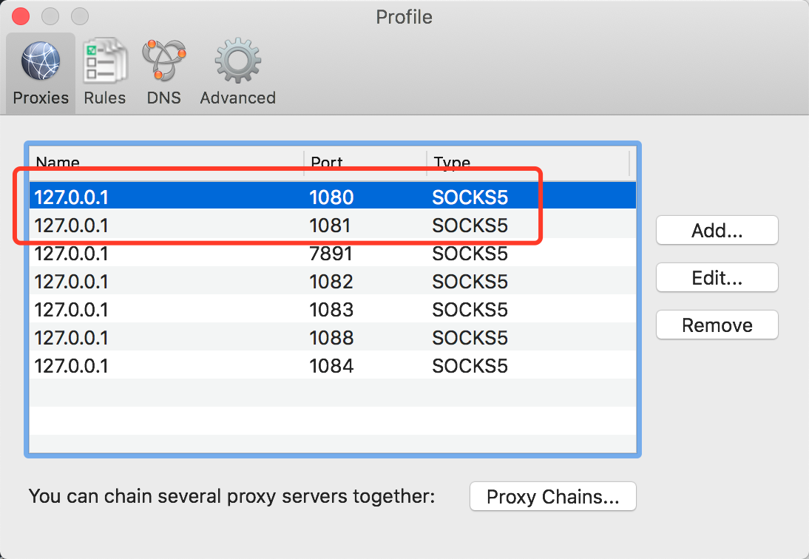
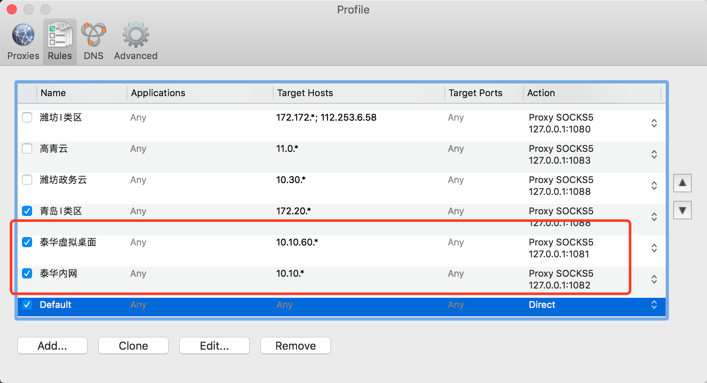

# 泰华内网渗透

## 跳板机

- 10.10.70.70  仅用于访问10.10.60.*虚拟桌面
- 10.10.71.100(10.10.50.204)  用于访问10.10.*网段大部分地址(但路由不到虚拟桌面60网段)

## 思路

1. 在内网虚拟桌面中安装BvSshServer，用于在Windows下开启SSH/SFTP服务
2. 使用一台阿里云ECS部署LanProxy服务端。
3. 在内网跳板机部署LanProxy客户端，用于反向连接，映射跳板机端口到互联网
4. 在跳板机部署ShadowSocks服务端，用于开启隧道(不直接映射22端口，风险较大)
5. 在本机使用ShadowSocks客户端，连接映射出来的SS服务，在本机开启Socks5代理
6. 在本机使用Proxifier，使Socks5透明化


## 虚拟桌面BvSshServer安装

下载地址: https://www.bitvise.com/download-area

## 阿里云LanProxy安装

### 客户端配置

- telchina70.70	2523ab5417e24a408ce4264f7bd5af20
- telchina.71.100	814bbb8d18a7464380a10429fd6d7fbb

### 端口映射配置

- 30001	--> 10.10.70.70:30001
- 30002	--> 10.10.71.100:30002


## 内网Lanproxy客户端安装

### 路径

/opt/lanproxy

### 10.10.70.70配置

```
client.key=2523ab5417e24a408ce4264f7bd5af20
ssl.enable=false
ssl.jksPath=test.jks
ssl.keyStorePassword=123456
server.host=39.97.233.136
server.port=34900
```

### 10.10.71.100配置

```
client.key=814bbb8d18a7464380a10429fd6d7fbb
ssl.enable=false
ssl.jksPath=test.jks
ssl.keyStorePassword=123456
server.host=39.97.233.136
server.port=34900
```

## 内网ShadowSocks服务端安装

### 安装步骤

```
curl "https://bootstrap.pypa.io/get-pip.py" -o "get-pip.py"
python get-pip.py
pip install shadowsocks
```

### 10.10.70.70配置

```
{
    "server":"10.10.70.70",
    "server_port":30001,
    "password":"banruoboluomi",
    "method":"rc4-md5"
}
```

### 10.10.71.100配置

```
{
    "server":"10.10.71.100",
    "server_port":30002,
    "password":"banruoboluomi",
    "method":"rc4-md5"
}
```

### 启动脚本

```
/usr/bin/ssserver -c /etc/shadowsocks.json
```

## 本机ShadowSocks客户端安装

### 安装步骤

灵活操作系统对应版本即可，推荐Python命令行版本

### 启动脚本

```
nohup sslocal -s 39.97.233.136 -p 30001 -l 1081 -m rc4-md5 -k banruoboluomi 2>&1 &
nohup sslocal -s 39.97.233.136 -p 30002 -l 1082 -m rc4-md5 -k banruoboluomi 2>&1 &
```

## 本机Proxifier代理透明化配置

### 配置截图






## 连通性测试

ssh root@10.10.70.70

http://10.10.51.101:32189/zorrodemo/docs/userguide/index.html