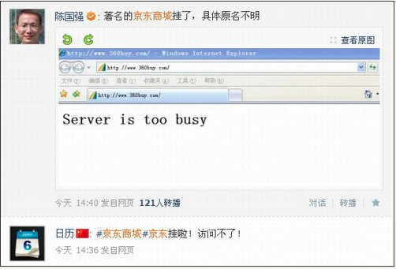
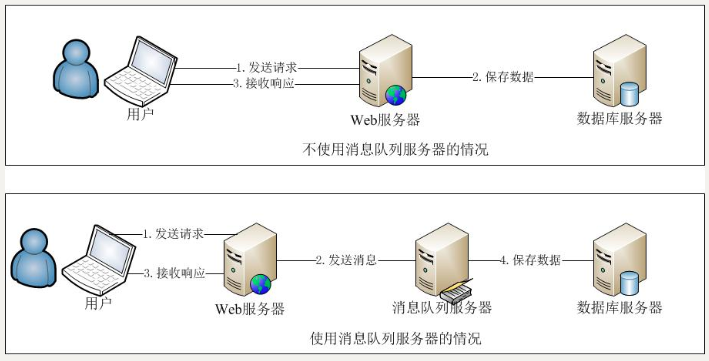
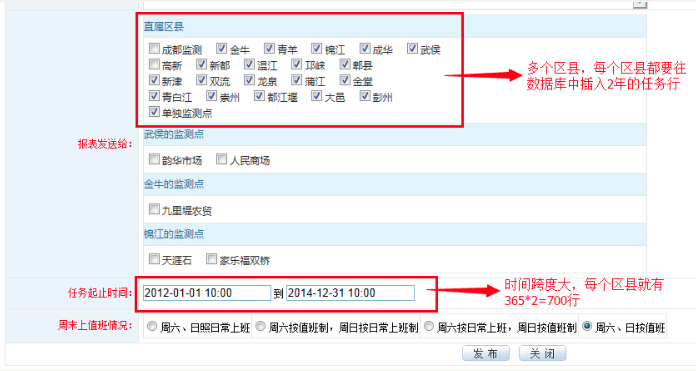
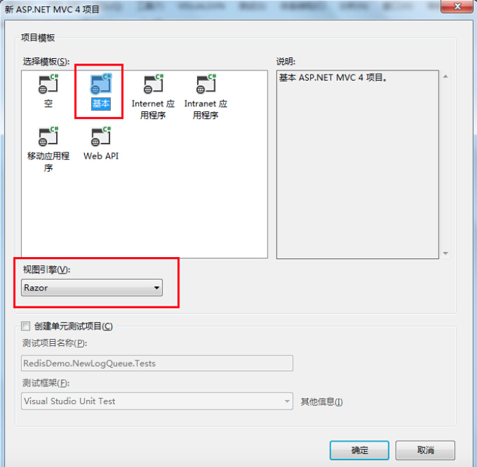
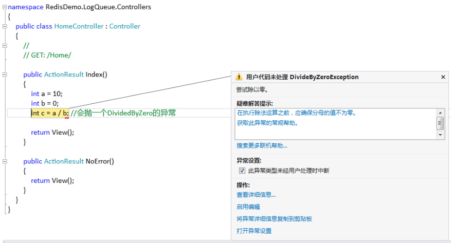
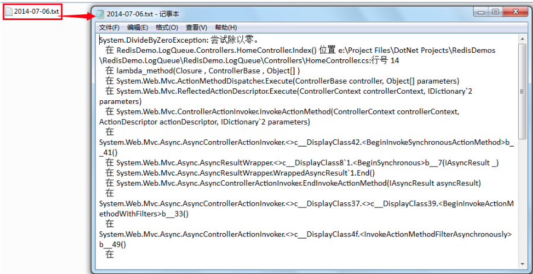
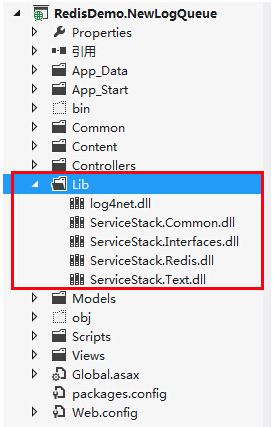
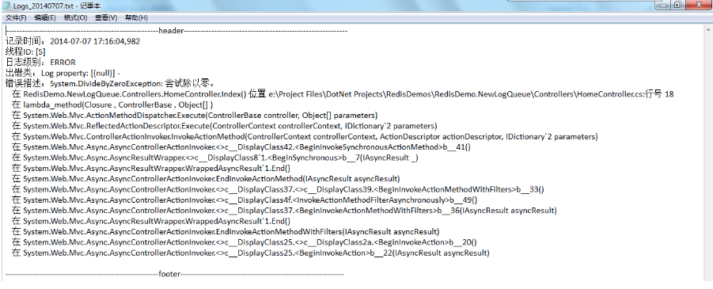

## Redis作为消息队列服务场景应用案例 - HackerVirus - 博客园

[回到目录](https://www.cnblogs.com/leo_wl/p/3831349.html#_labelTop)

　　“**消息**”是在两台计算机间传送的数据单位。消息可以非常简单，例如只包含文本字符串；也可以更复杂，可能包含嵌入对象。消息被发送到队列中，“**消息队列**”是在消息的传输过程中保存消息的**容器**。



　　在目前广泛的Web应用中，都会出现一种场景：在某一个时刻，网站会迎来一个用户请求的高峰期（比如：淘宝的双十一购物狂欢节，12306的春运抢票节等），一般的设计中，用户的请求都会被直接写入数据库或文件中，在高并发的情形下会对数据库服务器或文件服务器造成巨大的压力，同时呢，也使响应延迟加剧。这也说明了，为什么我们当时那么地抱怨和吐槽这些网站的响应速度了。当时2011年的京东图书促销，曾一直出现在购物车中点击“购买”按钮后一直是“**Service is too busy**”，其实就是因为当时的**并发访问量过大，超过了系统的最大负载能力**。当然，后边，刘强东临时购买了不少服务器进行扩展以求增强处理并发请求的能力，还请了信息部的人员“喝茶”，现在京东已经是超大型的网上商城了，我也有同学在京东成都研究院工作了。



　　从京东当年的“Service is too busy”不难看出，高并发的用户请求是网站成长过程中必不可少的过程，也是一个必须要解决的难题。在众多的实践当中，除了增加服务器数量配置服务器集群实现伸缩性架构设计之外，异步操作也被广泛采用。而异步操作中最核心的就是使用**消息队列**，通过消息队列，将短时间高并发产生的事务消息存储在消息队列中，从而削平高峰期的并发事务，改善网站系统的性能。在京东之类的电子商务网站促销活动中，**合理地使用消息队列，可以有效地抵御促销活动刚开始就开始大量涌入的订单对系统造成的冲击**。

　　记得我在实习期间，成都市XXXX局的一个价格信息采集发布系统项目中有一个采集任务发布的模块，其中每个任务都是一个事务，这个事务中需要向数据库中不断地插入行，每个任务发布时都要往表中插入几百行甚至几千行的任务数据（比如价格采集日报，往往需要发布2-3年的任务数据，每一天都是一个任务，所以大约有2,3千行任务期号数据，还要发给很多个区县的监测中心，因此数据库写操作量很大，更别说同时发布的并发操作），由于业务逻辑的处理比较复杂和往数据库的写操作量交大，所以在没有采用消息队列时点击“发布”按钮后往往需要等待1分钟左右的时间才提示“发布成功”，用户体验极不友好。



　　这时，我们就可以使用消息队列的思想来重构这个发布模块，在用户点击“发布”按钮后，系统只需要把往数据库插入的这个事务信息插入到指定的任务发布消息队列里边去（入队操作，这里一般有一台独立的消息队列服务器来单独存储和处理），然后系统就可以立即对用户的这个发布请求进行响应（比如给出一个发布成功的操作提示，这里暂不考虑消息队列服务操作失败的情形，如果失败了，可以考虑采用给用户发送邮件、短信或站内消息，让其重新进行发布操作）。


　　最后，消息队列服务器中有一个进程单独对消息队列进行处理，首先判断消息队列中是否有待处理的消息，如果有，则将其取出（出队操作，坚持“先进先出”的顺序，保证事务的准确性）进行相应地处理（比如这里是进行保存数据的操作，将数据插入到数据库服务器中的指定数据库里边，实质还是文件的IO操作）。就这样，通过消息队列将高并发用户请求进行异步操作，然后一一对消息队列进行出队的同步操作，也避免了并发控制的难题。

　　说到这里，大家可能会想到这尼玛不就是**生产者消费者模式**么？对的，么么嗒，消息队列就是生产者消费者模式的典型场景。简单地说，客户端不同用户发送的操作请求就是生产者，他们将要处理的事务存储到消息队列中，然后消息队列服务器的某个进程不停地将要处理的单个事务从消息队列中一个一个地取出来进行相应地处理，这就是消费者消费的过程。

　　下面我们将以异常日志为案例，介绍在.Net中如何采用消息队列的思想解决并发问题。当然，消息队列只是解决并发问题的其中一种方式，在实际中往往需要结合多种不同的技术方式来共同解决，比如负载均衡、反向代理、集群等方案。这里，虽然以异常日志为案例，但是“麻雀虽小五脏俱全”，日志写入文件的高并发操作也同样适用于数据库的高并发，所以，研究这个案例是具有实际意义的。

[回到目录](https://www.cnblogs.com/leo_wl/p/3831349.html#_labelTop)

# 二、使用预置类型实现异常日志队列


　　在日常的Web应用中，异常日志的记录是一个十分重要的要点。因为，人无完人，系统也一样，难免会在什么时候出一个测试阶段未能完全测试到的异常。这时候，不能将异常信息直接显示给客户，那样既不友好也不安全。所以，一般都采用将异常信息记录到日志文件中（比如某个txt文件，数据库中某个表等），然后技术支持人员通过查看异常日志，分析异常原因，改进BUG重新发布，保障系统正常运行。

　　在用户的各种操作中，如果出现异常的时间一致，那么记录异常日志的操作就会成为并发操作，而记录异常日志又属于文件的IO操作（其实数据库的读写归根结底也是对文件即对磁盘进行的IO操作），因此很有可能带来并发控制的一系列问题。在以往的编码实践中，我们可以通过给不同的IO请求进行加锁（C#中的lock），等第一个请求完成写入后释放锁，第二个请求再获得锁，进行IO操作，然后释放掉，一直到第N个请求释放后结束。这种方式，虽然解决了并发操作带来的问题，但是通过加锁延迟了用户响应请求的时间（比如第一个正在IO写入操作时，后面的均处于等待状态），并且加锁也会给服务器带来一定的性能负担，造成服务器性能的下降。

　　基于以上原因，我们采用消息队列的思想将异常日志的记录操作改为队列版，这里我们先不采用Redis，直接使用.Net为我们提供的预置类型-**Queue**。接下来，就让我们动手开刀，写起来。

　　（1）新建一个ASP.NET MVC 4项目，选择“基本”类型，视图引擎选择“Razor”。



　　（2）既然是异常日志记录，首先得有异常。这时，我们脑海中想到了那个经典的异常：DividedByZeroException。于是，在Controllers文件夹中新建一个Controller，取名为Home（这里因为Global文件中的默认路由就指向了Home控制器中的Index这个Action），在HomeController中修改Index这个Action的代码如下：

```
        public ActionResult Index()
        {
            int a = 10;
            int b = 0;
            int c = a / b; //会抛一个DividedByZero的异常

            return View();
        }
```

　　（3）在ASP.NET MVC项目中，我们需要在Global.asax中的Application_Start这个事件中修改全局过滤器（主要是App_Start中的FilterConfig类的RegisterGlobalFilters这个方法），让系统支持对异常的全局处理操作（我们这里主要是对异常进行记录到指定文件中）。**PS**：Application_Start是整个Web应用的起始事件，主要进行一些配置（如过滤器配置、日志器配置、路由配置等等）的初始化操作，当然这些配置也只会进行一次。

```
    public class FilterConfig
    {
        public static void RegisterGlobalFilters(GlobalFilterCollection filters)
        {
            // MyExceptionFilterAttribute继承自HandleError，主要作用是将异常信息写入日志文件中
            filters.Add(new MyExceptionFilterAttribute());
            // 默认的异常记录类
            filters.Add(new HandleErrorAttribute());
        }
    }
```

　　通过改写过滤器配置，我们向全局过滤器中注册了一个异常处理的过滤器配置，那么这个MyExceptionFilterAttribute类又是如何编写的呢？

```
    public class MyExceptionFilterAttribute : HandleErrorAttribute
    {
        //版本1：使用预置队列类型存储异常对象
        public static Queue<Exception> ExceptionQueue = new Queue<Exception>();

        public override void OnException(ExceptionContext filterContext)
        {
            //将异常信息入队
            ExceptionQueue.Enqueue(filterContext.Exception);
            //跳转到自定义错误页
            filterContext.HttpContext.Response.Redirect("~/Common/CommonError.html");

            base.OnException(filterContext);
        }
    }
```

　　通过使该类继承HandlerErrorAttribute并使其覆写OnException这个事件，代表在异常发生时可以进行的操作。而我们在这儿主要通过一个异常队列将获取的异常写入队列，然后跳转到自定义错误页：~/Common/CommonError.html，这个错误页很简单，就是简单的显示“系统发生错误，5秒后自动跳转到首页”

　　（4）走到这里，生产者消费者模式中生产者的任务已经完成了，接下来消费者就需要开始消费了。也就是说，消息队列已经建好了，我们什么时候从队列中去任务，在哪里执行？怎么样执行？通过上面的介绍，我们知道，在专门的消息队列服务器中有一个进程在始终不停地监视消息队列，如果有需要待办的任务信息，则会立即从队列中取出来执行相应的操作，直到队列为空为止。于是，思路有了，我们马上来实现以下。这个消息监视的操作也是一个全局操作，在系统启动时就会一直运行，于是它也应该写在Application_Start这个全局起始事件里边，于是按照标准的配置写法，我们在Application_Start中添加了如下代码：MessageQueueConfig.RegisterExceptionLogQueue()；

```
        protected void Application_Start()
        {
            AreaRegistration.RegisterAllAreas();

            WebApiConfig.Register(GlobalConfiguration.Configuration);
            FilterConfig.RegisterGlobalFilters(GlobalFilters.Filters);
            RouteConfig.RegisterRoutes(RouteTable.Routes);
            BundleConfig.RegisterBundles(BundleTable.Bundles);

            //自定义事件注册
            MessageQueueConfig.RegisterExceptionLogQueue();
        }
```

　　那么，这个MessageQueueConfig.RegisterExceptionLogQueue()又是怎么写的呢？

```
　　public class MessageQueueConfig
    {
        public static void RegisterExceptionLogQueue()
        {
            string logFilePath = HttpContext.Current.Server.MapPath("/App_Data/");
            //通过线程池开启线程，不停地从队列中获取异常信息并将其写入日志文件
            ThreadPool.QueueUserWorkItem(o =>
            {
                while (true)
                {
                    try
                    {
                        if (MyExceptionFilterAttribute.ExceptionQueue.Count > 0)
                        {
                            Exception ex = MyExceptionFilterAttribute.ExceptionQueue.Dequeue(); //从队列中出队，获取异常对象
                            if (ex != null)
                            {
                                //构建完整的日志文件名
                                string logFileName = logFilePath + DateTime.Now.ToString("yyyy-MM-dd") + ".txt";
                                //获得异常堆栈信息
                                string exceptionMsg = ex.ToString();
                                //将异常信息写入日志文件中
                                File.AppendAllText(logFileName, exceptionMsg, Encoding.Default);
                            }
                        }
                        else
                        {
                            Thread.Sleep(1000); //为避免CPU空转，在队列为空时休息1秒
                        }
                    }
                    catch (Exception ex)
                    {
                        MyExceptionFilterAttribute.ExceptionQueue.Enqueue(ex);
                    }
                }
            }, logFilePath);
        }
    }
```

　　现在，让我们来看看这段代码：

　　①首先定义Log文件存放的文件夹目录，这里我们一般放到App_Data里边，因为放到这里边外网是无法访问到的，可以防止下载操作；

　　②其次通过线程池ThreadPool开启一个线程，不停地监听消息队列里边的待办事项个数，如果个数>0，则进行出队（FIFO，先入队的先出队）操作。这里主要是取出具体的异常实例对象，并将异常的具体堆栈信息追加写入到指定命名格式的文件中。

> **PS：**许多应用程序创建的线程都要在休眠状态中消耗大量时间，以等待事件发生。其他线程可能进入休眠状态，只被定期唤醒以轮询更改或更新状态信息。**线程池**通过为应用程序提供一个由系统管理的辅助线程池使您可以更为有效地使用线程。关于线程池的更多信息请访问：<http://msdn.microsoft.com/zh-cn/library/system.threading.threadpool(v=VS.90).aspx>

　　③如果该线程检测到消息队列中无待办事项，则使用Thread.Sleep使线程“休息”一会，避免了CPU空转（从理论上来说，CPU资源是很珍贵的，应该尽量提高CPU的利用率）。

　　（5）最后，我们来看看效果如何？

　　①首先，高大上的VS捕捉到了异常-DividedByZeroException：



　　②按照我们的全局异常处理过滤器，会将此异常记入队列中，并返回HTTP 302重定向跳转到自定义错误页面：


　　③最后，打开App_Data文件夹，查看日志文件：



　　到这里时，我们已经借助消息队列的思想完成了一个自定义的异常日志队列服务。但也许有朋友会说，这个跟Redis有关系么？异常日志不都是用Log4Net么？不要着急，后边我们就会使用Redis+Log4Net来重构这个异常日志队列服务，不要走开，我们不得插播广告哦，么么嗒！

[回到目录](https://www.cnblogs.com/leo_wl/p/3831349.html#_labelTop)

# 三、使用Redis重构异常日志队列

　　（1）第一步，开启Redis的服务，这里我们使用命令开启Redis服务（之前已经将Redis注册到了Windows系统服务中了嘛，么么嗒）：**net start redis-instance**，当然，也可以通过在Windows服务列表中开启。


　　（2）第二步，在刚刚的版本1的Demo中新建一个文件夹，命名为Lib，将ServiceStack.Redis的dll和Log4Net的dll都拷贝进去。然后，在引用中添加对Lib文件夹中所有dll的引用。



　　（3）第三步，重写MyExceptionFilterAttribute这个全局异常信息过滤器。这里使用到了Redis的客户端连接池，每次连接时都是从池中取，不需要每次都创建，节省了时间和资源，提高了资源利用率。对于，多台Redis服务器组成的集群而言，这里需要指定多个形如 IP地址:端口号 的字符串数组。

```
    public class MyExceptionFilterAttribute : HandleErrorAttribute
    {
        //版本2：使用Redis的客户端管理器（对象池）
        public static IRedisClientsManager redisClientManager = new PooledRedisClientManager(new string[] 
        {
            //如果是Redis集群则配置多个{IP地址:端口号}即可
            //例如: "10.0.0.1:6379","10.0.0.2:6379","10.0.0.3:6379"
            "127.0.0.1:6379"
        });
        //从池中获取Redis客户端实例
        public static IRedisClient redisClient = redisClientManager.GetClient();

        public override void OnException(ExceptionContext filterContext)
        {
            //将异常信息入队
            redisClient.EnqueueItemOnList("ExceptionLog", filterContext.Exception.ToString());
            //跳转到自定义错误页
            filterContext.HttpContext.Response.Redirect("~/Common/CommonError.html");

            base.OnException(filterContext);
        }
    }
```

　　（4）第四步，首先在Web.config中加入Log4Net的详细配置。

> **PS:**Log4Net是用来记录日志的一个常用组件（Log4J的移植版本），可以将程序运行过程中的信息输出到一些地方（文件、数据库、EventLog等）。由于Log4Net不是本篇博文介绍的重点，所以对Log4Net不熟悉的朋友，请在博客园首页搜索：Log4Net，浏览其详细的介绍。

　　其次，在App_Start文件夹中添加一个类，取名为LogConfig，定义一个静态方法：RegisterLog4NetConfigure，具体代码只有一行，实现了Log4Net配置的初始化操作。

```
    public class LogConfig
    {
        public static void RegisterLog4NetConfigure()
        {
            //获取Log4Net配置信息(配置信息定义在Web.config文件中)
            log4net.Config.XmlConfigurator.Configure();
        }
    }
```

　　最后，在Global.asax中的Application_Start方法中添加一行代码，注册Log4Net的配置：

```
        protected void Application_Start()
        {
            AreaRegistration.RegisterAllAreas();

            WebApiConfig.Register(GlobalConfiguration.Configuration);
            FilterConfig.RegisterGlobalFilters(GlobalFilters.Filters);
            RouteConfig.RegisterRoutes(RouteTable.Routes);
            BundleConfig.RegisterBundles(BundleTable.Bundles);


            //自定义事件注册
            MessageQueueConfig.RegisterExceptionLogQueue();
            LogConfig.RegisterLog4NetConfigure();
        }
```

　　（5）第五步，改写MessageQueueConfig中的RegisterExceptionLogQueue方法。这里就不再需要从预置类型Queue中取任务了，而是Redis中取出任务出队进行相应处理。这里，我们使用了Log4Net进行异常日志的记录工作。**PS：**注意在代码顶部添加对log4net的引用：using log4net;

```
    　　public static void RegisterExceptionLogQueue()
        {
            //通过线程池开启线程，不停地从队列中获取异常信息并将其写入日志文件
            ThreadPool.QueueUserWorkItem(o =>
            {
                while (true)
                {
                    try
                    {
                        if (MyExceptionFilterAttribute.redisClient.GetListCount("ExceptionLog") > 0)
                        {
                            //从队列中出队，获取异常对象
                            string errorMsg = MyExceptionFilterAttribute.redisClient.DequeueItemFromList("ExceptionLog");
                            if (!string.IsNullOrEmpty(errorMsg))
                            {
                                //使用Log4Net写入异常日志
                                ILog logger = LogManager.GetLogger("Log");
                                logger.Error(errorMsg);
                            }
                        }
                        else
                        {
                            Thread.Sleep(1000); //为避免CPU空转，在队列为空时休息1秒
                        }
                    }
                    catch (Exception ex)
                    {
                        MyExceptionFilterAttribute.redisClient.EnqueueItemOnList("ExceptionLog", ex.ToString());
                    }
                }
            });
        }
```

 　　（6）最后一步，调试验证是否能正常写入App_Data文件的日志中，发现写入的异常日志如下，格式好看，信息详细，圆满完成了我们的目的。



[回到目录](https://www.cnblogs.com/leo_wl/p/3831349.html#_labelTop)

# 四、小结

　　使用消息队列将调用异步化，可以改善网站系统的性能：消息队列具有很好的削峰作用，即通过异步处理，将短时间高并发产生的事务消息存储在消息队列中，从而削平高峰期的并发事务。在电商网站的促销活动中，合理使用消息队列，可以有效地抵御促销活动刚开始大量涌入的订单对系统造成的冲击。本文使用消息队列的思想，借助Redis+Log4Net完成了一个超简单的异常日志队列的应用案例，可以有效地解决在多线程操作中对日志文件的并发操作带来的一些问题。同样地，借助消息队列的思想，我们也可以完成对数据库的高并发的消息队列方案。所以，麻雀虽小五脏俱全，理解好了这个案例，相信对我们这些菜鸟码农是有所裨益的。同样，也请大牛们一笑而过，多多指教菜鸟们一步一步地提高，谢谢了！后边，我们会探索一下Redis的集群、主从复制，以及在VMWare中建立几台虚拟机来构建主从结构，并使用Redis记录网站中重要的Session会话对象，或者是电商项目中常见的商品类目信息等。但是，本人资质尚浅，并且都是一些初探性质的学习，如有错误和不当，还请各位园友多多指教！

[回到目录](https://www.cnblogs.com/leo_wl/p/3831349.html#_labelTop)

# 参考文献

（1）传智播客.Net学院王承伟，数据优化技术之Redis公开课，http://bbs.itcast.cn/thread-26525-1-1.html

（2）Sanfilippo/贾隆译，《几点建议，让Redis在你的系统中发挥更大作用》，http://database.51cto.com/art/201107/276333.htm

（3）NoSQLFan，《Redis作者谈Redis应用场景》，http://blog.nosqlfan.com/html/2235.html

（4）善心如水，《C#中使用Log4Net记录日志》，http://www.cnblogs.com/wangsaiming/archive/2013/01/11/2856253.html

（5）逆心，《ServiceStack.Redis之IRedisClient》，http://www.cnblogs.com/kissdodog/p/3572084.html

（6）李智慧，《大型网站技术架构-核心原理与案例分析》，http://item.jd.com/11322972.html

[回到目录](https://www.cnblogs.com/leo_wl/p/3831349.html#_labelTop)

# 附件下载

（1）版本1：使用预置类型的异常日志队列Demo，<http://pan.baidu.com/s/1nt5G7Fj>

（2）版本2：使用Redis+Log4Net的异常日志队列Demo，<http://pan.baidu.com/s/1i3gMnnJ>

作者：[周旭龙](http://www.cnblogs.com/edisonchou/)

出处：<http://www.cnblogs.com/edisonchou/>