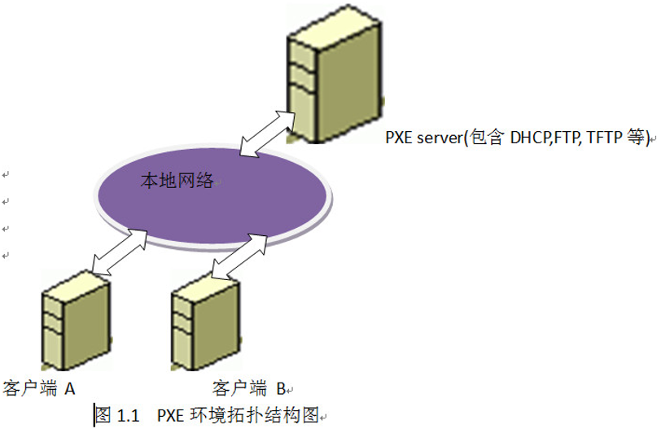
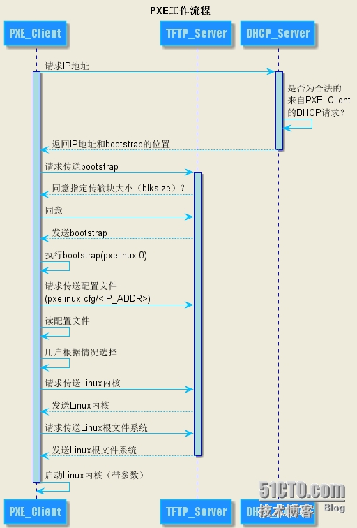

## PXE简介

**PXE**（Pre-boot Execution Environment）预启动执行环境，是由Intel开发的网络技术，工作于client/server的网络模式，支持工作站通过网络从远端服务器下载镜像，并由此支持通过网络启动操作系统。

PXE不是安装的方式，而是一种引导方式。

## PXE协议工作原理



a.)协议分为PXE server和client两端，PXE client端集成在网卡ROM中,即PXE启动需要网卡ROM的支持。

b.)当client端计算机启动时，BIOS把PXE client端网络启动请求调入内存执行，并显示出启动菜单。

c.) 经用户选择后，PXE server进行响应，将预定的启动文件传输给PXE client。

d.) client端将server上的启动文件经过网络下载到本地运行

## PXE启动流程



 PXE工作原理示意图说明：

1. Client向PXE Server上的DHCP发送IP地址请求消息，DHCP检测Client是否合法（主要是检测Client的网卡MAC地址），如果合法则返回Client的IP地址，同时将启动文件pxelinux.0的位置信息一并传送给Client。

2. Client向PXE Server上的TFTP发送获取pxelinux.0请求消息，TFTP接收到消息之后再向Client发送pxelinux.0大小信息，试探Client是否满意，当TFTP收到Client发回的同意大小信息之后，正式向Client发送pxelinux.0。

   `注：在传统Intel X86平台的操作系统中，bootstrap文件通常为pxelinux.0；而在Arm架构的Linux操作系统中，bootstrap文件通常名称为grubaa64.efi。`

3. Client执行接收到的pxelinux.0文件。

4. Client向TFTP发送针对本机的配置信息（记录在TFTP的pxelinux.cfg目录下），TFTP将配置文件发回Client，继而Client根据配置文件执行后续操作。

5. Client向TFTP发送Linux内核请求信息，TFTP接收到消息之后将内核文件发送给Client。

6. Client向TFTP发送根文件请求信息，TFTP接收到消息之后返回Linux根文件系统。

7. Client启动Linux内核（启动参数已经在4中的配置文件中设置好了）。

8. Client通过NFS或HTTP或FTP下载镜像文件，读取autoyast自动化安装脚本。至此，Client正式进入自动化安装模式开始安装系统直到完成。

脚本：

```sh
#!/bin/bash

# general config
SERVER_IP=192.168.17.56	# pxe server ip
CLIENT_ARCH=arm		# arm or x86
BOOT_MODE=uefi		# uefi or legacy
ISO=/root/Kylin-Kylin-Server-10-aarch64-Release-Build01.01-lic-2020041320-arm64.iso
NETWORK_INTERFACE=enp125s0f0	# pxe client network interface
AUTO=no		# "yes" for full-automatic install, "no" for half-automatic install
CONFIG_HTTP=yes		# config http repo
CONFIG_FTP=no		# config ftp repo
ROOT_PASSWORD=Kylin123123	# set password for root in full-automatic install

# dhcp config
SUBNET=192.168.17.0
NETMASK=255.255.255.0
ROUTER=192.168.17.1
DHCP_RANGE_LOW=192.168.17.10
DHCP_RANGE_HIGH=192.168.17.200

shutdown_firewall() {
	iptables -F || echo "iptables delete all rules failed!"

	systemctl stop firewalld || echo "Stop firewalld failed!"
	systemctl disable firewalld || echo "Disable firewalld failed!"
	systemctl status firewalld | grep -q running && echo "firewalld is still running!"

	sed -i 's/RefuseManualStop=yes/#RefuseManualStop=yes/' /usr/lib/systemd/system/auditd.service
	systemctl daemon-reload
	systemctl stop auditd || echo "Stop auditd failed"
	systemctl disable auditd || echo "Disable auditd failed!"
	sed -i 's/#RefuseManualStop=yes/RefuseManualStop=yes/' /usr/lib/systemd/system/auditd.service
	systemctl daemon-reload
	systemctl status auditd | grep -q running && echo "auditd is still running"

	case "`getenforce`" in
	"Enforcing")
		sed -i 's/SELINUX=enforcing/SELINUX=disabled/' /etc/selinux/config
		echo "Changing selinux from enforcing to disabled. Need reboot to take effect."
		echo -e "\033[31;1m[WARNING]: SYSTEM WILL REBOOT IN 60 SECONDS! \033[0m"
		sleep 60 && reboot
		;;
	"Permissive")
		sed -i 's/SELINUX=permissive/SELINUX=disabled/' /etc/selinux/config
		echo "Changing selinux from permissive to disabled. Need reboot to take effect."
		echo -e "\033[31;1m[WARNING]: SYSTEM WILL REBOOT IN 60 SECONDS! \033[0m"
		sleep 60 && reboot
		;;
	"Disabled")
		# do nothing
		;;
	esac

	echo -e "Shut down firewall:\t[\033[32;1m OK \033[0m]"
}

config_dhcp() {
	rpm -qa | grep -q dhcp || yum install dhcp -y > /dev/null

	case "$BOOT_MODE" in
	"uefi")
		case "$CLIENT_ARCH" in
		"arm")
			PXE_FILE=grubaa64.efi
			;;
		"x86")
			PXE_FILE=grubx64.efi
			;;
		*)
			echo "Invalid client arch!"
			;;
		esac
		;;
	"legacy")
		case "$CLIENT_ARCH" in
		"arm")
			echo "Legacy boot mode for arm pxe client is not supported yet!"
			umount_all
			exit 1
			;;
		"x86")
			PXE_FILE=pxelinux.0
			;;
		*)
			echo "Invalid client arch!"
			;;
		esac
		;;
	*)
		echo "Invalid boot mode!"
		;;
	esac

	cat > /etc/dhcp/dhcpd.conf <<-EOF
		ddns-update-style interim;
		ignore client-updates;
		filename "$PXE_FILE";
		next-server $SERVER_IP;

		subnet $SUBNET netmask $NETMASK {
		    option routers $ROUTER;
		    option subnet-mask $NETMASK;
		    range dynamic-bootp $DHCP_RANGE_LOW $DHCP_RANGE_HIGH;
		    default-lease-time 21600;
		    max-lease-time 43200;
		}
	EOF

	systemctl start dhcpd || echo "start dhcpd failed!"
	#systemctl enable dhcpd || echo "enable dhcpd failed!"
	if systemctl status dhcpd | grep -q running && systemctl restart dhcpd; then
		echo -e "Configure dhcp:\t[\033[32;1m OK \033[0m]"
	else
		echo -e "Configure dhcp:\t[\033[31;1m Failed \033[0m]" && exit 1
	fi
}

config_tftp() {
	rpm -qa | grep -v tftp-server | grep -q tftp || yum install tftp -y > /dev/null
	rpm -qa | grep -q tftp-server || yum install tftp-server -y > /dev/null
	rpm -qa | grep -q xinetd || yum install xinetd -y > /dev/null

	cat > /etc/xinetd.d/tftp <<-EOF
		service tftp
		{
		        socket_type             = dgram
		        protocol                = udp
		        wait                    = yes
		        user                    = root
		        server                  = /usr/sbin/in.tftpd
		        server_args             = -s /var/lib/tftpboot
		        disable                 = no
		        per_source              = 11
		        cps                     = 100 2
		        flags                   = IPv4
		}
	EOF

	rm -rf /var/lib/tftpboot/*
	cp -rf /tmpmnt/images/pxeboot/* /var/lib/tftpboot/

	HTTP_KS="inst.ks=http://$SERVER_IP/ks/kylin-ks.cfg"
	FTP_KS="inst.ks=ftp://$SERVER_IP/pub/ks/kylin-ks.cfg"

	case "$BOOT_MODE" in
	"uefi")
		[ -f /tmpmnt/EFI/BOOT/grub*.efi ] && cp -f /tmpmnt/EFI/BOOT/grub*.efi /var/lib/tftpboot || cp -f /tmpmedia/EFI/BOOT/grub*.efi /var/lib/tftpboot
		cat > /var/lib/tftpboot/grub.cfg <<-EOF
			set default="0"

			function load_video {
			  if [ x\$feature_all_video_module = xy ]; then
			    insmod all_video
			  else
			    insmod efi_gop
			    insmod efi_uga
			    insmod ieee1275_fb
			    insmod vbe
			    insmod vga
			    insmod video_bochs
			    insmod video_cirrus
			  fi
			}

			load_video
			set gfxpayload=keep
			insmod gzio
			insmod part_gpt
			insmod ext2

			set timeout=10

			### BEGIN /etc/grub.d/10_linux ###
		EOF

		if [ "$CONFIG_HTTP" = "yes" ]; then
			cat >> /var/lib/tftpboot/grub.cfg <<-EOF
				menuentry 'Install Kylin Linux Advanced Server V10 HTTP' --class red --class gnu-linux --class gnu --class os {
				    set root=(tftp,$SERVER_IP)
				    linux /vmlinuz ro inst.geoloc=0 console=ttyAMA0 console=tty0 rd.iscsi.waitnet=0 ip=dhcp inst.repo=http://$SERVER_IP/kylin $HTTP_KS rd.debug rd.udev.debug systemd.log_level=debug
				    initrd /initrd.img
				}
			EOF
		fi

		if [ "$CONFIG_FTP" = "yes" ]; then
			cat >> /var/lib/tftpboot/grub.cfg <<-EOF
				menuentry 'Install Kylin Linux Advanced Server V10 FTP' --class red --class gnu-linux --class gnu --class os {
				    set root=(tftp,$SERVER_IP)
				    linux /vmlinuz ro inst.geoloc=0 console=ttyAMA0 console=tty0 rd.iscsi.waitnet=0 ip=dhcp inst.repo=ftp://$SERVER_IP/pub/kylin $FTP_KS rd.debug rd.udev.debug systemd.log_level=debug
				    initrd /initrd.img
				}
			EOF
        	fi
		;;
	"legacy")
		case "$CLIENT_ARCH" in
		"arm")
			echo "Legacy boot mode for arm pxe client is not supported yet!"
			umount_all
			exit 1
			;;
		"x86")
			#cp -f /tmpmnt/isolinux/{boot.cat,boot.msg,grub.conf,isolinux.bin,ldlinux.c32,libcom32.c32,libutil.c32,splash.png,TRANS.TBL,vesamenu.c32} /var/lib/tftpboot || echo "Some file in /tmpmnt/isolinux copy failed!"
			cp -f /tmpmnt/isolinux/* /var/lib/tftpboot/ || echo "Some file in /tmpmnt/isolinux copy failed!"
			[ -d /var/lib/tftpboot/pxelinux.cfg ] || mkdir /var/lib/tftpboot/pxelinux.cfg
			cat > /var/lib/tftpboot/pxelinux.cfg/default <<-EOF
				default vesamenu.c32
				timeout 100
				display boot.msg

				# Clear the screen when exiting the menu, instead of leaving the menu displayed.
				# For vesamenu, this means the graphical background is still displayed without
				# the menu itself for as long as the screen remains in graphics mode.
				menu clear
				menu background splash.png
				menu title Kylin Linux Advanced Server V10
				menu vshift 8
				menu rows 18
				menu margin 8
				#menu hidden
				menu helpmsgrow 15
				menu tabmsgrow 13

				# Border Area
				menu color border * #00000000 #00000000 none
				# Selected item
				menu color sel 0 #ffffffff #00000000 none
				# Title bar
				menu color title 0 #ff7ba3d0 #00000000 none
				# Press [Tab] message
				menu color tabmsg 0 #ff3a6496 #00000000 none
				# Unselected menu item
				menu color unsel 0 #84b8ffff #00000000 none
				# Selected hotkey
				menu color hotsel 0 #84b8ffff #00000000 none
				# Unselected hotkey
				menu color hotkey 0 #ffffffff #00000000 none
				# Help text
				menu color help 0 #ffffffff #00000000 none
				# A scrollbar of some type? Not sure.
				menu color scrollbar 0 #ffffffff #ff355594 none
				# Timeout msg
				menu color timeout 0 #ffffffff #00000000 none
				menu color timeout_msg 0 #ffffffff #00000000 none
				# Command prompt text
				menu color cmdmark 0 #84b8ffff #00000000 none
				menu color cmdline 0 #ffffffff #00000000 none
				# Do not display the actual menu unless the user presses a key. All that is displayed is a timeout message.
				menu tabmsg Press Tab for full configuration options on menu items.
				menu separator # insert an empty line
				menu separator # insert an empty line
				menu end
			EOF

			if [ "$CONFIG_HTTP" = "yes" ]; then
				sed -i "/menu end/d" /var/lib/tftpboot/pxelinux.cfg/default
				cat >> /var/lib/tftpboot/pxelinux.cfg/default <<-EOF
					label http
					  menu label ^Install Kylin Linux Advanced Server V10 HTTP
					  menu default
					  kernel vmlinuz
					  append initrd=initrd.img ro inst.geoloc=0 console=ttyAMA0 console=tty0 rd.iscsi.waitnet=0 ip=dhcp inst.repo=http://$SERVER_IP/kylin $HTTP_KS rd.debug rd.udev.debug systemd.log_level=debug
					menu end
				EOF
			fi

			if [ "$CONFIG_FTP" = "yes" ]; then
				sed -i "/menu end/d" /var/lib/tftpboot/pxelinux.cfg/default
				[ "$CONFIG_HTTP" = "yes" ] && MENU_DEFAULT="" || MENU_DEFAULT="menu default"
				cat >> /var/lib/tftpboot/pxelinux.cfg/default <<-EOF
					label ftp
					  menu label ^Install Kylin Linux Advanced Server V10 FTP
					  $MENU_DEFAULT
					  kernel vmlinuz
					  append initrd=initrd.img ro inst.geoloc=0 console=ttyAMA0 console=tty0 rd.iscsi.waitnet=0 ip=dhcp inst.repo=ftp://$SERVER_IP/pub/kylin $FTP_KS rd.debug rd.udev.debug systemd.log_level=debug
					menu end
				EOF
			fi

			cp -f /tmpmnt/Packages/syslinux-nonlinux-* /tmp
			[ -d /tmp/usr ] && rm -rf /tmp/usr
			cd /tmp && rpm2cpio syslinux-nonlinux-* | cpio -idm --quiet
			cp -f /tmp/usr/share/syslinux/pxelinux.0 /var/lib/tftpboot/
			;;
		*)
			echo "Invalid client arch!"
			;;
		esac
		;;
	*)
		echo "Invalid boot mode!"
		exit 1
		;;
	esac

	chmod -R 755 /var/lib/tftpboot

	systemctl start xinetd || echo "Start xinetd failed!"
	#systemctl enable xinetd || echo "Enable xinetd failed!"
	systemctl status xinetd | grep -q running && systemctl restart xinetd || echo "xinetd is not running!"

	systemctl start tftp || echo "Start tftp failed!"
	#systemctl enable tftp || echo "Enable tftp failed!"
	systemctl status tftp | grep -q running && systemctl restart tftp || echo "tftp is not running!"

	if systemctl status xinetd | grep -q running && systemctl status tftp | grep -q running; then
		echo -e "Configure tftp:\t[\033[32;1m OK \033[0m]"
	else
		echo -e "Configure tftp:\t[\033[31;1m Failed \033[0m]" && exit 1
	fi
}

config_http() {
	rpm -qa | grep -q httpd || yum install httpd -y > /dev/null

	[ -d /var/www/html/kylin ] && rm -rf /var/www/html/kylin
	mkdir /var/www/html/kylin || echo "mkdir /var/www/html/kylin failed!"

	echo -e "rsync data from iso to /var/www/html/kylin:\c"
	rsync -a /tmpmnt/ /var/www/html/kylin/ && echo -e "\t[\033[32;1m Done \033[0m]" || echo -e "\t[\033[31;1m Failed \033[0m]"
	chmod -R 755 /var/www/html/kylin

	[ -f /var/lib/tftpboot/grub.cfg ] && cp -f /var/lib/tftpboot/grub.cfg /var/www/html/kylin/EFI/BOOT/grub.cfg

	systemctl start httpd || echo "Start httpd failed!"
	#systemctl enable httpd || echo "Enable httpd failed!"
	if systemctl status httpd | grep -q running && systemctl restart httpd; then
		echo -e "Configure http:\t[\033[32;1m OK \033[0m]"
	else
		echo -e "Configure http:\t[\033[31;1m Failed \033[0m]" && exit 1
	fi
}

config_ftp() {
	rpm -qa | grep -v vsftpd || yum install vsftpd -y > /dev/null

	sed -i "s/anonymous_enable=NO/#anonymous_enable=NO/" /etc/vsftpd/vsftpd.conf

	[ -d /var/ftp/pub/kylin ] && rm -rf /var/ftp/pub/kylin
	mkdir /var/ftp/pub/kylin || echo "mkdir /var/ftp/pub/kylin failed!"

	echo -e "rsync data from iso to /var/ftp/pub/kylin:\c"
	rsync -a /tmpmnt/ /var/ftp/pub/kylin/ && echo -e "\t[ \033[32;1mDone\033[0m ]" || echo -e "\t[\033[31;1m Failed \033[0m]"
	chmod -R 755 /var/ftp/pub/kylin

	[ -f /var/lib/tftpboot/grub.cfg ] && cp -f /var/lib/tftpboot/grub.cfg /var/ftp/pub/kylin/EFI/BOOT/grub.cfg

	systemctl start vsftpd || echo "Start vsftpd failed!"
	#systemctl enable vsftpd || echo "Enable vsftpd failed!"
	if systemctl status vsftpd | grep -q running && systemctl restart vsftpd; then
		echo -e "Configure ftp:\t[\033[32;1m OK \033[0m]"
	else
		echo -e "Configure ftp:\t[\033[31;1m Failed \033[0m]" && exit 1
	fi
}

config_kickstart() {
	[ "$AUTO" = "yes" ] && AUTOPART="autopart --type=lvm" || AUTOPART=""
	[ "$AUTO" = "yes" ] && PARTITION="clearpart --drives=sda --all" || PARTITION="clearpart --none --initlabel"

	cat > /tmp/rootpw.py <<-EOF
		#!/usr/bin/python
		import crypt
		print(crypt.crypt("$ROOT_PASSWORD"))
	EOF
	[ "$AUTO" = "yes" ] && ROOTPW="rootpw --iscrypted `python /tmp/rootpw.py | sed 's/\$/\\\$/g' | sed 's/.$//'`" || ROOTPW=""
	rm -f /tmp/rootpw.py

	cat > /tmp/kylin-ks.cfg <<-EOF
		# Installation disks
		ignoredisk --only-use=sda
		$AUTOPART

		# Partition clearing information
		$PARTITION

		# Use graphical install
		graphical

		# Keyboard layouts
		keyboard --vckeymap=cn --xlayouts='cn'

		# System language
		lang zh_CN.UTF-8

		# Network information
		network  --bootproto=dhcp --device=$NETWORK_INTERFACE --ipv6=auto --activate
		network  --hostname=localhost.localdomain

		# Run the Setup Agent on first boot
		firstboot --enable

		# X Window System configuration information
		xconfig  --startxonboot

		# System services
		services --enabled="chronyd"

		# System timezone
		timezone Asia/Shanghai --utc --nontp

		# Environment groups
		# Minimal Install/最小安装
		# Server/基础设施服务器
		# File and Print Server/文件及打印服务器
		# Basic Web Server/基本网页服务器
		# Virtualization Host/虚拟化主机
		# Server with UKUI GUI/带 UKUI GUI 的服务器
		%packages
		@^Server with UKUI GUI
		wget
		%end
 
		# Root password
		$ROOTPW

		# Password policies
		%anaconda
		pwpolicy root --minlen=8 --minquality=1 --notstrict --nochanges --notempty
		pwpolicy user --minlen=8 --minquality=1 --notstrict --nochanges --emptyok
		pwpolicy luks --minlen=8 --minquality=1 --notstrict --nochanges --notempty
		%end

		%post
		# Get kyinfo
		# Enable kdump
		sed -i "s/ crashkernel=auto / /" /boot/efi/EFI/kylin/grub.cfg
		%end
	EOF

	if [ "$CONFIG_HTTP" = "yes" ]; then
		[ -d /var/www/html/ks ] && rm -rf /var/www/html/ks
		mkdir /var/www/html/ks || echo "mkdir /var/www/html/ks failed!"
		cp -f /tmp/kylin-ks.cfg /var/www/html/ks/
		sed -i "/# Get kyinfo/awget http://$SERVER_IP/kylin/{.kyinfo,LICENSE} --random-wait --directory-prefix /etc/" /var/www/html/ks/kylin-ks.cfg
		chmod -R 755 /var/www/html/ks
		systemctl status httpd | grep -q running && systemctl restart httpd || echo "httpd is not running!"
	fi

	if [ "$CONFIG_FTP" = "yes" ]; then
		[ -d /var/ftp/pub/ks ] && rm -rf /var/ftp/pub/ks
		mkdir /var/ftp/pub/ks || echo "mkdir /var/ftp/pub/ks failed!"
		cp -f /tmp/kylin-ks.cfg /var/ftp/pub/ks/
		sed -i "/# Get kyinfo/awget ftp://$SERVER_IP/pub/kylin/{.kyinfo,LICENSE} --random-wait --directory-prefix /etc/" /var/ftp/pub/ks/kylin-ks.cfg
		chmod -R 755 /var/ftp/pub/ks
		systemctl status vsftpd | grep -q running && systemctl restart vsftpd || echo "vsftpd is not running!"
	fi

	rm -f /tmp/kylin-ks.cfg

	echo -e "Configure kickstart:\t[\033[32;1m OK \033[0m]"
}

mount_all() {
	mount | grep -q tmpmedia && umount -A /tmpmedia > /dev/null 2>&1
	mount | grep -q "/tmpmnt/images/efiboot.img" && umount -A /tmpmnt/images/efiboot.img > /dev/null 2>&1
	mount | grep -q tmpmnt && umount /tmpmnt > /dev/null 2>&1

	[ -d /tmpmnt ] || mkdir /tmpmnt
	mount $ISO /tmpmnt > /dev/null 2>&1 && echo -e "mount $ISO /tmpmnt:\t[ \033[32;1mSuccess\033[0m ]" || echo -e "mount $ISO /tmpmnt:\t[\033[31;1m Failed \033[0m]"

	[ -d /tmpmedia ] || mkdir /tmpmedia
	mount /tmpmnt/images/efiboot.img /tmpmedia/ > /dev/null 2>&1 && echo -e "mount efiboot.img /tmpmedia:\t[ \033[32;1mSuccess\033[0m ]" || echo -e "mount efiboot.img /tmpmedia:\t[\033[31;1m Failed \033[0m]"
}

umount_all() {
	if umount -A /tmpmnt/images/efiboot.img && rmdir /tmpmedia; then
		echo -e "umount /tmpmnt/images/efiboot.img:\t[\033[32;1m Success \033[0m]"
	else
		echo -e "umount /tmpmnt/images/efiboot.img:\t[\033[31;1m Failed \033[0m]"
	fi

	if umount -A /tmpmnt && rmdir /tmpmnt; then
		echo -e "umount /tmpmnt:\t[\033[32;1m Success \033[0m]"
	else
		echo -e "umount /tmpmnt:\t[\033[31;1m Failed \033[0m]"
	fi
}

main() {
	[ "$CONFIG_HTTP" != "yes" ] && [ "$CONFIG_FTP" != "yes" ] && echo "You must specify at least one repo!" && exit 1
	[ -f "$ISO" ] || { echo "No such iso: $ISO" && exit 1; }
	mount_all
	shutdown_firewall
	config_dhcp
	config_tftp
	[ "$CONFIG_HTTP" = "yes" ] && config_http
	[ "$CONFIG_FTP" = "yes" ] && config_ftp
	config_kickstart
	umount_all

	echo -e "\nPXE server configuration:\t[\033[32;1m Complete \033[0m]\n"
}

# check cancel action and do cleanup
trap "echo 'canceled by user...'; exit 1;" INT TERM

main

exit 0

```

## system-config-kickstart

https://www.linuxidc.com/Linux/2018-07/153260.htm


UOS PXE需求流程：

1、产线提出需求给接口人
2、接口人评估需求后，反馈给UOS项目经理
3、项目经理安排技术人员出镜像，转交给产线进行测试
4、产线测试完成后，如有批量激活需求，反馈给我们，最后由我们添加批量激活功能，并提供交付版镜像