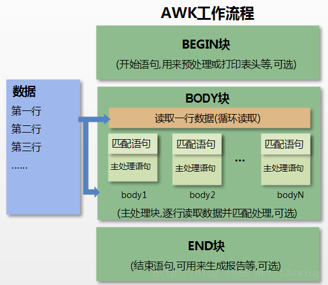

# awk编程语言

`awk`是一种处理文本文件的语言，几乎所有 Linux 系统都自带这个程序，是一个强大的文本分析工具。

之所以叫`awk`是因为其取了三位创始人 Alfred Aho，Peter Weinberger, 和 Brian Kernighan 的 Family Name 的首字符。

它依次处理文件的每一行，并读取里面的每一个字段。对于日志、CSV、json 那样的每行格式相同的文本文件，`awk`可能是最方便的工具。

`awk`其实不仅仅是工具软件，还是一种编程语言。	

## 一、awk工作原理

命令结构:

```sh
awk 'BEGIN{ commands } pattern{ commands } END{ commands }'
```

下面的流程图描述出了 AWK 的工作流程：



- 1、通过关键字 BEGIN 执行 BEGIN 块的内容，即 BEGIN 后花括号 {} 的内容。
- 2、完成 BEGIN 块的执行，开始执行body块。
- 3、读入有 \n 换行符分割的记录。
- 4、将记录按指定的域分隔符划分域，填充域，$0 则表示所有域(即一行内容)，$1 表示第一个域，$n 表示第 n 个域。
- 5、依次执行各 BODY 块，pattern 部分匹配该行内容成功后，才会执行 awk-commands 的内容。
- 6、循环读取并执行各行直到文件结束，完成body块执行。
- 7、开始 END 块执行，END 块可以输出最终结果。

### 开始块（BEGIN）

开始块的语法格式如下：

```
BEGIN {awk-commands}
```

开始块就是在程序启动的时候执行的代码部分，并且它在整个过程中只执行一次。

一般情况下，我们可以在开始块中初始化一些变量。

BEGIN 是 AWK 的关键字，因此它必须是大写的。

**注意：**开始块部分是可选的，你的程序可以没有开始块部分。

### 主体块（BODY）

主体部分的语法格式如下：

```sh
/pattern/ {awk-commands}
```

对于每一个输入的行都会执行一次主体部分的命令。

默认情况下，对于输入的每一行，AWK 都会执行命令。但是，我们可以将其限定在指定的模式中。

**注意**：在主体块部分没有关键字存在。

### 结束块（END）

结束块的语法格式如下：

```sh
END {awk-commands}
```

结束块是在程序结束时执行的代码。 END 也是 AWK 的关键字，它也必须大写。 与开始块相似，结束块也是可选的。

### 实例

先创建一个名为 marks.txt 的文件。其中包括序列号、学生名字、课程名称与所得分数。

```
1)    张三    语文    80
2)    李四    数学    90
3)    王五    英语    87
```

接下来，我们将使用 AWK 脚本来显示输出文件中的内容，同时输出表头信息。

```sh
$ awk 'BEGIN{printf "序号\t名字\t课程\t分数\n"} {print}' marks.txt
```

执行以上命令，输出结果如下：

```
序号    名字    课程    分数
1)    张三    语文    80
2)    李四    数学    90
3)    王五    英语    87
```

程序开始执行时，AWK 在开始块中输出表头信息。在主体块中，AWK 每读入一行就将读入的内容输出至标准输出流中，一直到整个文件被全部读入为止。

## 二、基本用法

log.txt文本内容如下：

```tex
2 this is a test
3 Are you like awk
This's a test
10 There are orange,apple,mongo
```

用法一：

```sh
awk '[pattern]{action}' {filenames}   # 行匹配语句 awk '' 只能用单引号
```

实例：

```sh
# 每行按空格或TAB分割，输出文本中的1、4项
 $ awk '{print $1,$4}' log.txt
 ---------------------------------------------
 2 a
 3 like
 This's
 10 orange,apple,mongo
 
 # 格式化输出
 $ awk '{printf "%-8s %-10s\n",$1,$4}' log.txt
 ---------------------------------------------
 2        a
 3        like
 This's
 10       orange,apple,mongo
```

用法二：

```sh
awk -F  #-F相当于内置变量FS, 指定分割字符
```

实例：

```sh
# 使用","分割
 $  awk -F, '{print $1,$2}' log.txt
 ---------------------------------------------
 2 this is a test
 3 Are you like awk
 This's a test
 10 There are orange apple
 
 # 或者使用内建变量
 $ awk 'BEGIN{FS=","} {print $1,$2}' log.txt
 ---------------------------------------------
 2 this is a test
 3 Are you like awk
 This's a test
 10 There are orange apple
 
 # 使用多种分隔符.使用空格或逗号分隔
 $ awk -F '[ ,]'  '{print $1,$2,$5}'   log.txt
 ---------------------------------------------
 2 this test
 3 Are awk
 This's a
 10 There apple
 
 # 还可以使用字符串作为分隔符，以视图云dataclean日志为例说明
 awk -F'DataCleanBefore-' '{print $2}' dataClean.log  ##去掉日志前缀，只保留json数据
 awk -F'vehicle_kind":"' '{print $2}' dataClean.log | awk -F'","vehicle_kind_confidence' '{print $1}' | sort -u    ##从日志中获取所有的车型
 awk -F'\000' 'NF!=22 {print}' hdfs.log  ##检查每行数据的列数是否均是22列
```

用法三：

```
awk -v  # 设置变量
```

实例：

```sh
 $ awk -va=1 '{print $1,$1+a}' log.txt
 ---------------------------------------------
 2 3
 3 4
 This's 1
 10 11
 $ awk -va=1 -vb=s '{print $1,$1+a,$1b}' log.txt
 ---------------------------------------------
 2 3 2s
 3 4 3s
 This's 1 This'ss
 10 11 10s
```

## 三、运算符

| 运算符                  | 描述                             |
| :---------------------- | :------------------------------- |
| = += -= *= /= %= ^= **= | 赋值                             |
| ?:                      | C条件表达式                      |
| \|\|                    | 逻辑或                           |
| &&                      | 逻辑与                           |
| ~ ~!                    | 匹配正则表达式和不匹配正则表达式 |
| < <= > >= != ==         | 关系运算符                       |
| 空格                    | 连接                             |
| + -                     | 加，减                           |
| * / %                   | 乘，除与求余                     |
| + - !                   | 一元加，减和逻辑非               |
| ^ ***                   | 求幂                             |
| ++ --                   | 增加或减少，作为前缀或后缀       |
| $                       | 字段引用                         |
| in                      | 数组成员                         |

过滤第一列大于2的行

```sh
$ awk '$1>2' log.txt    #命令
#输出
3 Are you like awk
This's a test
10 There are orange,apple,mongo
```

过滤第一列等于2的行

```sh
$ awk '$1==2 {print $1,$3}' log.txt    #命令
#输出
2 is
```

过滤第一列大于2并且第二列等于'Are'的行

```sh
$ awk '$1>2 && $2=="Are" {print $1,$2,$3}' log.txt    #命令
#输出
3 Are you
```

## 四、内置变量

| 变量        | 描述                                                       |
| :---------- | :--------------------------------------------------------- |
| $n          | 当前记录的第n个字段，字段间由FS分隔                        |
| $0          | 完整的输入记录                                             |
| ARGC        | 命令行参数的数目                                           |
| ARGIND      | 命令行中当前文件的位置(从0开始算)                          |
| ARGV        | 包含命令行参数的数组                                       |
| CONVFMT     | 数字转换格式(默认值为%.6g)ENVIRON环境变量关联数组          |
| ERRNO       | 最后一个系统错误的描述                                     |
| FIELDWIDTHS | 字段宽度列表(用空格键分隔)                                 |
| FILENAME    | 当前文件名                                                 |
| FNR         | 各文件分别计数的行号                                       |
| FS          | 字段分隔符(默认是任何空格)                                 |
| IGNORECASE  | 如果为真，则进行忽略大小写的匹配                           |
| NF          | 一条记录的字段的数目                                       |
| NR          | 已经读出的记录数，就是行号，从1开始                        |
| OFMT        | 数字的输出格式(默认值是%.6g)                               |
| OFS         | 输出记录分隔符（输出换行符），输出时用指定的符号代替换行符 |
| ORS         | 输出记录分隔符(默认值是一个换行符)                         |
| RLENGTH     | 由match函数所匹配的字符串的长度                            |
| RS          | 记录分隔符(默认是一个换行符)                               |
| RSTART      | 由match函数所匹配的字符串的第一个位置                      |
| SUBSEP      | 数组下标分隔符(默认值是/034)                               |

### FS: 输入字段分隔符变量

FS(Field Separator) 读取并解析输入文件中的每一行时，默认按照空格分隔为字段变量,$1,$2...等。FS 变量被用来设置每一记录的字段分隔符号。FS 可以是任意的字符串或者正则表达式.你可以使用下面两种方式来声名FS:

使用 -F 命令选项

作为设置为普通变量使用

```sh
语法:

$ awk -F 'FS' 'commands' inputfilename

或者

$ awk 'BEGIN{FS="FS";}'
```

**FS** 可以是任意字符或者正则表达式

**FS** 可以多次改变, 不过会保持不变直到被明确修改。不过如果想要改变字段分隔符,　最好是在读入文本之前就改变 FS, 这样改变才会在你读入的文本生效。

下面是一个使用 FS 读取 /etc/passwd 以 : 作为分隔符的例子

```sh
$ cat etc_passwd.awk
BEGIN{
FS=":";
print "Name\tUserID\tGroupID\tHomeDirectory";
}
{
    print $1"\t"$3"\t"$4"\t"$6;
}
END {
    print NR,"Records Processed";
}
```

使用结果:

```sh
$ awk -f etc_passwd.awk /etc/passwd
Name    UserID  GroupID        HomeDirectory
gnats    41    41    /var/lib/gnats
libuuid    100    101    /var/lib/libuuid
syslog    101    102    /home/syslog
hplip    103    7    /var/run/hplip
avahi    105    111    /var/run/avahi-daemon
saned    110    116    /home/saned
pulse    111    117    /var/run/pulse
gdm    112    119    /var/lib/gdm
8 Records Processed
```

### OFS: 输出字段分隔符变量

OFS(Output Field Separator) 相当与输出上的 FS, 默认是以一个空格字符作为输出分隔符的，下面是一个 OFS 的例子:

```bash
$ awk -F':' '{print $3,$4;}' /etc/passwd
41 41
100 101
101 102
103 7
105 111
110 116
111 117
112 119
```

注意命令中的 print 语句的, 表示的使用一个空格连接两个参数，也就是默认的OFS的值。因此 OFS 可以像下面那样插入到输出的字段之间:

```sh
$ awk -F':' 'BEGIN{OFS="=";} {print $3,$4;}' /etc/passwd
41=41
100=101
101=102
103=7
105=111
110=116
111=117
112=11
```

### RS: 记录分隔符

RS(Record Separator)定义了一行记录。读取文件时，默认将一行作为一条记录。 下面的例子以 student.txt 作为输入文件，记录之间用两行空行分隔，并且每条记录的每个字段用一个换行符分隔:

```sh
$ cat student.txt
Jones
2143
78
84
77

Gondrol
2321
56
58
45

RinRao
2122
38
37
65

Edwin
2537
78
67
45

Dayan
2415
30
47
20
```

然后下面的脚本就会从student.txt输出两项内容:

```sh
$ cat student.awk
BEGIN {
    RS="\n\n";
    FS="\n";
}
{
    print $1,$2;
}
$ awk -f student.awk  student.txt
Jones 2143
Gondrol 2321
RinRao 2122
Edwin 2537
Dayan 2415
```

在 student.awk 中，把每个学生的详细信息作为一条记录，　这是因为RS(记录分隔符)是被设置为两个换行符。并且因为 FS (字段分隔符)是一个换行符，所以一行就是一个字段。

### ORS: 输出记录分隔符变量

ORS(Output Record Separator)顾名思义就相当与输出的 RS。 每条记录在输出时候会用分隔符隔开，看下面的 ORS 的例子:

```sh
$  awk 'BEGIN{ORS="=";} {print;}' student-marks
Jones 2143 78 84 77=Gondrol 2321 56 58 45=RinRao 2122 38 37 65=Edwin 2537 78 67 45=Dayan 2415 30 47 20=
```

上面的脚本，输入文件的每条记录被 = 分隔开。 附:student-marks 便是上面的输出.

### NR: 记录数变量

NR(Number of Record) 表示的是已经处理过的总记录数目，或者说行号(不一定是一个文件，可能是多个)。下面的例子，NR 表示行号，在 END 部分，NR就是文件中的所有记录数目。

```sh
$ awk '{print "Processing Record - ",NR;}END {print NR, "Students Records are processed";}' student-marks
Processing Record -  1
Processing Record -  2
Processing Record -  3
Processing Record -  4
Processing Record -  5
5 Students Records are processed
```

### NF:一条记录的记录数目

NF(Number for Field)表示的是，一条记录的字段的数目.　它在判断某条记录是否所有字段都存在时非常有用。 让我们观察 student-mark 文件如下:

```sh
$ cat student-marks
Jones 2143 78 84 77
Gondrol 2321 56 58 45
RinRao 2122 38 37
Edwin 2537 78 67 45
Dayan 2415 30 47
```

接着下面的Awk程序，打印了记录数(NR),以及该记录的字段数目: 因此可以非常容易的发现那些数据丢失了。

```sh
$ awk '{print NR,"->",NF}' student-marks
1 -> 5
2 -> 5
3 -> 4
4 -> 5
5 -> 4
```

变量`NF`表示当前行有多少个字段，因此`$NF`就代表最后一个字段。

> ```sh
> $ echo 'this is a test' | awk '{print $NF}'
> test
> ```

`$(NF-1)`代表倒数第二个字段。

> ```sh
> $ awk -F ':' '{print $1, $(NF-1)}' demo.txt
> root /root
> daemon /usr/sbin
> bin /bin
> sys /dev
> sync /bin
> ```

### FILENAME: 当前输入文件的名字

FILENAME 表示当前正在输入的文件的名字。 AWK 可以接受读取很多个文件去处理。看下面的例子:

```sh
$ awk '{print FILENAME}' student-marks
student-marks
student-marks
student-marks
student-marks
student-marks
```

在输入的文件的每一条记录都会输出该名字。

### FNR: 当前输入文件的记录数目

当awk读取多个文件时，NR 代表的是当前输入所有文件的全部记录数，而 FNR则是当前文件的记录数。如下面的例子:

```sh
$ awk '{print FILENAME, "FNR= ", FNR,"  NR= ", NR}' student-marks bookdetails
student-marks FNR=  1   NR=  1
student-marks FNR=  2   NR=  2
student-marks FNR=  3   NR=  3
student-marks FNR=  4   NR=  4
student-marks FNR=  5   NR=  5
bookdetails FNR=  1   NR=  6
bookdetails FNR=  2   NR=  7
bookdetails FNR=  3   NR=  8
bookdetails FNR=  4   NR=  9
bookdetails FNR=  5   NR=  10
```

附: bookdetails 与 student-marks 内容一样，作例子. 可以看出来 NR 与 FNR 的区别。

经常使用 NR 与 FNR 结合来处理两个文件，比如有两个文件:

```sh
$ cat a.txt
李四|000002
张三|000001
王五|000003
赵六|000004

$ cat b.txt
000001|10
000001|20
000002|30
000002|15
000002|45
000003|40
000003|25
000004|60
```

如果想作对应的话,　比如张三|000001|10

```sh
$ awk -F '|' 'NR == FNR{a[$2]=$1;} NR>FNR {print a[$1],"|", $0}' a.txt b.txt
张三 | 000001|10
张三 | 000001|20
李四 | 000002|30
李四 | 000002|15
李四 | 000002|45
王五 | 000003|40
王五 | 000003|25
赵六 | 000004|60
```

## 五、函数

### 内置函数

AWK 内置函数主要有以下几种：

- [算数函数](https://www.runoob.com/w3cnote/awk-built-in-functions.html#b1)
- [字符串函数](https://www.runoob.com/w3cnote/awk-built-in-functions.html#b2)
- [时间函数](https://www.runoob.com/w3cnote/awk-built-in-functions.html#b3)
- [位操作函数](https://www.runoob.com/w3cnote/awk-built-in-functions.html#b4)
- [其它函数](https://www.runoob.com/w3cnote/awk-built-in-functions.html#b5)

### 算数函数

| **函数名**      | **说明**                                                     | **实例**                                                     |
| --------------- | ------------------------------------------------------------ | ------------------------------------------------------------ |
| atan2( y, x )   | 返回 y/x 的反正切。                                          | `$ awk 'BEGIN {   PI = 3.14159265   x = -10   y = 10   result = atan2 (y,x) * 180 / PI;    printf "The arc tangent for (x=%f, y=%f) is %f degrees\n", x, y, result }'`输出结果为：`The arc tangent for (x=-10.000000, y=10.000000) is 135.000000 degrees` |
| cos( x )        | 返回 x 的余弦；x 是弧度。                                    | `$ awk 'BEGIN {   PI = 3.14159265   param = 60   result = cos(param * PI / 180.0);    printf "The cosine of %f degrees is %f.\n", param, result }'`输出结果为：`The cosine of 60.000000 degrees is 0.500000.` |
| sin( x )        | 返回 x 的正弦；x 是弧度。                                    | `$ awk 'BEGIN {   PI = 3.14159265   param = 30.0   result = sin(param * PI /180)    printf "The sine of %f degrees is %f.\n", param, result }'`输出结果为：`The sine of 30.000000 degrees is 0.500000.` |
| exp( x )        | 返回 x 幂函数。                                              | `$ awk 'BEGIN {   param = 5   result = exp(param);    printf "The exponential value of %f is %f.\n", param, result }'`输出结果为：`The exponential value of 5.000000 is 148.413159.` |
| log( x )        | 返回 x 的自然对数。                                          | `$ awk 'BEGIN {   param = 5.5   result = log (param)    printf "log(%f) = %f\n", param, result }'`输出结果为：`log(5.500000) = 1.704748` |
| sqrt( x )       | 返回 x 平方根。                                              | `$ awk 'BEGIN {   param = 1024.0   result = sqrt(param)    printf "sqrt(%f) = %f\n", param, result }'`输出结果为：`sqrt(1024.000000) = 32.000000` |
| int( x )        | 返回 x 的截断至整数的值。                                    | `$ awk 'BEGIN {   param = 5.12345   result = int(param)    print "Truncated value =", result }'`输出结果为：`Truncated value = 5` |
| rand( )         | 返回任意数字 n，其中 0 <= n < 1。                            | `$ awk 'BEGIN {   print "Random num1 =" , rand()   print "Random num2 =" , rand()   print "Random num3 =" , rand() }'`输出结果为：`Random num1 = 0.237788 Random num2 = 0.291066 Random num3 = 0.845814` |
| srand( [Expr] ) | 将 rand 函数的种子值设置为 Expr 参数的值，或如果省略 Expr 参数则使用某天的时间。返回先前的种子值。 | `$ awk 'BEGIN {   param = 10    printf "srand() = %d\n", srand()   printf "srand(%d) = %d\n", param, srand(param) }'`输出结果为：`srand() = 1 srand(10) = 1417959587` |

### 字符串函数

| **函数**                            | **说明**                                                     | **实例**                                                     |
| ----------------------------------- | ------------------------------------------------------------ | ------------------------------------------------------------ |
| gsub( Ere, Repl, [ In ] )           | gsub 是全局替换( global substitution )的缩写。除了正则表达式所有具体值被替代这点，它和 sub 函数完全一样地执行。 | `$ awk 'BEGIN {     str = "Hello, World"      print "String before replacement = " str      gsub("World", "Jerry", str)      print "String after replacement = " str }'`输出结果为：`String before replacement = Hello, World String after replacement = Hello, Jerry` |
| sub(regex,sub,string)               | sub 函数执行一次子串替换。它将第一次出现的子串用 regex 替换。第三个参数是可选的，默认为 $0。 | `$ awk 'BEGIN {     str = "Hello, World"      print "String before replacement = " str      sub("World", "Jerry", str)      print "String after replacement = " str }'`输出结果为：`String before replacement = Hello, World String after replacement = Hello, Jerry` |
| substr(str, start, l)               | substr 函数返回 str 字符串中从第 start 个字符开始长度为 l 的子串。如果没有指定 l 的值，返回 str 从第 start 个字符开始的后缀子串。 | `$ awk 'BEGIN {     str = "Hello, World !!!"     subs = substr(str, 1, 5)      print "Substring = " subs }'`输出结果为：`Substring = Hello` |
| index( String1, String2 )           | 在由 String1 参数指定的字符串（其中有出现 String2 指定的参数）中，返回位置，从 1 开始编号。如果 String2 参数不在 String1 参数中出现，则返回 0（零）。 | `$ awk 'BEGIN {     str = "One Two Three"     subs = "Two"      ret = index(str, subs)      printf "Substring \"%s\" found at %d location.\n", subs, ret }'`输出结果为：`Substring "Two" found at 5 location.` |
| length [(String)]                   | 返回 String 参数指定的字符串的长度（字符形式）。如果未给出 String 参数，则返回整个记录的长度（$0 记录变量）。 | `$ awk 'BEGIN {     str = "Hello, World !!!"      print "Length = ", length(str) }'`输出结果为：`Substring "Two" found at 5 location.` |
| blength [(String)]                  | 返回 String 参数指定的字符串的长度（以字节为单位）。如果未给出 String 参数，则返回整个记录的长度（$0 记录变量）。 |                                                              |
| substr( String, M, [ N ] )          | 返回具有 N 参数指定的字符数量子串。子串从 String 参数指定的字符串取得，其字符以 M 参数指定的位置开始。M 参数指定为将 String 参数中的第一个字符作为编号 1。如果未指定 N 参数，则子串的长度将是 M 参数指定的位置到 String 参数的末尾 的长度。 | `$ awk 'BEGIN {     str = "Hello, World !!!"     subs = substr(str, 1, 5)      print "Substring = " subs }'`输出结果为：`Substring = Hello` |
| match( String, Ere )                | 在 String 参数指定的字符串（Ere 参数指定的扩展正则表达式出现在其中）中返回位置（字符形式），从 1 开始编号，或如果 Ere 参数不出现，则返回 0（零）。RSTART 特殊变量设置为返回值。RLENGTH 特殊变量设置为匹配的字符串的长度，或如果未找到任何匹配，则设置为 -1（负一）。 | `$ awk 'BEGIN {     str = "One Two Three"     subs = "Two"      ret = match(str, subs)      printf "Substring \"%s\" found at %d location.\n", subs, ret }'`输出结果为：`Substring "Two" found at 5 location.` |
| split( String, A, [Ere] )           | 将 String 参数指定的参数分割为数组元素 A[1], A[2], . . ., A[n]，并返回 n 变量的值。此分隔可以通过 Ere 参数指定的扩展正则表达式进行，或用当前字段分隔符（FS 特殊变量）来进行（如果没有给出 Ere 参数）。除非上下文指明特定的元素还应具有一个数字值，否则 A 数组中的元素用字符串值来创建。 | `$ awk 'BEGIN {     str = "One,Two,Three,Four"      split(str, arr, ",")      print "Array contains following values"      for (i in arr) {         print arr[i]     } }'`输出结果为：`Array contains following values One Two Three Four` |
| tolower( String )                   | 返回 String 参数指定的字符串，字符串中每个大写字符将更改为小写。大写和小写的映射由当前语言环境的 LC_CTYPE 范畴定义。 | `$ awk 'BEGIN {     str = "HELLO, WORLD !!!"      print "Lowercase string = " tolower(str) }'`输出结果为：`Lowercase string = hello, world !!!` |
| toupper( String )                   | 返回 String 参数指定的字符串，字符串中每个小写字符将更改为大写。大写和小写的映射由当前语言环境的 LC_CTYPE 范畴定义。 | `$ awk 'BEGIN {     str = "hello, world !!!"      print "Uppercase string = " toupper(str) }'`输出结果为：`Uppercase string = HELLO, WORLD !!!` |
| sprintf(Format, Expr, Expr, . . . ) | 根据 Format 参数指定的 printf 子例程格式字符串来格式化 Expr 参数指定的表达式并返回最后生成的字符串。 | `$ awk 'BEGIN {     str = sprintf("%s", "Hello, World !!!")      print str }'`输出结果为：`Hello, World !!!` |
| strtonum(str)                       | strtonum 将字符串 str 转换为数值。 如果字符串以 0 开始，则将其当作十进制数；如果字符串以 0x 或 0X 开始，则将其当作十六进制数；否则，将其当作浮点数。 | `$ awk 'BEGIN {     print "Decimal num = " strtonum("123")     print "Octal num = " strtonum("0123")     print "Hexadecimal num = " strtonum("0x123") }'`输出结果为：`Decimal num = 123 Octal num = 83 Hexadecimal num = 291` |

**注：**Ere 部分可以是正则表达式。

**1、gsub、sub 使用**

```sh
$ awk 'BEGIN{info="this is a test2012test!";gsub(/[0-9]+/,"||",info);print info}'
this is a test||test!
```

**2、查找字符串（index 使用）**

使用了三元运算符: 表达式 ? 动作1 : 动作2

```sh
$ awk 'BEGIN{info="this is a test2012test!";print index(info,"11111")?"ok":"no found";}'
no found
$ awk 'BEGIN{info="this is a test2012test!";print index(info,"is")?"ok":"no found";}'
ok
$ awk 'BEGIN{info="this is a test2012test!";print index(info,"test")?"ok":"no found";}'
ok
```

**3、正则表达式匹配查找(match 使用）**

```sh
$ awk 'BEGIN{info="this is a test2012test!";print match(info,/[0-9]+/)?"ok":"no found";}'
ok
```

**4、截取字符串(substr使用）**

从第 4 个 字符开始，截取 10 个长度字符串。

```sh
$ awk 'BEGIN{info="this is a test2012test!";print substr(info,4,10);}'
s is a tes
```

**5、字符串分割（split使用）**

```sh
$ awk 'BEGIN{info="this is a test";split(info,tA," ");print length(tA);for(k in tA){print k,tA[k];}}'
4
2 is
3 a
4 test
1 this
```

分割 info，将 info 字符串使用空格切分为动态数组 tA。注意 awk for …in 循环，是一个无序的循环。 并不是从数组下标 1…n ，因此使用时候需要特别注意。

**6、格式化字符串输出（sprintf使用）**

其中格式化字符串包括两部分内容: 一部分是正常字符，这些字符将按原样输出; 另一部分是格式化规定字符， 以 % 开始, 后跟一个或几个规定字符，用来确定输出内容格式。 需要特别注意的是使用 **printf** 时默认是不会换行的，而 **print**函数默认会在每行后面加上 \n 换行符。

| **格式符** | **说明**                      |
| ---------- | ----------------------------- |
| %d         | 十进制有符号整数              |
| %u         | 十进制无符号整数              |
| %f         | 浮点数                        |
| %s         | 字符串                        |
| %c         | 单个字符                      |
| %p         | 指针的值                      |
| %e         | 指数形式的浮点数              |
| %x         | %X 无符号以十六进制表示的整数 |
| %o         | 无符号以八进制表示的整数      |
| %g         | 自动选择合适的表示法          |

```sh
$ awk 'BEGIN{n1=124.113;n2=-1.224;n3=1.2345; printf("%.2f,%.2u,%.2g,%X,%o\n",n1,n2,n3,n1,n1);}'
124.11,4294967295,1.2,7C,174
$  awk 'BEGIN{n1=124.113;n2=-1.224;n3=1.2645; printf("%.2f,%.2u,%.2g,%X,%o\n",n1,n2,n3,n1,n1);}'
124.11,4294967295,1.3,7C,174
```

**注：**看上面的 n3 输出值会发现，在使用 printf 处理时一个比较智能的功能是可以进行四舍五入保留小数点位的。

### 时间函数

| **函数名**                         | **说明**                                                     | **实例**                                                     |
| ---------------------------------- | ------------------------------------------------------------ | ------------------------------------------------------------ |
| mktime( YYYY MM DD HH MM SS[ DST]) | 生成时间格式                                                 | `$ awk 'BEGIN {     print "Number of seconds since the Epoch = " mktime("2014 12 14 30 20 10") }'`输出结果为：`Number of seconds since the Epoch = 1418604610` |
| strftime([format [, timestamp]])   | 格式化时间输出，将时间戳转为时间字符串  具体格式，见下表.    | `$ awk 'BEGIN {     print strftime("Time = %m/%d/%Y %H:%M:%S", systime()) }'`输出结果为：`Time = 12/14/2014 22:08:42` |
| systime()                          | 得到时间戳,返回从1970年1月1日开始到当前时间(不计闰年)的整秒数 | `awk 'BEGIN{now=systime();print now}'`输出结果为：`1343210982` |

strftime 日期和时间格式说明符:

| 序号 | 描述                                                         |
| ---- | ------------------------------------------------------------ |
| %a   | 星期缩写(Mon-Sun)。                                          |
| %A   | 星期全称（Monday-Sunday）。                                  |
| %b   | 月份缩写（Jan）。                                            |
| %B   | 月份全称（January）。                                        |
| %c   | 本地日期与时间。                                             |
| %C   | 年份中的世纪部分，其值为年份整除100。                        |
| %d   | 十进制日期(01-31)                                            |
| %D   | 等价于 %m/%d/%y.                                             |
| %e   | 日期，如果只有一位数字则用空格补齐                           |
| %F   | 等价于 %Y-%m-%d，这也是 ISO 8601 标准日期格式。              |
| %g   | ISO8610 标准周所在的年份模除 100（00-99)。比如，1993 年 1 月 1 日属于 1992 年的第 53 周。所以，虽然它是 1993 年第 1 天，但是其　ISO8601 标准周所在年份却是 1992。同样，尽管 1973 年 12 月 31 日属于 1973 年但是它却属于 1994 年的第一周。所以 1973 年 12 月 31 日的 ISO8610　标准周所在的年是 1974 而不是 1973。 |
| %G   | ISO 标准周所在年份的全称。                                   |
| %h   | 等价于 %b.                                                   |
| %H   | 用十进制表示的 24 小时格式的小时(00-23)                      |
| %I   | 用十进制表示的 12 小时格式的小时（00-12）                    |
| %j   | 一年中的第几天（001-366）                                    |
| %m   | 月份（01-12）                                                |
| %M   | 分钟数（00-59)                                               |
| %n   | 换行符 (ASCII LF)                                            |
| %p   | 十二进制表示法（AM/PM）                                      |
| %r   | 十二进制表示法的时间（等价于 %I:%M:%S %p）。                 |
| %R   | 等价于 %H:%M。                                               |
| %S   | 时间的秒数值（00-60）                                        |
| %t   | 制表符 (tab)                                                 |
| %T   | 等价于 %H:%M:%S。                                            |
| %u   | 以数字表示的星期(1-7),1 表示星期一。                         |
| %U   | 一年中的第几个星期（第一个星期天作为第一周的开始），00-53    |
| %V   | 一年中的第几个星期（第一个星期一作为第一周的开始），01-53。  |
| %w   | 以数字表示的星期（0-6），0表示星期日 。                      |
| %W   | 十进制表示的一年中的第几个星期（第一个星期一作为第一周的开始），00-53。 |
| %x   | 本地日期表示                                                 |
| %X   | 本地时间表示                                                 |
| %y   | 年份模除 100。                                               |
| %Y   | 十进制表示的完整年份。                                       |
| %z   | 时区，表示格式为+HHMM（例如，格式要求生成的 RFC 822或者 RFC 1036 时间头） |
| %Z   | 时区名称或缩写，如果时区待定则无输出。                       |

### 位操作函数

| **函数名** | **说明**     | **实例**                                                     |
| ---------- | ------------ | ------------------------------------------------------------ |
| and        | 位与操作。   | `$ awk 'BEGIN {     num1 = 10     num2 = 6      printf "(%d AND %d) = %d\n", num1, num2, and(num1, num2) }'`输出结果为：`(10 AND 6) = 2` |
| compl      | 按位求补。   | `$ awk 'BEGIN {     num1 = 10      printf "compl(%d) = %d\n", num1, compl(num1) }'`输出结果为：`compl(10) = 9007199254740981` |
| lshift     | 左移位操作   | `$ awk 'BEGIN {     num1 = 10      printf "lshift(%d) by 1 = %d\n", num1, lshift(num1, 1) }'`输出结果为：`lshift(10) by 1 = 20` |
| rshift     | 右移位操作   | `$ awk 'BEGIN {     num1 = 10      printf "rshift(%d) by 1 = %d\n", num1, rshift(num1, 1) }'`输出结果为：`rshift(10) by 1 = 5` |
| or         | 按位或操作   | `$ awk 'BEGIN {     num1 = 10     num2 = 6      printf "(%d OR %d) = %d\n", num1, num2, or(num1, num2) }'`输出结果为：`(10 OR 6) = 14` |
| xor        | 按位异或操作 | `$ awk 'BEGIN {     num1 = 10     num2 = 6      printf "(%d XOR %d) = %d\n", num1, num2, xor(num1, num2) }'`输出结果为：`(10 bitwise xor 6) = 12` |

### 其他函数

| **函数名**  | **说明**                                                     | **实例**                                                     |
| ----------- | ------------------------------------------------------------ | ------------------------------------------------------------ |
| close(expr) | 关闭管道的文件                                               | `$ awk 'BEGIN {     cmd = "tr [a-z] [A-Z]"     print "hello, world !!!" |& cmd     close(cmd, "to")     cmd |& getline out     print out;     close(cmd); }'`输出结果为：`HELLO, WORLD !!!`第一条语句 cmd = "tr [a-z] [A-Z]" 在　AWK 中建立了一个双向的通信通道。第二条语句 print 为 tr 命令提供输入。&\| 表示双向通信。第三条语句 close(cmd, "to") 完成执行后关闭 to 进程。第四条语句 cmd \|& getline out 使用 getline 函数将输出存储到 out 变量中。接下来的输出语句打印输出的内容，最后 close 函数关闭 cmd。 |
| delete      | 用于从数组中删除元素                                         | `$ awk 'BEGIN {     arr[0] = "One"     arr[1] = "Two"     arr[2] = "Three"     arr[3] = "Four"      print "Array elements before delete operation:"     for (i in arr) {         print arr[i]     }      delete arr[0]     delete arr[1]      print "Array elements after delete operation:"     for (i in arr) {         print arr[i]     } }'`输出结果为：`Array elements before delete operation: One Two Three Four  Array elements after delete operation: Three Four` |
| exit        | 终止脚本执行，它可以接受可选的参数 expr 传递 AWK 返回状态。  | `$ awk 'BEGIN {     print "Hello, World !!!"      exit 10      print "AWK never executes this statement." }'`输出结果为：`Hello, World !!!` |
| flush       | 刷新打开文件或管道的缓冲区                                   |                                                              |
| getline     | 读入下一行                                                   | 使用 getline 从文件 marks.txt 中读入一行并输出：`$ awk '{getline; print $0}' marks.txt `，AWK 从文件 marks.txt 中读入一行存储到变量 0 中。在下一条语句中，我们使用 getline 读入下一行。因此AWK读入第二行并存储到 0 中。最后，AWK 使用 print 输出第二行的内容。这个过程一直到文件结束。 |
| next        | 停止处理当前记录，并且进入到下一条记录的处理过程。           | 当模式串匹配成功后程序并不执行任何操作：`$ awk '{if ($0 ~/Shyam/) next; print $0}' marks.txt` |
| nextfile    | 停止处理当前文件，从下一个文件第一个记录开始处理。           | 首先创建两个文件。 file1.txt 内容如下:`file1:str1 file1:str2 file1:str3 file1:str4`文件 file2.txt 内容如下：`file2:str1 file2:str2 file2:str3 file2:str4`现在我们来测试 nextfile 函数。`$ awk '{ if ($0 ~ /file1:str2/) nextfile; print $0 }' file1.txt file2.txt`输出结果为：`file1:str1 file2:str1 file2:str2 file2:str3 file2:str4` |
| return      | 从用户自定义的函数中返回值。请注意，如果没有指定返回值，那么的返回值是未定义的。 | 创建文件 functions.awk，内容如下：`function addition(num1, num2) {     result = num1 + num2      return result }  BEGIN {     res = addition(10, 20)     print "10 + 20 = " res }`执行该文件：`$ awk -f functions.awk  10 + 20 = 30` |
| system      | 执行特定的命令然后返回其退出状态。返回值为 0 表示命令执行成功；非 0 表示命令执行失败。 | `$ awk 'BEGIN { ret = system("date"); print "Return value = " ret }'`输出结果为：`Sun Dec 21 23:16:07 IST 2014 Return value = 0` |


`awk`还提供了一些内置函数，方便对原始数据的处理。

函数`toupper()`用于将字符转为大写。

> ```sh
> $ awk -F ':' '{ print toupper($1) }' demo.txt
> ROOT
> DAEMON
> BIN
> SYS
> SYNC
> ```

上面代码中，第一个字段输出时都变成了大写。

其他常用函数如下。

> - `tolower()`：字符转为小写。
> - `length()`：返回字符串长度。
> - `substr()`：返回子字符串。
> - `sin()`：正弦。
> - `cos()`：余弦。
> - `sqrt()`：平方根。
> - `rand()`：随机数。

`awk`内置函数的完整列表，可以查看[手册](https://www.gnu.org/software/gawk/manual/html_node/Built_002din.html#Built_002din)。https://www.gnu.org/software/gawk/manual/html_node/Built_002din.html#Built_002din

### 自定义函数

用户自定义函数的语法格式为：

```sh
function function_name(argument1, argument2, ...)
{
    function body
}
```

**解析：**

- **function_name** 是用户自定义函数的名称。函数名称应该以字母开头，其后可以是数字、字母或下划线的自由组合。AWK 保留的关键字不能作为用户自定义函数的名称。
- 自定义函数可以接受多个输入参数，这些参数之间通过逗号分隔。参数并不是必须的。我们也可以定义没有任何输入参数的函数。
- **function body** 是函数体部分，它包含 AWK 程序代码。

以下实例我们实现了两个简单函数，它们分别返回两个数值中的最小值和最大值。我们在主函数 main 中调用了这两个函数。 文件 functions.awk 代码如下：

```sh
# 返回最小值
function find_min(num1, num2)
{
  if (num1 < num2)
    return num1
  return num2
}

# 返回最大值
function find_max(num1, num2)
{
  if (num1 > num2)
    return num1
  return num2
}

# 主函数
function main(num1, num2)
{
  # 查找最小值
  result = find_min(10, 20)
  print "Minimum =", result

  # 查找最大值
  result = find_max(10, 20)
  print "Maximum =", result
}

# 脚本从这里开始执行
BEGIN {
  main(10, 20)
}  
```

执行 functions.awk 文件，可以得到如下的结果：

```sh
$ awk -f functions.awk 
Minimum = 10
Maximum = 20
```

## 六、字符串匹配

`awk`允许指定输出条件，只输出符合条件的行。

输出条件要写在动作的前面。

> ```sh
> $ awk '条件 动作' 文件名
> ```

### 使用运算符

下面的例子只输出奇数行，以及输出第三行以后的行。

> ```sh
> # 输出奇数行
> $ awk -F ':' 'NR % 2 == 1 {print $1}' demo.txt
> root
> bin
> sync
> 
> # 输出第三行以后的行
> $ awk -F ':' 'NR >3 {print $1}' demo.txt
> sys
> sync
> ```

下面的例子输出第一个字段等于指定值的行。

> ```sh
> $ awk -F ':' '$1 == "root" {print $1}' demo.txt
> root
> 
> $ awk -F ':' '$1 == "root" || $1 == "bin" {print $1}' demo.txt
> root
> bin
> ```

### 使用正则

```sh
# 输出第二列包含 "th"，并打印第二列与第四列
$ awk '$2 ~ /th/ {print $2,$4}' log.txt
---------------------------------------------
this a
```

**~ 表示模式开始。// 中是模式。**

```sh
# 输出包含"re" 的行
$ awk '/re/ ' log.txt
---------------------------------------------
3 Are you like awk
10 There are orange,apple,mongo
```

### 忽略大小写

```sh
$ awk 'BEGIN{IGNORECASE=1} /this/' log.txt
---------------------------------------------
2 this is a test
This's a test
```

### 模式取反

```sh
$ awk '$2 !~ /th/ {print $2,$4}' log.txt
---------------------------------------------
Are like
a
There orange,apple,mongo
$ awk '!/th/ {print $2,$4}' log.txt
---------------------------------------------
Are like
a
There orange,apple,mongo
```

## 七、过程控制

### IF 语句

IF 条件语句语法格式如下：

```sh
if (condition)
    action
```

也可以使用花括号来执行一组操作：

```sh
if (condition)
{
    action-1
    action-1
    .
    .
    action-n
}
```

以下实例用来判断数字是奇数还是偶数：

```sh
$ awk 'BEGIN {num = 10; if (num % 2 == 0) printf "%d 是偶数\n", num }'
```

输出结果为：

10 是偶数

### IF - ELSE 语句

IF - ELSE 条件语句语法格式如下：

```sh
if (condition)
    action-1
else
    action-2
```

在条件语句 condition 为 true 时只需 action-1，否则执行 action-2。

```sh
$ awk 'BEGIN {
    num = 11; 
    if (num % 2 == 0) printf "%d 是偶数\n", num; 
    else printf "%d 是奇数\n", num 
}'
```

输出结果为：

```
11 是奇数
```

### IF - ELSE - IF

我们可以创建多个 IF - ELSE 格式的判断语句来实现多个条件的判断：

```sh
$ awk 'BEGIN {
a=30;
if (a==10)
  print "a = 10";
else if (a == 20)
  print "a = 20";
else if (a == 30)
  print "a = 30";
}'
```

输出结果为：

a = 30

### For

For 循环的语法如下：

```sh
for (initialisation; condition; increment/decrement)
    action
```

for 语句首先执行初始化动作( initialisation )，然后再检查条件( condition )。如果条件为真，则执行动作( action )，然后执行递增( increment )或者递减( decrement )操作。只要条件为 true 循环就会一直执行。每次循环结束都会进条件检查，若条件为 false 则结束循环。

下面的例子使用 For 循环输出数字 1 至 5：

```sh
$ awk 'BEGIN { for (i = 1; i <= 5; ++i) print i }'
```

输出结果为：

```
1
2
3
4
5
```

### While

While 循环的语法如下：

```sh
while (condition)
    action
```

While 循环首先检查条件 condition 是否为 true ，若条件为 true 则执行动作 action。此过程一直重复直到条件 condition 为 flase 才停止。

下面是使用 While 循环输出数字 1 到 5 的例子：

```sh
$ awk 'BEGIN {i = 1; while (i < 6) { print i; ++i } }'
```

输出结果为：

```
1
2
3
4
5
```

### Break

break 用以结束循环:

在下面的示例子中，当计算的和大于 50 的时候使用 break 结束循环：

```sh
$ awk 'BEGIN {
   sum = 0; for (i = 0; i < 20; ++i) { 
      sum += i; if (sum > 50) break; else print "Sum =", sum 
   } 
}'
```

输出结果为：

```
Sum = 0
Sum = 1
Sum = 3
Sum = 6
Sum = 10
Sum = 15
Sum = 21
Sum = 28
Sum = 36
Sum = 45
```

### Continue

Continue 语句用于在循环体内部结束本次循环，从而直接进入下一次循环迭代。

下面的例子输出 1 到 20 之间的偶数：

```sh
$ awk 'BEGIN {for (i = 1; i <= 20; ++i) {if (i % 2 == 0) print i ; else continue} }'
```

输出结果为：

```
2
4
6
8
10
12
14
16
18
20
```

### Exit

Exit 用于结束脚本程序的执行。

该函数接受一个整数作为参数表示 AWK 进程结束状态。 如果没有提供该参数，其默认状态为 0。

下面例子中当和大于 50 时结束 AWK 程序。

```sh
$ awk 'BEGIN {
   sum = 0; for (i = 0; i < 20; ++i) {
      sum += i; if (sum > 50) exit(10); else print "Sum =", sum 
   } 
}'
```

输出结果为：

```
Sum = 0
Sum = 1
Sum = 3
Sum = 6
Sum = 10
Sum = 15
Sum = 21
Sum = 28
Sum = 36
Sum = 45
```

让我们检查一下脚本执行后的返回状态：

```
$ echo $?
```

执行上面的命令可以得到如下的结果：

```
19
```

## 八、awk脚本

关于awk脚本，我们需要注意两个关键词BEGIN和END。

- BEGIN{ 这里面放的是执行前的语句 }
- END {这里面放的是处理完所有的行后要执行的语句 }
- {这里面放的是处理每一行时要执行的语句}

假设有这么一个文件（学生成绩表）：

```sh
$ cat score.txt
Marry   2143 78 84 77
Jack    2321 66 78 45
Tom     2122 48 77 71
Mike    2537 87 97 95
Bob     2415 40 57 62
```

我们的awk脚本如下：

```sh
$ cat cal.awk
#!/bin/awk -f
#运行前
BEGIN {
    math = 0
    english = 0
    computer = 0
 
    printf "NAME    NO.   MATH  ENGLISH  COMPUTER   TOTAL\n"
    printf "---------------------------------------------\n"
}
#运行中
{
    math+=$3
    english+=$4
    computer+=$5
    printf "%-6s %-6s %4d %8d %8d %8d\n", $1, $2, $3,$4,$5, $3+$4+$5
}
#运行后
END {
    printf "---------------------------------------------\n"
    printf "  TOTAL:%10d %8d %8d \n", math, english, computer
    printf "AVERAGE:%10.2f %8.2f %8.2f\n", math/NR, english/NR, computer/NR
}
```

我们来看一下执行结果：

```sh
$ awk -f cal.awk score.txt
NAME    NO.   MATH  ENGLISH  COMPUTER   TOTAL
---------------------------------------------
Marry  2143     78       84       77      239
Jack   2321     66       78       45      189
Tom    2122     48       77       71      196
Mike   2537     87       97       95      279
Bob    2415     40       57       62      159
---------------------------------------------
  TOTAL:       319      393      350
AVERAGE:     63.80    78.60    70.00
```

## 九、参考链接

- https://www.gnu.org/software/gawk/manual/gawk.html
- [An Awk tutorial by Example](https://gregable.com/2010/09/why-you-should-know-just-little-awk.html), Greg Grothaus
- [30 Examples for Awk Command in Text Processing](https://likegeeks.com/awk-command/), Mokhtar Ebrahim

（完）