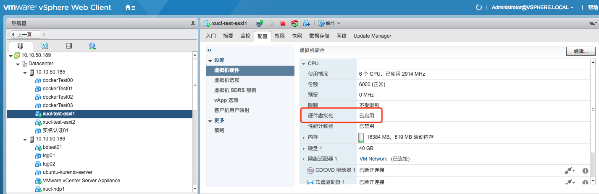
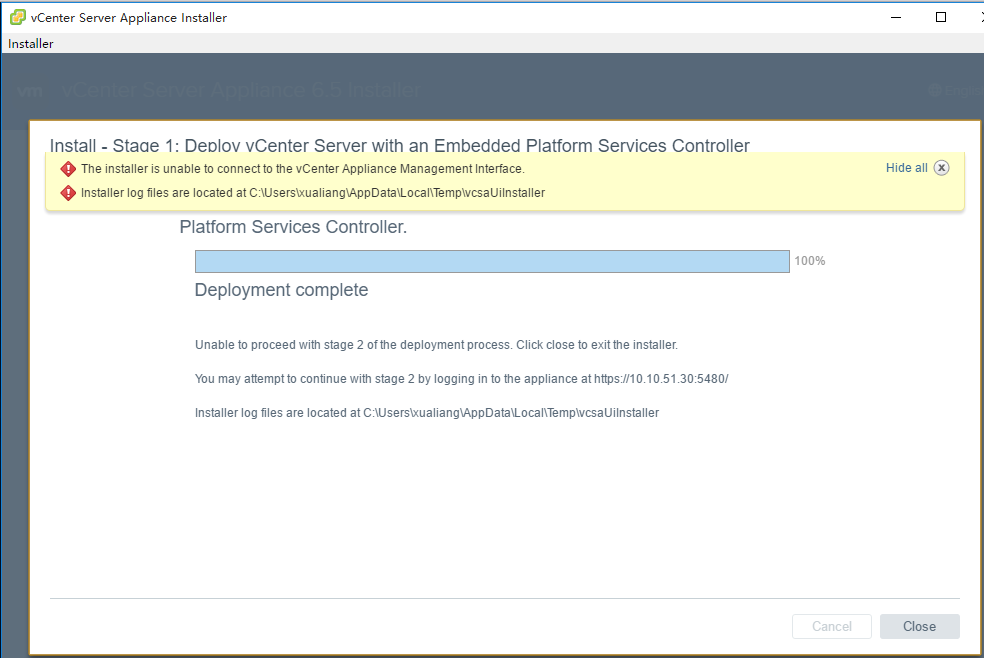
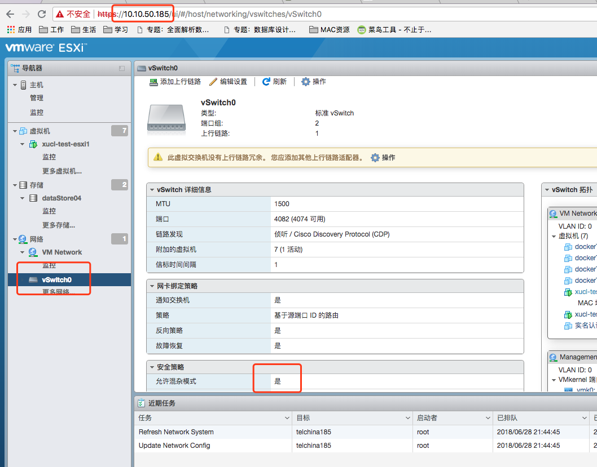

1、将ESXI6.5的iso文件挂载到服务器的光驱，一步一步安装完ESXI

2、按键F2设置ESXI的IP、hostname、网关、掩码等，关闭ip6

3、找一台Windows机器（只要能够联通ESXI服务器即可），将Vcenter的安装包上传到Windows，双击vcsa-ui-installer目录下的install，安装过程中指定一台ESXI的服务器即可

 

使用虚拟机模拟VCSA6.5安装的过程中，报错问题：

1、安装进行至80%时，报错：**Task failed on server: Module 'CPUID' power on failed.**

原因：ESXI中嵌套运行ESXI（在ESXI虚拟机上安装Vcenter，因为Vcenter实际上就是一个预装了vcenter的suse虚拟机），需要开启ESXI虚拟机的CPU虚拟化，如下：

 

 

解决了问题1后，重新安装vcenter，安装至100%后，报错如下，vcenter的IP10.10.51.30无法ping通

 

The installer is unable to connect to the vCenter Appliance Management Interface.

Installer log files are located at C:\Users\xualiang\AppData\Local\Temp\vcsaUiInstaller

 

解决方法：登录http://10.10.50.185，网络设置中修改vswitch0的安全模式为混杂模式，之后能够ping通vcenter的IP。属于虚拟机嵌套的网络设置问题。需要设置185的原因：vcenter安装到10.10.51.36ESXI上，而36安装到了185上。如下：

 

