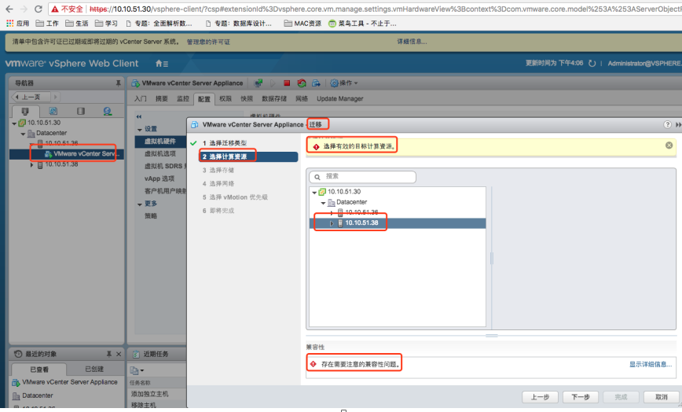
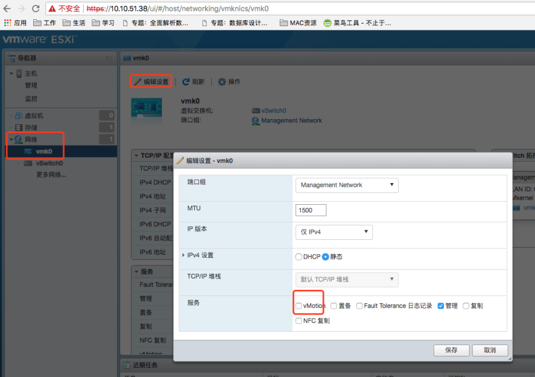

## Vcenter中迁移虚拟机时提示vmotion未配置或配置错误

将一个虚拟机从Vcenter中的一台ESXI服务器迁移至到另外一台ESXI服务器时，报错：提示：源和目标的vmotion未配置

解决办法：分别登录源ESXI和目标ESXI的管理界面，进行如下设置：

参考资料： <https://blog.csdn.net/kepa520/article/details/50405582>