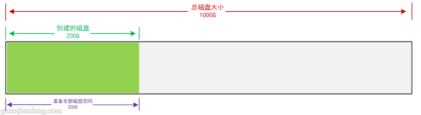
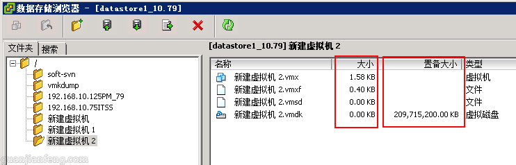

在VMware vSphere中，不管是以前的5.1版本，或者是现在的6.5版本，创建虚拟机时，在创建磁盘时，都会让选择磁盘的置备类型，如下图所示，分为：

**（1）厚置备延迟置零； （2）厚置备置零； （3）Thin Provision（精简置备）。**

在创建虚拟机时，可以选择这三种类型的其中一种，如下图所示

这三种类型的磁盘，每一种类型的磁盘创建的方式和磁盘性能都有所不同，具体解释如下。

**1、厚置备延迟置零**

举例，如下图，本次创建的磁盘为200GB大小，如果选择厚置备延迟置零，VMware会在整个磁盘中划分一个200GB的空间专用于此虚拟机，故会创建一个200GB的vmdk文件，但由于是延迟置零，故假如目前只用到了50G空间，VMware会先zero（置零）这50G空间，后面150G空间会等到用到的时候再zero（置零），这种工作机制会对磁盘性能造成一定的影响。

创建完虚拟机后VMware创建的200GB vmdk文件，如下图

示意图：

**2、厚置备置零**

举例，如下图，本次创建的磁盘为200GB大小，如果选择厚置备置零，VMware会在整个磁盘中划分一个200GB的空间专用于此虚拟机，故会创建一个200GB的vmdk文件，由于是置零模式，故VMware会将这200GB的空间全部进行zero（置零）工作，故创建磁盘时比其它两种模式花的时间都要长，这种机制的磁盘的性能是最好的，因为这就好像是给虚拟机挂载了一块独立的硬盘，硬盘上的空间也全部属于该虚拟机，且提前也都已经格式化好，后期不管随着数据怎么增长，都可以直接使用这200G的空间，没有zero（置零）的操作了。

示意图：

**4、Thin Provision（精简置备）**

举例，如下图，本次创建的磁盘为200GB大小，如果选择Thin Provision（精科置备），VMware会在整个磁盘中划分一个200GB的置备空间，但此200GB没有从整个磁盘中真正划出来，它的vmdk文件在虚拟机刚创建时可能为0KB，以后随着虚拟机的使用空间越来越大，再给它划分更多的空间，直至200GB全部给这虚拟机。就好像是给虚拟机挂载了一块空间会不断变化的硬盘，开始很小，后期会根据你的使用情况不断的增长空间。

故选择精简置备时，有个好处是，可以创建更多的虚拟机，如创建10个虚拟机，每个虚拟机创建（置备）了200GB空间，那就是2000GB，但整个磁盘可能只有1000GB，但也能成功创建，因为置备的2000G，VMware没有真正给每个虚拟机200G，而是在以后不断的使用中慢慢增长至200G，所以选择精简模式，很容易出现整个磁盘卷空间爆满的情况，导致虚拟机运行不正常。

示意图：

根据这三种类型的磁盘的了解，磁盘的性能排序应该是：**厚置备置零>厚置备延迟置零>Thic Provision（精科置备）。**

厚置备置零和厚置备延迟置零对磁盘空间的使用最快，Thic Provision（精科置备）最节省磁盘空间，但也容易出现磁盘“爆仓”的危险。