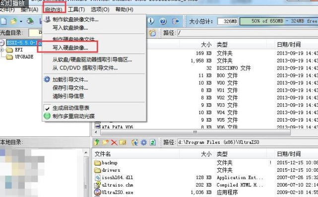
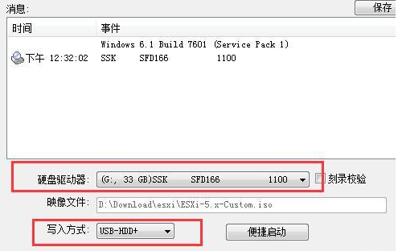
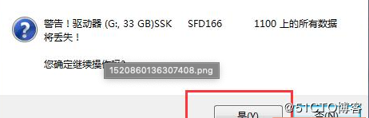
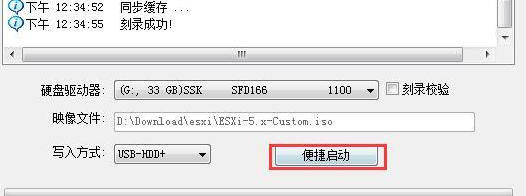
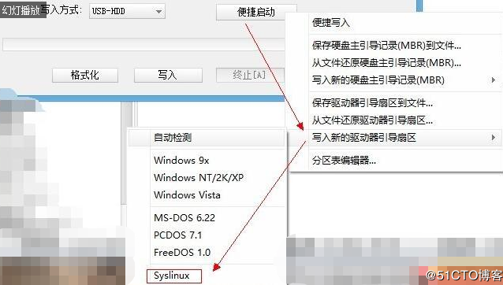
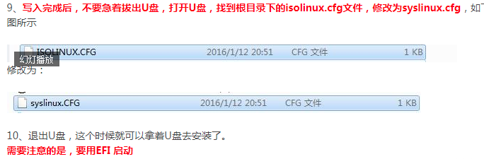

**#**需要注意的是，如果是安装提示找不到网卡、或者找不到硬盘等不是U盘启动导致的（你用光盘一样会报错），因为是ESXi 对硬件的兼容性的问题，可参考官网的兼容性指引：

<http://www.vmware.com/resources/compatibility/search.php>

\#因为每个厂商都有各自定制ISO，例如 HP Dell  Lenovo 这些厂商直接可以在[vmware官网](http://www.vmware.com/)下载到现成的ISO，不需要直接封装刻录。

\#如果你能找到相对应驱动，可以自己做一个ISO，用这个工具ESXi-Customizer，可自行搜索制作。

**#**例如realtek 8169的网卡在 ESXi 5.5 ESXi 6.0是不识别的，通过以上ESXi-Customizer+驱动，自行封装一个ISO并刻录

1、用UltraISO 工具制作U盘启动

2、按照下图红色框点选操作

3、选择需要刻录的目标U盘 盘符，写入格式为 USB-HDD+ 也可以是USB-HDD

4、写入会格式化U盘，所以如果不是空U盘请备份资料后再操作，制作完成后，原有U盘内容可以拷贝回去

5、刻录完成

6、**刻录完成后不要忙着关掉和拔出U盘，下面这个步骤非常重要，如果不执行，U盘是没有引导的，在安装的设备上回提示找不到启动项**

7、点击便捷启动

