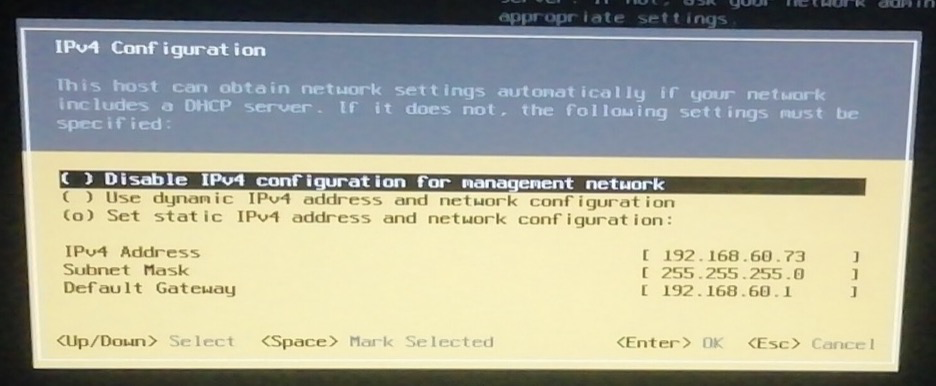
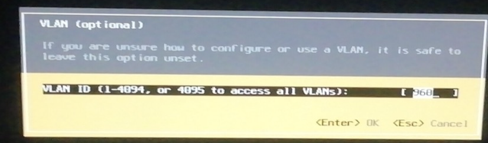
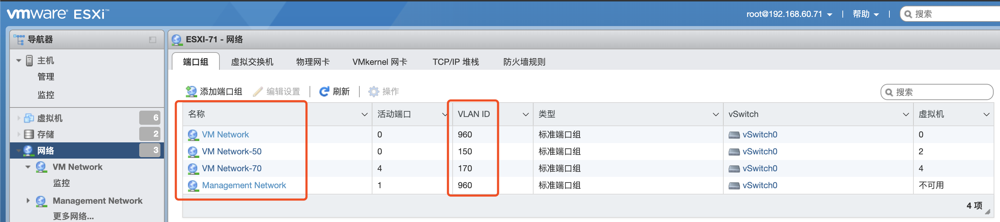
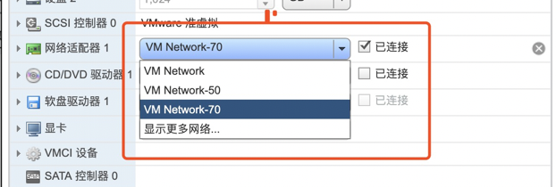

场景：公司要求在虚拟桌面内开发，所以需要将之前游离在虚拟桌面网络外面的服务器切换到虚拟桌面内部网络（从50段切换到70段，50段包括51段，70段包括71段）。我们有一套VMware虚拟化平台需要切换，如下：

四台ESXI6.5物理机：

10.10.50.185

10.10.50.186

10.10.50.187

10.10.50.188

VCenter：10.10.50.189

虚拟机：若干，其中部分需要切换到70段，用于虚拟桌面内日常开发；另一部分保持50段，用于个人在虚拟桌面外测试学习等。

工作步骤：

1. 登录到华为交换机（物理机连接的那台交换机）后台，使用命令创建VLAN960

2. 进入机房检查服务器连接到了交换机的几号端口上，然后通过交换机后台命令，将端口加入到VLAN960

3. 进入机房，主机接上显示器，设置ESXI的IP、网关、掩码、VLAN、主机名，如下：

   

   

4. 在ESXI管理界面中设置**Management Network**、**VM Network**的VLAN ID 为960，其中**Management Network**为物理主机使用的网络，VM Network是为VCenter使用的，因为VCenter需要和ESXI物理主机的IP地址段一致，但由于VCenter也是一台虚拟机，而虚拟机是不能使用**Management Network**的。添加**VM Network-50**和**VM Network-70**两个VLAN，150和170这两个vlanId公司一直存在。

5. 修改每台虚拟机的网络，需要在虚拟桌面内访问的设置为VM Network-70，需要在外部访问的设置为VM Network-50，如下：

   

6. 修改虚拟机的IP，分别设置为51段（和50段是一个子网）或71段(和70段是一个子网)

7. 修改VCenter的IP，在VCenter的虚拟机维护界面80端口和管理界面5480端口，均未找到修改IP的解决办法

8. 由于没有修改VCenterIP成功，所以使用旧地址将旧的ESXI主机移除，重新添加修改了IP地址后的ESXI主机，但是，在添加VCenter本身所在的那台ESXI主机时报错：datastore02冲突，最终未能解决，于是重新安装了一个VCenter，然后将新的ESXI主机添加进去。

   

   在修改VCenter这台虚拟机的IP时遇到问题：

   1. VCenter管理界面的默认端口为：5480，https://192.168.60.70:5480，默认用户名为root，密码忘记了，通过linux忘记密码的解决方法重置了密码。
   2. 通过5480管理界面修改了DNS、时钟服务器，但是无法重新设置IP
   3. 

   