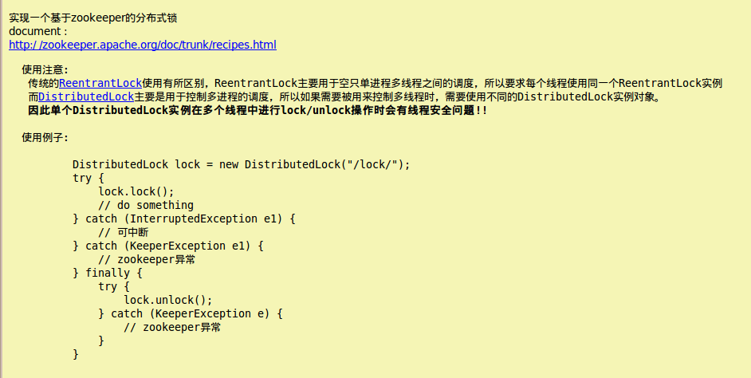

## 【Zookeeper系列四】ZooKeeper 分布式锁实现 - 陶邦仁的个人空间 - 开源中国

\#1 场景描述# 在分布式应用, 往往存在多个进程提供同一服务. 这些进程有可能在相同的机器上, 也有可能分布在不同的机器上. `如果这些进程共享了一些资源, 可能就需要分布式锁来锁定对这些资源的访问`。

\#2 思路# 进程需要访问共享数据时, `就在"/locks"节点下创建一个sequence类型的子节点, 称为thisPath`. **当thisPath在所有子节点中最小时, 说明该进程获得了锁. 进程获得锁之后, 就可以访问共享资源了. 访问完成后, 需要将thisPath删除. 锁由新的最小的子节点获得.**

有了清晰的思路之后, 还需要补充一些细节. 进程如何知道thisPath是所有子节点中最小的呢? `可以在创建的时候, 通过getChildren方法获取子节点列表, 然后在列表中找到排名比thisPath前1位的节点, 称为waitPath, 然后在waitPath上注册监听, 当waitPath被删除后, 进程获得通知, 此时说明该进程获得了锁.`

\#3 算法#

1. **lock操作过程：**

首先为一个lock场景，在zookeeper中指定对应的一个根节点，用于记录资源竞争的内容；

每个lock创建后，会lazy在zookeeper中创建一个node节点，表明对应的资源竞争标识。 (小技巧：`node节点为EPHEMERAL_SEQUENTIAL，自增长的临时节点`)；

进行lock操作时，获取对应lock根节点下的所有子节点，也即处于竞争中的资源标识；

按照`Fair（公平）竞争`的原则，按照对应的自增内容做排序，取出编号最小的一个节点做为lock的owner，判断自己的节点id是否就为owner id，如果是则返回，lock成功。

如果自己非owner id，按照排序的结果`找到序号比自己前一位的id，关注它锁释放的操作(也就是exist watcher)，形成一个链式的触发过程`；

1. **unlock操作过程：**

`将自己id对应的节点删除即可，对应的下一个排队的节点就可以收到Watcher事件，从而被唤醒得到锁后退出`；

1. **其中的几个关键点：**

node节点选择为EPHEMERAL_SEQUENTIAL很重要。

`自增长的特性，可以方便构建一个基于Fair特性的锁`，前一个节点唤醒后一个节点，形成一个链式的触发过程。`可以有效的避免"惊群效应"(一个锁释放，所有等待的线程都被唤醒)`，有针对性的唤醒，提升性能。

`选择一个EPHEMERAL临时节点的特性`。因为和zookeeper交互是一个网络操作，不可控因素过多，比如网络断了，上一个节点释放锁的操作会失败。临时节点是和对应的session挂接的，`session一旦超时或者异常退出其节点就会消失，类似于ReentrantLock中等待队列Thread的被中断处理`。

`获取lock操作是一个阻塞的操作，而对应的Watcher是一个异步事件`，所以需要使用`互斥信号共享锁BooleanMutex进行通知`，可以比较方便的解决锁重入的问题。(锁重入可以理解为多次读操作，锁释放为写抢占操作)

1. **注意：**

使用EPHEMERAL会引出一个风险：在非正常情况下，`网络延迟比较大会出现session timeout，zookeeper就会认为该client已关闭，从而销毁其id标示，竞争资源的下一个id就可以获取锁`。这时`可能会有两个process同时拿到锁在跑任务`，所以设置好session timeout很重要。

同样`使用PERSISTENT同样会存在一个死锁的风险，进程异常退出后，对应的竞争资源id一直没有删除，下一个id一直无法获取到锁对象`。

\#4 实现# **1. DistributedLock.java源码：分布式锁**

```
package com.king.lock;

import java.io.IOException;
import java.util.List;
import java.util.SortedSet;
import java.util.TreeSet;

import org.apache.commons.lang3.StringUtils;
import org.apache.zookeeper.*;
import org.apache.zookeeper.data.Stat;

/**
 * Zookeeper 分布式锁
 */
public class DistributedLock {

	private static final int SESSION_TIMEOUT = 10000;

	private static final int DEFAULT_TIMEOUT_PERIOD = 10000;

	private static final String CONNECTION_STRING = "127.0.0.1:2180,127.0.0.1:2181,127.0.0.1:2182,127.0.0.1:2183";

	private static final byte[] data = {0x12, 0x34};

	private ZooKeeper zookeeper;

	private String root;

	private String id;

	private LockNode idName;

	private String ownerId;

	private String lastChildId;

	private Throwable other = null;

	private KeeperException exception = null;

	private InterruptedException interrupt = null;

	public DistributedLock(String root) {
		try {
			this.zookeeper = new ZooKeeper(CONNECTION_STRING, SESSION_TIMEOUT, null);
			this.root = root;
			ensureExists(root);
		} catch (IOException e) {
			e.printStackTrace();
			other = e;
		}
	}

	/**
	 * 尝试获取锁操作，阻塞式可被中断
	 */
	public void lock() throws Exception {
		// 可能初始化的时候就失败了
		if (exception != null) {
			throw exception;
		}

		if (interrupt != null) {
			throw interrupt;
		}

		if (other != null) {
			throw new Exception("", other);
		}

		if (isOwner()) {// 锁重入
			return;
		}

		BooleanMutex mutex = new BooleanMutex();
		acquireLock(mutex);
		// 避免zookeeper重启后导致watcher丢失，会出现死锁使用了超时进行重试
		try {
//			mutex.lockTimeOut(DEFAULT_TIMEOUT_PERIOD, TimeUnit.MICROSECONDS);// 阻塞等待值为true
			mutex.lock();
		} catch (Exception e) {
			e.printStackTrace();
			if (!mutex.state()) {
				lock();
			}
		}

		if (exception != null) {
			throw exception;
		}

		if (interrupt != null) {
			throw interrupt;
		}

		if (other != null) {
			throw new Exception("", other);
		}
	}

	/**
	 * 尝试获取锁对象, 不会阻塞
	 *
	 * @throws InterruptedException
	 * @throws KeeperException
	 */
	public boolean tryLock() throws Exception {
		// 可能初始化的时候就失败了
		if (exception != null) {
			throw exception;
		}

		if (isOwner()) { // 锁重入
			return true;
		}

		acquireLock(null);

		if (exception != null) {
			throw exception;
		}

		if (interrupt != null) {
			Thread.currentThread().interrupt();
		}

		if (other != null) {
			throw new Exception("", other);
		}

		return isOwner();
	}

	/**
	 * 释放锁对象
	 */
	public void unlock() throws KeeperException {
		if (id != null) {
			try {
				zookeeper.delete(root + "/" + id, -1);
			} catch (InterruptedException e) {
				Thread.currentThread().interrupt();
			} catch (KeeperException.NoNodeException e) {
				// do nothing
			} finally {
				id = null;
			}
		} else {
			//do nothing
		}
	}

	/**
	 * 判断某path节点是否存在，不存在就创建
	 * @param path
	 */
	private void ensureExists(final String path) {
		try {
			Stat stat = zookeeper.exists(path, false);
			if (stat != null) {
				return;
			}
			zookeeper.create(path, data, ZooDefs.Ids.OPEN_ACL_UNSAFE, CreateMode.PERSISTENT);
		} catch (KeeperException e) {
			exception = e;
		} catch (InterruptedException e) {
			Thread.currentThread().interrupt();
			interrupt = e;
		}
	}

	/**
	 * 返回锁对象对应的path
	 */
	public String getRoot() {
		return root;
	}

	/**
	 * 判断当前是不是锁的owner
	 */
	public boolean isOwner() {
		return id != null && ownerId != null && id.equals(ownerId);
	}

	/**
	 * 返回当前的节点id
	 */
	public String getId() {
		return this.id;
	}

	// ===================== helper method =============================

	/**
	 * 执行lock操作，允许传递watch变量控制是否需要阻塞lock操作
	 */
	private Boolean acquireLock(final BooleanMutex mutex) {
		try {
			do {
				if (id == null) { // 构建当前lock的唯一标识
					long sessionId = zookeeper.getSessionId();
					String prefix = "x-" + sessionId + "-";
					// 如果第一次，则创建一个节点
					String path = zookeeper.create(root + "/" + prefix, data, ZooDefs.Ids.OPEN_ACL_UNSAFE, CreateMode.EPHEMERAL_SEQUENTIAL);
					int index = path.lastIndexOf("/");
					id = StringUtils.substring(path, index + 1);
					idName = new LockNode(id);
				}

				if (id != null) {
					List<String> names = zookeeper.getChildren(root, false);
					if (names.isEmpty()) {
						id = null; // 异常情况，重新创建一个
					} else {
						// 对节点进行排序
						SortedSet<LockNode> sortedNames = new TreeSet<>();
						for (String name : names) {
							sortedNames.add(new LockNode(name));
						}

						if (!sortedNames.contains(idName)) {
							id = null;// 清空为null，重新创建一个
							continue;
						}

						// 将第一个节点做为ownerId
						ownerId = sortedNames.first().getName();
						if (mutex != null && isOwner()) {
							mutex.unlock();// 直接更新状态，返回
							return true;
						} else if (mutex == null) {
							return isOwner();
						}

						SortedSet<LockNode> lessThanMe = sortedNames.headSet(idName);
						if (!lessThanMe.isEmpty()) {
							// 关注一下排队在自己之前的最近的一个节点
							LockNode lastChildName = lessThanMe.last();
							lastChildId = lastChildName.getName();
							// 异步watcher处理
							Stat stat = zookeeper.exists(root + "/" + lastChildId, new Watcher() {
								public void process(WatchedEvent event) {
									acquireLock(mutex);
								}
							});

							if (stat == null) {
								acquireLock(mutex);// 如果节点不存在，需要自己重新触发一下，watcher不会被挂上去
							}
						} else {
							if (isOwner()) {
								mutex.unlock();
							} else {
								id = null;// 可能自己的节点已超时挂了，所以id和ownerId不相同
							}
						}
					}
				}
			} while (id == null);
		} catch (KeeperException e) {
			exception = e;
			if (mutex != null) {
				mutex.unlock();
			}
		} catch (InterruptedException e) {
			interrupt = e;
			if (mutex != null) {
				mutex.unlock();
			}
		} catch (Throwable e) {
			other = e;
			if (mutex != null) {
				mutex.unlock();
			}
		}

		if (isOwner() && mutex != null) {
			mutex.unlock();
		}
		return Boolean.FALSE;
	}
}
```

**2. BooleanMutex.java源码：互斥信号共享锁**

```
package com.king.lock;

import java.util.concurrent.TimeUnit;
import java.util.concurrent.TimeoutException;
import java.util.concurrent.locks.AbstractQueuedSynchronizer;

/**
 * 互斥信号共享锁
 */
public class BooleanMutex {

	private Sync sync;

	public BooleanMutex() {
		sync = new Sync();
		set(false);
	}

	/**
	 * 阻塞等待Boolean为true
	 * @throws InterruptedException
	 */
	public void lock() throws InterruptedException {
		sync.innerLock();
	}

	/**
	 * 阻塞等待Boolean为true,允许设置超时时间
	 * @param timeout
	 * @param unit
	 * @throws InterruptedException
	 * @throws TimeoutException
	 */
	public void lockTimeOut(long timeout, TimeUnit unit) throws InterruptedException, TimeoutException {
		sync.innerLock(unit.toNanos(timeout));
	}

	public void unlock(){
		set(true);
	}

	/**
	 * 重新设置对应的Boolean mutex
	 * @param mutex
	 */
	public void set(Boolean mutex) {
		if (mutex) {
			sync.innerSetTrue();
		} else {
			sync.innerSetFalse();
		}
	}

	public boolean state() {
		return sync.innerState();
	}

	/**
	 * 互斥信号共享锁
	 */
	private final class Sync extends AbstractQueuedSynchronizer {
		private static final long serialVersionUID = -7828117401763700385L;

		/**
		 * 状态为1，则唤醒被阻塞在状态为FALSE的所有线程
		 */
		private static final int TRUE = 1;
		/**
		 * 状态为0，则当前线程阻塞，等待被唤醒
		 */
		private static final int FALSE = 0;

		/**
		 * 返回值大于0，则执行；返回值小于0，则阻塞
		 */
		protected int tryAcquireShared(int arg) {
			return getState() == 1 ? 1 : -1;
		}

		/**
		 * 实现AQS的接口，释放共享锁的判断
		 */
		protected boolean tryReleaseShared(int ignore) {
			// 始终返回true，代表可以release
			return true;
		}

		private boolean innerState() {
			return getState() == 1;
		}

		private void innerLock() throws InterruptedException {
			acquireSharedInterruptibly(0);
		}

		private void innerLock(long nanosTimeout) throws InterruptedException, TimeoutException {
			if (!tryAcquireSharedNanos(0, nanosTimeout))
				throw new TimeoutException();
		}

		private void innerSetTrue() {
			for (;;) {
				int s = getState();
				if (s == TRUE) {
					return; // 直接退出
				}
				if (compareAndSetState(s, TRUE)) {// cas更新状态，避免并发更新true操作
					releaseShared(0);// 释放一下锁对象，唤醒一下阻塞的Thread
				}
			}
		}

		private void innerSetFalse() {
			for (;;) {
				int s = getState();
				if (s == FALSE) {
					return; //直接退出
				}
				if (compareAndSetState(s, FALSE)) {//cas更新状态，避免并发更新false操作
					setState(FALSE);
				}
			}
		}
	}
}
```

**3. 相关说明：**



**4. 测试类：**

```
package com.king.lock;

import java.util.concurrent.CountDownLatch;
import java.util.concurrent.ExecutorService;
import java.util.concurrent.Executors;

import org.apache.zookeeper.KeeperException;

/**
 * 分布式锁测试
 * @author taomk
 * @version 1.0
 * @since 15-11-19 上午11:48
 */
public class DistributedLockTest {

	public static void main(String [] args) {
		ExecutorService executor = Executors.newCachedThreadPool();
		final int count = 50;
		final CountDownLatch latch = new CountDownLatch(count);
		for (int i = 0; i < count; i++) {
			final DistributedLock node = new DistributedLock("/locks");
			executor.submit(new Runnable() {
				public void run() {
					try {
						Thread.sleep(1000);
//						node.tryLock(); // 无阻塞获取锁
						node.lock(); // 阻塞获取锁
						Thread.sleep(100);

						System.out.println("id: " + node.getId() + " is leader: " + node.isOwner());
					} catch (InterruptedException e) {
						e.printStackTrace();
					} catch (KeeperException e) {
						e.printStackTrace();
					} catch (Exception e) {
						e.printStackTrace();
					} finally {
						latch.countDown();
						try {
							node.unlock();
						} catch (KeeperException e) {
							e.printStackTrace();
						}
					}

				}
			});
		}

		try {
			latch.await();
		} catch (InterruptedException e) {
			e.printStackTrace();
		}

		executor.shutdown();
	}
}
```

**控制台输出：**

```
id: x-239027745716109354-0000000248 is leader: true
id: x-22854963329433645-0000000249 is leader: true
id: x-22854963329433646-0000000250 is leader: true
id: x-166970151413415997-0000000251 is leader: true
id: x-166970151413415998-0000000252 is leader: true
id: x-166970151413415999-0000000253 is leader: true
id: x-166970151413416000-0000000254 is leader: true
id: x-166970151413416001-0000000255 is leader: true
id: x-166970151413416002-0000000256 is leader: true
id: x-22854963329433647-0000000257 is leader: true
id: x-239027745716109355-0000000258 is leader: true
id: x-166970151413416003-0000000259 is leader: true
id: x-94912557367427124-0000000260 is leader: true
id: x-22854963329433648-0000000261 is leader: true
id: x-239027745716109356-0000000262 is leader: true
id: x-239027745716109357-0000000263 is leader: true
id: x-166970151413416004-0000000264 is leader: true
id: x-239027745716109358-0000000265 is leader: true
id: x-239027745716109359-0000000266 is leader: true
id: x-22854963329433649-0000000267 is leader: true
id: x-22854963329433650-0000000268 is leader: true
id: x-94912557367427125-0000000269 is leader: true
id: x-22854963329433651-0000000270 is leader: true
id: x-94912557367427126-0000000271 is leader: true
id: x-239027745716109360-0000000272 is leader: true
id: x-94912557367427127-0000000273 is leader: true
id: x-94912557367427128-0000000274 is leader: true
id: x-166970151413416005-0000000275 is leader: true
id: x-94912557367427129-0000000276 is leader: true
id: x-166970151413416006-0000000277 is leader: true
id: x-94912557367427130-0000000278 is leader: true
id: x-94912557367427131-0000000279 is leader: true
id: x-239027745716109361-0000000280 is leader: true
id: x-239027745716109362-0000000281 is leader: true
id: x-166970151413416007-0000000282 is leader: true
id: x-94912557367427132-0000000283 is leader: true
id: x-22854963329433652-0000000284 is leader: true
id: x-166970151413416008-0000000285 is leader: true
id: x-239027745716109363-0000000286 is leader: true
id: x-239027745716109364-0000000287 is leader: true
id: x-166970151413416009-0000000288 is leader: true
id: x-166970151413416010-0000000289 is leader: true
id: x-239027745716109365-0000000290 is leader: true
id: x-94912557367427133-0000000291 is leader: true
id: x-239027745716109366-0000000292 is leader: true
id: x-94912557367427134-0000000293 is leader: true
id: x-22854963329433653-0000000294 is leader: true
id: x-94912557367427135-0000000295 is leader: true
id: x-239027745716109367-0000000296 is leader: true
id: x-239027745716109368-0000000297 is leader: true
```

\#5 升级版# 实现了一个分布式lock后，可以解决多进程之间的同步问题，但设计多线程+多进程的lock控制需求，`单jvm中每个线程都和zookeeper进行网络交互成本就有点高了`，所以基于DistributedLock，实现了一个分布式二层锁。

**大致原理就是ReentrantLock 和 DistributedLock的一个结合：**

1. `单jvm的多线程竞争时，首先需要先拿到第一层的ReentrantLock的锁`；
2. `拿到锁之后这个线程再去和其他JVM的线程竞争锁，最后拿到之后锁之后就开始处理任务`；

锁的释放过程是一个反方向的操作，`先释放DistributedLock，再释放ReentrantLock`。 可以思考一下，如果先释放ReentrantLock，假如这个`JVM ReentrantLock竞争度比较高，一直其他JVM的锁竞争容易被饿死`。

**1. DistributedReentrantLock.java源码：多进程+多线程分布式锁**

```
package com.king.lock;

import java.text.MessageFormat;
import java.util.concurrent.locks.ReentrantLock;

import org.apache.zookeeper.KeeperException;

/**
 * 多进程+多线程分布式锁
 */
public class DistributedReentrantLock extends DistributedLock {

	private static final String ID_FORMAT = "Thread[{0}] Distributed[{1}]";
	private ReentrantLock reentrantLock = new ReentrantLock();

	public DistributedReentrantLock(String root) {
		super(root);
	}

	public void lock() throws Exception {
		reentrantLock.lock();//多线程竞争时，先拿到第一层锁
		super.lock();
	}

	public boolean tryLock() throws Exception {
		//多线程竞争时，先拿到第一层锁
		return reentrantLock.tryLock() && super.tryLock();
	}

	public void unlock() throws KeeperException {
		super.unlock();
		reentrantLock.unlock();//多线程竞争时，释放最外层锁
	}

	@Override
	public String getId() {
		return MessageFormat.format(ID_FORMAT, Thread.currentThread().getId(), super.getId());
	}

	@Override
	public boolean isOwner() {
		return reentrantLock.isHeldByCurrentThread() && super.isOwner();
	}
}
```

**2. 测试代码：**

```
package com.king.lock;

import java.util.concurrent.CountDownLatch;
import java.util.concurrent.ExecutorService;
import java.util.concurrent.Executors;

import org.apache.zookeeper.KeeperException;

/**
 * @author taomk
 * @version 1.0
 * @since 15-11-23 下午12:15
 */
public class DistributedReentrantLockTest {

	public static void main(String [] args) {
		ExecutorService executor = Executors.newCachedThreadPool();
		final int count = 50;
		final CountDownLatch latch = new CountDownLatch(count);

		final DistributedReentrantLock lock = new DistributedReentrantLock("/locks"); //单个锁
		for (int i = 0; i < count; i++) {
			executor.submit(new Runnable() {
				public void run() {
					try {
						Thread.sleep(1000);
						lock.lock();
						Thread.sleep(100);

						System.out.println("id: " + lock.getId() + " is leader: " + lock.isOwner());
					} catch (Exception e) {
						e.printStackTrace();
					} finally {
						latch.countDown();
						try {
							lock.unlock();
						} catch (KeeperException e) {
							e.printStackTrace();
						}
					}
				}
			});
		}

		try {
			latch.await();
		} catch (InterruptedException e) {
			e.printStackTrace();
		}

		executor.shutdown();
	}
}
```

\#6 最后# 其实再可以发散一下，`实现一个分布式的read/write lock`，也差不多就是这个理了。`大致思路：`

1. 竞争资源标示： `read_自增id , write_自增id`；
2. 首先按照自增id进行排序，`如果队列的前边都是read标识，对应的所有read都获得锁`。`如果队列的前边是write标识，第一个write节点获取锁`；
3. watcher监听： `read监听距离自己最近的一个write节点的exist`，`write监听距离自己最近的一个节点(read或者write节点)`；