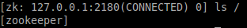

## 【Zookeeper系列一】Zookeeper应用介绍与安装部署 - 陶邦仁的个人空间 - 开源中国

\#1 Zookeeper概述# ZooKeeper是一个为分布式应用所设计的分布的、开源的协调服务，它主要是`用来解决分布式应用中经常遇到的一些数据管理问题，简化分布式应用协调及其管理的难度，提供高性能的分布式服务`。ZooKeeper本身可以`以Standalone模式安装运行`，不过`它的长处在于通过分布式ZooKeeper集群（一个Leader，多个Follower），基于一定的策略来保证ZooKeeper集群的稳定性和可用性，从而实现分布式应用的可靠性`。

在网上看到了一个很不错的关于ZooKeeper的介绍： `顾名思义动物园管理员`，他是拿来管大象(Hadoop) 、 蜜蜂(Hive) 、 小猪(Pig) 的管理员， Apache Hbase和 Apache Solr 以及LinkedIn sensei 等项目中都采用到了 Zookeeper。ZooKeeper是一个分布式的，开放源码的分布式应用程序协调服务，`ZooKeeper是以Fast Paxos算法为基础，实现同步服务，配置维护和命名服务等分布式应用`。

从介绍可以看出，`ZooKeeper更倾向于对大型应用的协同维护管理工作`。IBM则给出了IBM对ZooKeeper的认知： Zookeeper 分布式服务框架是 Apache Hadoop 的一个子项目，`它主要是用来解决分布式应用中经常遇到的一些数据管理问题，如：统一命名服务、状态同步服务、集群管理、分布式应用配置项的管理等`。

总之，我认为它的核心词就是`一个单词，协调`。

\#2 Zookeeper特征# 在Hadoop权威指南中看到了关于ZooKeeper的一些核心特征，阅读之后感觉总结的甚是精辟，在这里引用并总结。

\##2.1 简易## ZooKeeper的最重要核心就是`一个精简文件系统`，提供一些简单的操作以及附加的抽象（例如排序和通知）。

\##2.2 易表达## ZooKeeper的原型是一个丰富的集合，`它们是一些已建好的块，可以用来构建大型的协作数据结构和协议`，例如：分布式队列、分布式锁以及一组对等体的选举。

\##2.3 高可用性## ZooKeeper运行在一些集群上，被设计成可用性较高的，因此应用程序可以依赖它。`ZooKeeper可以帮助你的系统避免单点故障，从而建立一个可靠的应用程序`。

\##2.4 松散耦合## ZooKeeper的交互支持参与者之间并不了解对方。例如：ZooKeeper可以被当做一种公共的机制，使得进程彼此不知道对方的存在也可以相互发现并且交互，对等方可能甚至不是同步的。

这一特点我感觉最能体现在集群的部署启动过程中。像Hadoop当把配置文件写好之后，然后运行启动脚本，则251，241，242中作为集群的虚拟机是同步启动的，也就是DataNode，NameNode，TaskTracker，以及JobTracker的启动并运行时在一次启动过程中启动的，就是运行一次启动脚本文件，则都启动起来。但是ZooKeeper的启动过程却不是这样的。我在251，241，242部署了ZooKeeper集群，并进行启动，则启动的过程是这样的：`首先ssh到251然后启动，这时候251的集群节点启动起来，但是控制台一直报错，大概的含义就是没有检测到其他两个结点。接着分别ssh到241，242，分别启动集群中的剩下的结点，当241启动起来时，回到251查看，发现报错的信息减少，意思是只差一个结点。当251，241，242三台服务器的结点全部启动起来，则三台的服务器的控制台打印出正常的信息`。

\##2.5 一个库## ZooKeeper提供了一个开源的、共享的执行存储，以及通用协作的方法，分担了每个程序员写通用协议的负担。随着时间的推移，人们可以增加和改进这个库来满足自己的需求。

\#3 为什么使用Zookeeper# 记得在大约在2006年的时候Google出了Chubby来`解决分布一致性的问题(distributed consensus problem)`，所有集群中的服务器通过Chubby最终选出一个Master Server ，`最后这个Master Server来协调工作`。简单来说其原理就是：在一个分布式系统中，有一组服务器在运行同样的程序，它们需要确定一个Value，`以那个服务器提供的信息为主/为准，当这个服务器经过n/2+1的方式被选出来后`，所有的机器上的Process都会被通知到这个服务器就是主服务器 Master服务器，大家以他提供的信息为准。很想知道Google Chubby中的奥妙，可惜人家Google不开源，自家用。

但是在2009年3年以后沉默已久的Yahoo在Apache上推出了类似的产品ZooKeeper，并且在Google原有Chubby的设计思想上做了一些改进，因为`ZooKeeper并不是完全遵循Paxos协议`，而是基于自身设计并优化的一个`2 phase commit`的协议，如图所示：


ZooKeeper跟Chubby一样用来`存放一些相互协作的信息(Coordination)`，这些信息比较小一般不会超过1M，在zookeeper中是`以一种hierarchical tree的形式来存放，这些具体的Key/Value信息就store在tree node中`。

当有事件导致node数据，例如：变更，增加，删除时，`Zookeeper就会调用 triggerWatch方法，判断当前的path来是否有对应的监听者(watcher),如果有watcher，会触发其process方法，执行process方法中的业务逻辑`，如图：


\##3.1 应用实例## ZooKeeper有了上述的这些用途，让我们设想一下，在一个分布式系统中有这这样的一个应用：

2个任务工厂(Task Factory)一主一从，如果从的发现主的死了以后，从的就开始工作，他的工作就是向下面很多台代理(Agent)发送指令，让每台代理(Agent)获得不同的账户进行分布式并行计算，而每台代理(Agent)中将分配很多帐号，如果其中一台代理(Agent)死掉了，那么这台死掉的代理上的账户就不会继续工作了。上述，出现了3个最主要的问题：

1. Task Factory `主/从一致性的问题`；
2. Task Factory `主/从心跳如何用简单+稳定 或者2者折中的方式实现`；
3. 一台代理(Agent)死掉了以后，一部分的账户就无法继续工作，`需要通知所有在线的代理(Agent)重新分配一次帐号`；


OK，让我们想想ZooKeeper是不是能帮助我们去解决目前遇到的这3个最主要的问题呢？

1. 任务工厂Task Factory都连接到ZooKeeper上，创建节点，设置对这个节点进行监控，监控方法例如：

```
event= new WatchedEvent(EventType.NodeDeleted, KeeperState.SyncConnected, "/TaskFactory");
```

这个方法的意思就是`只要Task Factory与zookeeper断开连接后，这个节点就会被自动删除`。

1. `原来主的任务工厂断开了TCP连接，这个被创建的/TaskFactory节点就不存在了`，而且另外一个连接在上面的Task Factory可以立刻收到这个事件(Event)，知道这个节点不存在了，也就是说主TaskFactory死了。
2. `接下来另外一个活着的TaskFactory会再次创建/TaskFactory节点`，并且写入自己的ip到znode里面，作为新的标记。
3. 此时Agents也会知道主的TaskFactory不工作了，为了防止系统中大量的抛出异常，他们将会先把自己手上的事情做完，然后挂起，`等待收到Zookeeper上重新创建一个/TaskFactory节点，收到 EventType.NodeCreated 类型的事件将会继续工作`。
4. `原来从的TaskFactory 将自己变成一个主TaskFactory`，当系统管理员启动原来死掉的主的TaskFactory，世界又恢复平静了。
5. `如果一台代理死掉，其他代理他们将会先把自己手上的事情做完`，然后挂起，`向TaskFactory发送请求，TaskFactory会重新分配(sharding)帐户到每个Agent上了`，继续工作。

上述内容，大致如图所示：


\#4 Zookeeper基本知识# ##4.1 层次化的名字空间## `ZooKeeper的整个名字空间的结构是层次化的，和一般的Linux文件系统结构非常相似，一颗很大的树`。这也就是ZooKeeper的数据结构情况。名字空间的层次由斜杠/来进行分割，在名称空间里面的每一个结点的名字空间唯一由这个结点的路径来确定。

每一个节点拥有自身的一些信息，包括：`数据、数据长度、创建时间、修改时间等等`。从这样一类既含有数据，又作为路径表标示的节点的特点中，可以看出，`ZooKeeper的节点既可以被看做是一个文件，又可以被看做是一个目录，它同时具有二者的特点`。为了便于表达，今后我们将使用`Znode来表示所讨论的ZooKeeper节点`。

\##4.2 Znode## `Znode维护着数据、ACL（access control list，访问控制列表）、时间戳等交换版本号等数据结构`，它通过对这些数据的管理来让缓存生效并且令协调更新。每当Znode中的数据更新后它所维护的版本号将增加，这非常类似于数据库中计数器时间戳的操作方式。

另外`Znode还具有原子性操作的特点`：命名空间中，每一个Znode的数据将被原子地读写。读操作将读取与Znode相关的所有数据，写操作将替换掉所有的数据。除此之外，每一个节点都有一个访问控制列表，这个访问控制列表规定了用户操作的权限。

`ZooKeeper中同样存在临时节点`。这些节点与session同时存在，当session生命周期结束，这些临时节点也将被删除。临时节点在某些场合也发挥着非常重要的作用。

\##4.3 Watch机制## Watch机制就和单词本身的意思一样，看。看什么？具体来讲就是某一个或者一些Znode的变化。官方给出的定义：`一个Watch事件是一个一次性的触发器，当被设置了Watch的数据发生了改变的时候，则服务器将这个改变发送给设置了Watch的客户端，以便通知它们`。

**Watch机制主要有以下三个特点：**

1. 一次性的触发器（one-time trigger）

当数据改变的时候，那么一个Watch事件会产生并且被发送到客户端中。`但是客户端只会收到一次这样的通知`，如果以后这个数据再次发生改变的时候，之前设置Watch的客户端将不会再次收到改变的通知，`因为Watch机制规定了它是一个一次性的触发器`。

当设置监视的数据发生改变时，该监视事件会被发送到客户端，例如，如果客户端调用了 getData("/znode1", true) 并且稍后 /znode1 节点上的数据发生了改变或者被删除了，客户端将会获取到 /znode1 发生变化的监视事件，而`如果 /znode1 再一次发生了变化，除非客户端再次对 /znode1 设置监视，否则客户端不会收到事件通知`。

1. 发送给客户端（Sent to the client）

这个表明了`Watch的通知事件是从服务器发送给客户端的，是异步的，这就表明不同的客户端收到的Watch的时间可能不同`，但是ZooKeeper有保证：`当一个客户端在看到Watch事件之前是不会看到结点数据的变化的`。例如：A=3，此时在上面设置了一次Watch，如果A突然变成4了，那么客户端会先收到Watch事件的通知，然后才会看到A=4。

Zookeeper 客户端和服务端是通过 Socket 进行通信的，由于网络存在故障，所以监视事件很有可能不会成功地到达客户端，`监视事件是异步发送至监视者的`，Zookeeper 本身提供了保序性(ordering guarantee)：`即客户端只有首先看到了监视事件后，才会感知到它所设置监视的 znode 发生了变化`(a client will never see a change for which it has set a watch until it first sees the watch event). `网络延迟或者其他因素可能导致不同的客户端在不同的时刻感知某一监视事件，但是不同的客户端所看到的一切具有一致的顺序`。

1. 被设置Watch的数据（The data for which the watch was set）

这意味着 znode 节点本身具有不同的改变方式。你也可以想象 Zookeeper 维护了两条监视链表：`数据监视和子节点监视`(data watches and child watches) `getData() and exists() 设置数据监视`，`getChildren() 设置子节点监视`。 或者，你也可以想象 Zookeeper 设置的不同监视返回不同的数据，`getData() 和 exists() 返回 znode 节点的相关信息`，而 `getChildren() 返回子节点列表`。因此， `setData() 会触发设置在某一节点上所设置的数据监视(假定数据设置成功)`，而`一次成功的 create() 操作则会出发当前节点上所设置的数据监视以及父节点的子节点监视`。`一次成功的 delete() 操作将会触发当前节点的数据监视和子节点监视事件，同时也会触发该节点父节点的child watch`。

Zookeeper 中的监视是轻量级的，因此容易设置、维护和分发。`当客户端与 Zookeeper 服务器端失去联系时，客户端并不会收到监视事件的通知，只有当客户端重新连接后，若在必要的情况下，以前注册的监视会重新被注册并触发，对于开发人员来说 这通常是透明的`。只有一种情况会导致监视事件的丢失，即：`通过 exists() 设置了某个 znode 节点的监视，但是如果某个客户端在此 znode 节点被创建和删除的时间间隔内与 zookeeper 服务器失去了联系，该客户端即使稍后重新连接 zookeeper服务器后也得不到事件通知`。

\##4.4 ACL访问控制列表## 这是另外一个和Linux操作系统非常相似的地方，`ZooKeeper使用ACL来控制对旗下Znode结点们的访问`。ACL的实现和Linux文件系统的访问权限十分类似：`它通过设置权限为来表明是否允许对一个结点的相关内容的改变`。

但是与传统Linux机制不太相同，一个结点的数据没有类似“拥有者，组用户，其他用户”的概念，`在ZooKeeper中，ACL通过设置ID以及与其关联的权限来完成访问控制的`。ACL的权限组成语法是：

```
(scheme:expression, perms)
```

前者表明设置的ID，逗号后面表示的是ID相关的权限，例如：

```
(ip:172.16.16.1,READ)
```

指明了IP地址为如上的用户的权限为只读。

以下列举以下ACL所具有的权限：

```
CREATE：表明你可以创建一个Znode的子结点。
READ：你可以得到这个结点的数据以及列举该结点的子结点情况。
WRITE：设置一个结点的数据。
DELETE：可以删除一个结点
ADMIN：对一个结点设置权限。
```

\#5 Zookeeper部署# ZooKeeper的部署方式主要有三种，`单机模式、伪集群模式、集群模式`。其实剩下的两种模式都是集群模式的特殊情况。

\##5.1 系统环境## 

\##5.2 下载Zookeeper##

> 1. mkdir /home/taomk/zk 创建文件夹
> 2. cd /home/taomk/zk; wget <http://mirror.bit.edu.cn/apache/zookeeper/zookeeper-3.4.6/zookeeper-3.4.6.tar.gz> 下载
> 3. tar xvf zookeeper-3.4.6.tar.gz 解压缩
> 4. mv zookeeper-3.4.6 zookeeper346 重命名
> 5. cd zookeeper346; ls -l


\##5.3 配置环境变量##

```
export ZOOKEEPER_HOME=/home/taomk/zk/zookeeper346
export PATH=$PATH:$ZOOKEEPER_HOME/bin:$ZOOKEEPER_HOME/conf
```

\##5.4 ZooKeeper的单机模式部署## ZooKeeper的单机模式通常是用来快速测试客户端应用程序的，在实际过程中不可能是单机模式。单机模式的配置也比较简单。

1. **编写配置文件zoo.cfg**：ZooKeeper的运行`默认是读取zoo.cfg文件`里面的内容的。

```
～mkdir /home/taomk/zk/zoo/zk0
～cp conf/zoo_sample.cfg conf/zk0.cfg
～vim conf/zk0.cfg
tickTime=2000
initLimit=10
syncLimit=5
dataDir=/home/conan/zoo/zk0
clientPort=2181
```

在zk0.cfg这个文件中，我们需要`指定 dataDir 的值，它指向了一个目录，这个目录在开始的时候需要为空`。下面是每个参数的含义：

`tickTime ：基本事件单元，以毫秒为单位`。这个时间是作为 Zookeeper 服务器之间或客户端与服务器之间维持心跳的时间间隔，也就是每个 tickTime 时间就会发送一个心跳。

`dataDir ：存储内存中数据库快照的位置`，顾名思义就是 Zookeeper 保存数据的目录，`默认情况下，Zookeeper 将写数据的日志文件也保存在这个目录里`。

`clientPort ：这个端口就是客户端连接 Zookeeper 服务器的端口`，Zookeeper 会监听这个端口，接受客户端的访问请求。

使用单机模式时用户需要注意：`这种配置方式下没有 ZooKeeper 副本，所以如果 ZooKeeper 服务器出现故障， ZooKeeper 服务将会停止`。

1. **启动Zookeeper**

```
～bin/zkServer.sh start zk0.cfg
```


**zk的服务显示为QuorumPeerMain**：

```
～jps
5321 QuorumPeerMain
5338 Jps
```

**查看运行状态**：

```
～bin/zkServer.sh status zk0.cfg
JMX enabled by default
Using config: /home/taomk/zk/zookeeper346/bin/../conf/zk0.cfg
Mode: standalone
单节点的时，Mode会显示为standalone。
```

1. **停止ZooKeeper服务**

```
~ bin/zkServer.sh stop zk0.cfg
JMX enabled by default
Using config: /home/taomk/zk/zookeeper346/bin/../conf/zk0.cfg
Stopping zookeeper ... STOPPED
```

\##5.5 ZooKeeper的伪集群模式部署## 所谓 “伪分布式集群” 就是在，在一台PC中，启动多个ZooKeeper的实例。“完全分布式集群” 是每台PC，启动一个ZooKeeper实例。其实在企业中式不会存在的，另外为了测试一个客户端程序也没有必要存在，只有在物质条件比较匮乏的条件下才会存在的模式。`集群伪分布模式就是在单机下模拟集群的ZooKeeper服务，在一台机器上面有多个ZooKeeper的JVM同时运行`。

ZooKeeper的集群模式下，`多个Zookeeper服务器在工作前会选举出一个Leader`，在接下来的工作中这个被选举出来的Leader死了，而剩下的Zookeeper服务器会知道这个Leader死掉了，`在活着的Zookeeper集群中会继续选出一个Leader`，选举出Leader的目的是为了可以在分布式的环境中保证数据的一致性。

1. **确认集群服务器的数量**

由于ZooKeeper集群中，会有一个Leader负责管理和协调其他集群服务器，`因此服务器的数量通常都是单数`，例如3，5，7...等，`这样2n+1的数量的服务器就可以允许最多n台服务器的失效`。

1. **创建环境目录**

```
~ mkdir /home/taomk/zk/zoo/zk1
~ mkdir /home/taomk/zk/zoo/zk2
~ mkdir /home/taomk/zk/zoo/zk3

#新建myid文件
~ echo "1" > /home/taomk/zk/zoo/zk1/myid
~ echo "2" > /home/taomk/zk/zoo/zk2/myid
~ echo "3" > /home/taomk/zk/zoo/zk3/myid
```

1. **分别修改配置文件**

`修改`：dataDir,clientPort

`增加`：集群的实例，server.X，”X”表示每个目录中的myid的值

```
~ vim /home/taomk/zk/zookeeper346/conf/zk1.cfg
tickTime=2000
initLimit=10
syncLimit=5
dataDir=/home/taomk/zk/zoo/zk1
clientPort=2181
server.1=127.0.0.1:2888:3888
server.2=127.0.0.1:2889:3889
server.3=127.0.0.1:2890:3890

~ vim /home/taomk/zk/zookeeper346/conf/zk2.cfg
tickTime=2000
initLimit=10
syncLimit=5
dataDir=/home/taomk/zk/zoo/zk2
clientPort=2182
server.1=127.0.0.1:2888:3888
server.2=127.0.0.1:2889:3889
server.3=127.0.0.1:2890:3890

~ vim /home/taomk/zk/zookeeper346/conf/zk3.cfg
tickTime=2000
initLimit=10
syncLimit=5
dataDir=/home/taomk/zk/zoo/zk3
clientPort=2183
server.1=127.0.0.1:2888:3888
server.2=127.0.0.1:2889:3889
server.3=127.0.0.1:2890:3890
```

`initLimit`：这个配置项是用来配置 Zookeeper 接受客户端（这里所说的客户端不是用户连接 Zookeeper 服务器的客户端，`而是 Zookeeper 服务器集群中连接到 Leader 的 Follower 服务器`）`初始化连接时最长能忍受多少个心跳时间间隔数`。当已经超过 10 个心跳的时间（也就是 tickTime）长度后 Zookeeper 服务器还没有收到客户端的返回信息，那么表明这个客户端连接失败。总的时间长度就是 10*2000=20 秒。

`syncLimit`：这个配置项标识 Leader 与 Follower 之间发送消息，`请求和应答时间长度，最长不能超过多少个 tickTime 的时间长度`，总的时间长度就是 5*2000=10 秒。

`server.A=B：C：D`：其中 A 是一个数字，表示这个是第几号服务器，就是集群模式下配置的myid文件所存放的数值；B 是这个服务器的 ip 地址；C 表示的是这个服务器与集群中的 Leader 服务器交换信息的端口；D 表示的是万一集群中的 Leader 服务器挂了，需要一个端口来重新进行选举，选出一个新的 Leader，而`这个端口就是用来执行选举时服务器相互通信的端口`。`如果是伪集群的配置方式，由于 B 都是一样，所以不同的 Zookeeper 实例通信端口号不能一样，所以要给它们分配不同的端口号`。

由于三个服务都在同一台电脑上，因此这里要保证地址的唯一性，因此要特别注意IP地址和端口号不要互相冲突，以免影响程序的正确执行。

3个节点的ZooKeeper集群配置完成，接下来我们的启动服务。

1. **启动集群**

```
~ bin/zkServer.sh start zk1.cfg
~ bin/zkServer.sh start zk2.cfg
~ bin/zkServer.sh start zk3.cfg

~ jps
5422 QuorumPeerMain
5395 QuorumPeerMain
5463 QuorumPeerMain
5494 Jps

#查看节点状态
~ bin/zkServer.sh status zk1.cfg
JMX enabled by default
Using config: /home/taomk/zk/zookeeper346/bin/../conf/zk1.cfg
Mode: follower

~ bin/zkServer.sh status zk2.cfg
JMX enabled by default
Using config: /home/taomk/zk/zookeeper346/bin/../conf/zk2.cfg
Mode: leader

~ bin/zkServer.sh status zk3.cfg
JMX enabled by default
Using config: /home/taomk/zk/zookeeper346/bin/../conf/zk3.cfg
Mode: follower
```

1. **查看ZooKeeper物理文件目录结构**

```
~ tree -L 3 /home/taomk/zk/zoo
```


\##5.6 ZooKeeper Distributed模式## ZooKeeper分布式模式安装（ZooKeeper集群）也比较容易，这里说明一下基本要点。

首先要明确的是，`ZooKeeper集群是一个独立的分布式协调服务集群`，“独立”的含义就是说，如果想使用ZooKeeper实现分布式应用的协调与管理，简化协调与管理，任何分布式应用都可以使用，这就要`归功于Zookeeper的数据模型（Data Model）和层次命名空间（Hierarchical Namespace）结构`，在设计你的分布式应用协调服务时，首要的就是考虑如何组织层次命名空间。

下面说明分布式模式的安装配置，过程如下所示：

1. **第一步：主机名称到IP地址映射配置**

ZooKeeper集群中具有两个关键的角色：`Leader和Follower`。集群中所有的结点作为一个整体对分布式应用提供服务，集群中每个结点之间都互相连接，所以，在配置的ZooKeeper集群的时候，`每一个结点的host到IP地址的映射都要配置上集群中其它结点的映射信息`。

例如，ZooKeeper集群中每个结点的配置，以slave-01为例，/etc/hosts内容如下所示：

```
192.168.0.179   slave-01  
192.168.0.178   slave-02  
192.168.0.177   slave-03
```

ZooKeeper采用一种称为Leader election的选举算法。在整个集群运行过程中，只有一个Leader，其他的都是Follower，如果ZooKeeper集群在运行过程中Leader出了问题，系统会采用该算法重新选出一个Leader。因此，各个结点之间要能够保证互相连接，必须配置上述映射。

ZooKeeper集群启动的时候，会首先选出一个Leader，在Leader election过程中，某一个满足选举算法的结点就能成为Leader。

1. **第二步：修改ZooKeeper配置文件**

在其中一台机器（slave-01）上，解压缩zookeeper-3.3.4.tar.gz，修改配置文件conf/zoo.cfg，内容如下所示：

```
tickTime=2000  
dataDir=/home/hadoop/storage/zookeeper  
clientPort=2181  
initLimit=5  
syncLimit=2  
server.1=slave-01:2888:3888  
server.2=slave-02:2888:3888  
server.3=slave-03:2888:3888 
```

1. **第三步：远程复制分发安装文件**

上面已经在一台机器slave-01上配置完成ZooKeeper，现在可以将该配置好的安装文件远程拷贝到集群中的各个结点对应的目录下：

```
cd /home/hadoop/installation/  
scp -r zookeeper-3.3.4/ hadoop@slave-02:/home/hadoop/installation/  
scp -r zookeeper-3.3.4/ hadoop@slave-03:/home/hadoop/installation/
```

1. **第四步：设置myid**

在我们配置的dataDir指定的目录下面，创建一个myid文件，里面内容为一个数字，用来标识当前主机，conf/zoo.cfg文件中配置的server.X中X为什么数字，则myid文件中就输入这个数字，例如：

```
hadoop@slave-01:~/installation/zookeeper-3.3.4$ echo "1" > /home/hadoop/storage/zookeeper/myid  
hadoop@slave-02:~/installation/zookeeper-3.3.4$ echo "2" > /home/hadoop/storage/zookeeper/myid  
hadoop@slave-03:~/installation/zookeeper-3.3.4$ echo "3" > /home/hadoop/storage/zookeeper/myid 
```

1. **第五步：启动ZooKeeper集群**

在ZooKeeper集群的每个结点上，执行启动ZooKeeper服务的脚本，如下所示：

```
hadoop@slave-01:~/installation/zookeeper-3.3.4$ bin/zkServer.sh start  
hadoop@slave-02:~/installation/zookeeper-3.3.4$ bin/zkServer.sh start  
hadoop@slave-03:~/installation/zookeeper-3.3.4$ bin/zkServer.sh start
```

启动的顺序是slave-01>slave-02>slave-03，由于ZooKeeper集群启动的时候，每个结点都试图去连接集群中的其它结点，`先启动的肯定连不上后面还没启动的，所以日志前面部分的异常是可以忽略的`。通过后面部分可以看到，集群在选出一个Leader后，最后稳定了。其他结点可能也出现类似问题，属于正常。

\#6 Zookeeper命令行操作# ZooKeeper命令行工具类似于Linux的shell环境，不过功能肯定不及shell啦，但是使用它我们可以简单的对ZooKeeper进行访问，数据创建，数据修改等操作。

对于客户端来说，ZooKeeper是一个整体（ensemble），连接到ZooKeeper集群实际上感觉在独享整个集群的服务，所以，你可以在任何一个结点上建立到服务集群的连接。

当启动 ZooKeeper 服务成功之后，输入下述命令，连接到 ZooKeeper 服务：

```
~ bin/zkCli.sh –server 127.0.0.1:2181
```

连接成功后，系统会输出 ZooKeeper 的相关环境以及配置信息，并在屏幕输出“ Welcome to ZooKeeper ”等信息。

**命令行工具的一些简单操作如下：**

1. `使用 ls 命令来查看当前 ZooKeeper 中所包含的内容`：

```
ls /
```



1. `创建一个新的 znode` ，使用 create /zk myData 。这个命令创建了一个新的 znode 节点“ zk ”以及与它关联的字符串：

```
create /zk "myData"
```


1. `运行 get 命令来确认 znode` 是否包含我们所创建的字符串：

```
get /zk
```


1. 通过 `set 命令来对 zk 所关联的字符串进行设置`：

```
set /zk "zsl"
get /zk
```


1. `znode 删除`：

```
delete /zk
```

1. `通过help打印命令行帮助`：


1. `退出客户端连接`：

```
quit
```

\#7 Java编程现实命令行操作#

1. **ZkDemo.java** ：

```
public class ZkDemo {

    public static void main(String[] args) throws IOException, KeeperException, InterruptedException {
        // 创建一个与服务器的连接
        ZooKeeper zk = new ZooKeeper("127.0.0.1:2181", 60000, new Watcher() {
            // 监控所有被触发的事件
            public void process(WatchedEvent event) {
                System.out.println("EVENT:" + event.getType());
            }
        });

        // 查看根节点
        System.out.println("ls / => " + zk.getChildren("/", true));

        // 创建一个目录节点
        if (zk.exists("/node", true) == null) {
            zk.create("/node", "conan".getBytes(), Ids.OPEN_ACL_UNSAFE, CreateMode.PERSISTENT);
            System.out.println("create /node conan");
            // 查看/node节点数据
            System.out.println("get /node => " + new String(zk.getData("/node", false, null)));
            // 查看根节点
            System.out.println("ls / => " + zk.getChildren("/", true));
        }

        // 创建一个子目录节点
        if (zk.exists("/node/sub1", true) == null) {
            zk.create("/node/sub1", "sub1".getBytes(), Ids.OPEN_ACL_UNSAFE, CreateMode.PERSISTENT);
            System.out.println("create /node/sub1 sub1");
            // 查看node节点
            System.out.println("ls /node => " + zk.getChildren("/node", true));
        }

        // 修改节点数据
        if (zk.exists("/node", true) != null) {
            zk.setData("/node", "changed".getBytes(), -1);
            // 查看/node节点数据
            System.out.println("get /node => " + new String(zk.getData("/node", false, null)));
        }

        // 删除节点
        if (zk.exists("/node/sub1", true) != null) {
            zk.delete("/node/sub1", -1);
            zk.delete("/node", -1);
            // 查看根节点
            System.out.println("ls / => " + zk.getChildren("/", true));
        }

        // 关闭连接
        zk.close();
    }
}
```

1. **pom.xml，maven配置文件**：

```
<dependencies>
    <dependency>
        <groupId>org.apache.zookeeper</groupId>
        <artifactId>zookeeper</artifactId>
        <version>3.4.6</version>
        <exclusions>
            <exclusion>
                <groupId>javax.jms</groupId>
                <artifactId>jms</artifactId>
            </exclusion>
            <exclusion>
                <groupId>com.sun.jdmk</groupId>
                <artifactId>jmxtools</artifactId>
            </exclusion>
            <exclusion>
                <groupId>com.sun.jmx</groupId>
                <artifactId>jmxri</artifactId>
            </exclusion>
        </exclusions>
    </dependency>
</dependencies>
```

