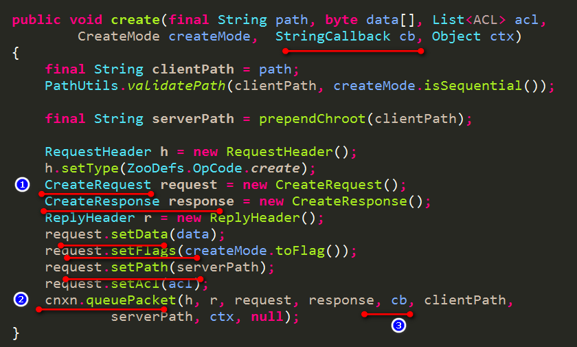

## 【Zookeeper源码二】Zookeeper 客户端创建连接过程分析 - 陶邦仁的个人空间 - 开源中国

\#1 客户端API简单使用# ##1.1 demo案例## **一个最简单的demo如下：**

```
package com.king.demo;

import java.io.IOException;
import java.util.concurrent.CountDownLatch;

import org.apache.zookeeper.WatchedEvent;
import org.apache.zookeeper.Watcher;
import org.apache.zookeeper.ZooKeeper;

public class ZookeeperConstructorSimple implements Watcher {

    private static CountDownLatch connectedSemaphone=new CountDownLatch(1);

    public static void main(String[] args) throws IOException {
        ZooKeeper zooKeeper=new ZooKeeper("127.0.0.1:2181",5000,new ZookeeperConstructorSimple());
        System.out.println(zooKeeper.getState());
        try {
            connectedSemaphone.await();
        } catch (Exception e) {}
        System.out.println("ZooKeeper session established");
        System.out.println("sessionId="+zooKeeper.getSessionId());
        System.out.println("password="+zooKeeper.getSessionPasswd());
    }

    @Override
    public void process(WatchedEvent event) {
        System.out.println("my ZookeeperConstructorSimple watcher Receive watched event:"+event);
        if(Event.KeeperState.SyncConnected==event.getState()){
            connectedSemaphone.countDown();
        }
    }
}
```

**使用的maven依赖如下：**

```
<dependency>
    <groupId>org.apache.zookeeper</groupId>
    <artifactId>zookeeper</artifactId>
    <version>3.4.6</version>
</dependency>
```

对于目前来说，`ZooKeeper的服务器端代码和客户端代码还是混在一起的，估计日后能改吧`。

**使用的ZooKeeper的构造函数有三个参数构成：**

1. Zookeeper集群的服务器地址列表

该地址是可以填写多个的，以逗号分隔。如"127.0.0.1:2181,127.0.0.1:2182,127.0.0.1:2183",那客户端连接的时候到底是使用哪一个呢？`先随机打乱，然后轮询着用`，后面再详细介绍。

1. sessionTimeout

最终会引出三个时间设置：和服务器端协商后的`sessionTimeout、readTimeout、connectTimeout`。

`服务器端使用协商后的sessionTimeout`：即超过该时间后，客户端没有向服务器端发送任何请求（正常情况下客户端会每隔一段时间发送心跳请求，此时服务器端会从新计算客户端的超时时间点的），则服务器端认为session超时，清理数据。此时客户端的ZooKeeper对象就不再起作用了，需要再重新new一个新的对象了。

**客户端使用connectTimeout、readTimeout分别用于检测连接超时和读取超时，一旦超时，则该客户端认为该服务器不稳定，就会从新连接下一个服务器地址。**

1. Watcher

作为ZooKeeper对象一个默认的Watcher，用于接收一些事件通知。`如和服务器连接成功的通知、断开连接的通知、Session过期的通知等`。同时我们可以看到，`一旦和ZooKeeper服务器连接建立成功，就会获取服务器端分配的sessionId和password`，如下：

```
sessionId=94249128002584594
password=[B@4de3aaf6
```

\#2 客户端建立连接的过程# ##2.1 大体连接过程概述## 首先与ZooKeeper服务器建立连接，有两层连接要建立：

1. 客户端与服务器端的TCP连接；
2. 在TCP连接的基础上建立session关联；

建立TCP连接之后，`客户端发送ConnectRequest请求，申请建立session关联`，此时服务器端会`为该客户端分配sessionId和密码`，同时`开启对该session是否超时的检测`。

**当在sessionTimeout时间内，即还未超时，此时TCP连接断开：**`服务器端仍然认为该sessionId处于存活状态`。此时，客户端会选择下一个ZooKeeper服务器地址进行TCP连接建立，TCP连接建立完成后，`拿着之前的sessionId和密码发送ConnectRequest请求，如果还未到该sessionId的超时时间，则表示自动重连成功`，对客户端用户是透明的，一切都在背后默默执行，ZooKeeper对象是有效的。

**如果重新建立TCP连接后，已经达到该sessionId的超时时间了（服务器端就会清理与该sessionId相关的数据）：**则返回给客户端的sessionTimeout时间为0，sessionid为0，密码为空字节数组。`客户端接收到该数据后，会判断协商后的sessionTimeout时间是否小于等于0，如果小于等于0，则使用eventThread线程先发出一个KeeperState.Expired事件，通知相应的Watcher，然后结束EventThread线程的循环，开始走向结束`。此时`ZooKeeper对象就是无效的了，必须要重新new一个新的ZooKeeper对象，分配新的sessionId了`。

\##2.2 ZooKeeper对象## 它是面向用户的，提供一些操作API。它又两个重要的属性：

1. `ClientCnxn cnxn：`负责所有的ZooKeeper节点操作的执行
2. `ZKWatchManager watchManager：`负责维护某个path上注册的Watcher

**如创建某个node操作（同步方式）：**

ZooKeeper对象负责创建出Request，并交给ClientCnxn来执行，ZooKeeper对象再对返回结果进行处理。


**下面来看下异步回调的方式创建node：**



**同步方式提交一个请求后：**开始`循环判断该请求包的状态是否结束，即处于阻塞状态`，一旦结束则继续往下走下去，返回结果。

**异步方式则提交一个请求后：**直接返回，`对结果的处理逻辑包含在回调函数中`。一旦对该请求包响应完毕，则取出回调函数执行相应的回调方法。

至此简单了解了，`ZooKeeper对象主要封装用户的请求以及处理响应等操作`。`用户请求的执行全部交给ClientCnxn来执行`，那我们就详细看下ClientCnxn的来源及大体内容。

**先看看ClientCnxn是怎么来的：**


1. 第一步：为ZKWatchManager watchManager`设置一个默认的Watcher`；
2. 第二步：`将连接字符串信息交给ConnectStringParser进行解析`，连接字符串比如： "192.168.12.1:2181,192.168.12.2:2181,192.168.12.3:2181/root"。解析结果如下：


得到两个数据`String chrootPath默认的跟路径`和`ArrayList<InetSocketAddress> serverAddresses即多个host和port信息`。 3. 第三步：根据上述解析的host和port列表结果，`创建一个HostProvider`，有了ConnectStringParser的解析结果，为什么还需要一个HostProvider再来包装下呢？`主要是为将来留下扩展的余地`，来看下HostProvider的详细接口介绍：


`HostProvider主要负责不断的对外提供可用的ZooKeeper服务器地址`，这些服务器地址可以是从一个url中加载得来或者其他途径得来。`同时对于不同的ZooKeeper客户端，给出就近的ZooKeeper服务器地址等`。

来看下默认的HostProvider实现StaticHostProvider：


有三个属性，`一个就是服务器地址列表（经过如下方式随机打乱了）`：

```
    Collections.shuffle(this.serverAddresses)
```

另外`两个属性用于标记`，下面来具体看下，StaticHostProvider是如何实现不断的对外提供ZooKeeper服务器地址的：


`代码也很简单，就是在打乱的服务器地址列表中，不断地遍历，到头之后，在从0开始`。

**上面的spinDelay是个什么情况呢？**

正常情况下，currentIndex先加1，然后返回currentIndex+1的地址，当该地址连接成功后会执行onConnected方法，即lastIndex = currentIndex了。然而当返回的currentIndex+1的地址连接不成功，继续尝试下一个，仍不成功，仍继续下一个，就会遇到currentIndex=lastIndex的情况，`此时即轮询了一遍，仍然没有一个地址能够连接上，此时的策略就是先暂停休息休息，然后再继续`。

1. 第四步：为创建ClientCnxn准备参数并创建ClientCnxn。

首先是`通过getClientCnxnSocket()获取一个ClientCnxnSocket`。来看下ClientCnxnSocket是主要做什么工作的，`专门用于负责socket通信的`，把一些公共部分抽象出来，其他的留给不同的实现者来实现。`如可以选择默认的ClientCnxnSocketNIO，也可以使用netty等`。

**来看下getClientCnxnSocket()的获取ClientCnxnSocket的过程：**


首先获取系统参数`"zookeeper.clientCnxnSocket",如果没有的话，使用默认的ClientCnxnSocketNIO`，所以我们可以通过指定该参数来替换默认的实现。

**参数准备好了，ClientCnxn是如何来创建的呢？**


`首先就是保存一些对象参数，此时的sessionId和sessionPasswd都还没有`。然后就是两个timeout参数：connectTimeout和readTimeout。在ClientCnxn的发送和接收数据的线程中，会不断的检测连接超时和读取超时，一旦出现超时，就认为服务不稳定，需要更换服务器，就会从HostProvider中获取下一个服务器地址进行连接。

最后就是两个线程，`一个事件线程即EventThread，一个发送和接收socket数据的线程即SendThread`。

**事件线程EventThread呢就是从一个事件队列中不断取出事件并进行处理：**


看下具体的处理过程，主要分成两种情况，`一种就是我们注册的watch事件，另一种就是处理异步回调函数`：


可以看到这里`就是触发我们注册Watch的，还有触发上文提到的异步回调的情况的`。明白了EventThread是如何来处理事件的，需要知道这些事件是如何来的：


对外提供了三个方法来添加不同类型的事件，如`SendThread线程就会调用这三个方法来添加事件`。其中对于事件通知，会首先根据ZKWatchManager watchManager来获取关心该事件的所有Watcher，然后触发他们。

**再来看看SendThread的工作内容：**

```
// 把传递给ClientCnxn的clientCnxnSocket，再传递给SendThread，让它服务于SendThread。
sendThread = new SendThread(clientCnxnSocket);
```

**在SendThread的run方法中，有一个while循环，不断的做着以下几件事：**

- **任务1：**`不断检测clientCnxnSocket是否和服务器处于连接状态`，如果是未连接状态，则从hostProvider中取出一个服务器地址，使用clientCnxnSocket进行连接。


和服务器建立连接成功后，`开始发送ConnectRequest请求，把该请求放到outgoingQueue请求队列中`，等待被发送给服务器。


- **任务2：**检测是否超时：`当处于连接状态时，检测是否读超时`，当处于未连接状态时，检测是否连接超时。


一旦超时，则抛出SessionTimeoutException，然后看下是如何处理呢？


可以看到一旦发生超时异常或者其他异常，都会进行清理，并设置连接状态为未连接，然后发送Disconnected事件，至此又会进入任务1的流程。

- **任务3：**`不断的发送ping通知，服务器端每接收到ping请求，就会从当前时间重新计算session过期时间`，所以当客户端按照一定时间间隔不断的发送ping请求，就能保证客户端的session不会过期。发送时间间隔如下：


`clientCnxnSocket.getIdleSend()：是最后一次发送数据包的时间与当前时间的间隔`。当readTimeout的时间已经过去一半多了，都没有发送数据包的话，则执行一次Ping发送。或者过去MAX_SEND_PING_INTERVAL（10s）都还没有发送数据包的话，则执行一次Ping发送。


ping发送的内容只有请求头OpCode.ping的标示，其他都为空。`发送ping请求，也是把该请求放到outgoingQueue发送队列中，等待被执行`。

- **任务4：**执行IO操作，`即发送请求队列中的请求和读取服务器端的响应数据`。


首先从outgoingQueue请求队列中取出第一个请求，然后进行序列化，然后使用socket进行发送。

**读取服务器端数据如下：**


分为两种：一种是读取针对ConnectRequest请求的响应，另一种就是其他响应，先暂时不说。

**先来看看针对ConnectRequest请求的响应：**


`首先进行反序列化，得到ConnectResponse对象`，我们就可以获取到服务器端给我们客户端分配的sessionId和passwd，以及协商后的sessionTimeOut时间。


首选要根据协商后的sessionTimeout时间，重新计算readTimeout和connectTimeout值。然后保留和记录sessionId和passwd。`最后通过EventThread发送一个SyncConnected连接成功事件`。至此，TCP连接和session初始化请求都完成了，客户端的ZooKeeper对象可以正常使用了。

至此，我们便了解客户端与服务器端建立连接的过程。

\#3 服务器端处理连接的过程# 服务器端情况分很多种，先暂时说最简单的单机版。同时也不再给出服务器端的启动过程（后面的文章再来详细说明）。

**首先介绍下服务器端的大体概况：**

- `首先是服务器端的配置文件，有tickTime、minSessionTimeout、maxSessionTimeout相关属性`。默认情况下，tickTime是3000ms，minSessionTimeout是2倍的tickTime，maxSessionTimeout是20倍的tickTime。
- `服务器端默认采用NIOServerCnxnFactory来负责socket的处理`。每来一个客户端socket请求，为该客户端创建一个NIOServerCnxn。之后与该客户端的交互，就交给了NIOServerCnxn来处理。对于客户端的ConnectRequest请求，处理如下：

**1. 首先反序列化出ConnectRequest**


**2. 然后开始协商sessionTimeout时间**


`即判断用户传递过来的sessionTimeout时间是否在minSessionTimeout、maxSessionTimeout之间`。协商完成之后，根据用户传递过来的sessionId是否是0进行不同的处理。客户端第一次请求，sessionId为0。当客户端已经连接过一个服务器地址，分配了sessionId，然后如果发生超时等异常，客户端会去拿着已经分配的sessionId去连接下一个服务器地址，此时的sessionId不为0。

sessionId为0，则代表着要创建session。sessionId不为0，则需要对该sessionId进行合法性检查，以及是否已经过期了的检查。

**我们先来看看sessionId为0的情况：**


**大体上分三大步：**

1. 使用sessionTracker根据sessionTimeout时间创建一个新的session；
2. 根据sessionId创建出密码；
3. 提交这个创建session的请求到请求处理器链，最终将sessionId和密码返回给客户端；

下面来分别详细的说明这三个过程：

\##3.1 使用sessionTracker创建session## SessionTracker是用来创建删除session，执行session的过期检查的。

**直接看下默认使用的SessionTrackerImpl：**


**先看下session有哪些属性：**

```
final long sessionId：session的唯一标示
final int timeout：这个session的timeout时间（即上文中客户端和服务器端商定下来的timeout时间）
long tickTime：这个session的下一次超时时间点（随着客户端不断的发送PING请求，就会不断的刷新该时间，不断的往后变化）
boolean isClosing：session的标示符，用于标示session是否还被正常使用
Object owner：创建该session的owner。会在客户端更换所连接的服务器的时候用到（之后详细说明）
```

**然后再来看看SessionTracker的几个数据：**

```
HashMap<Long, SessionImpl> sessionsById：很简单，以sessionId存储session
ConcurrentHashMap<Long, Integer> sessionsWithTimeout：以sessionId存储每个session的timeout时间
HashMap<Long, SessionSet> sessionSets：某个时间点上的session集合（用于session过期检查）
long nextSessionId：初始的sessionId，之后创建的sessionId就在此基础上自增
nextExpirationTime：下一次过期时间点，每当到该时间点就会进行一次session的过期检查
expirationInterval：session过期检查的周期
```

要搞清楚的内容有：（1） 创建session的过程；（2） session过期检查的过程；

1. **先来看看创建session的过程：**


代码很简单，就是创建一个SessionImpl对象，然后存储到SessionTracker中，同时开始计算session的超时时间。`这里有一个内容就是sessionId的来历，我们可以看到就是根据nextSessionId来的，并且是不断自增的`。

`sessionId是一个客户端的重要标示，是全局唯一的`，先来看看单机版的nextSessionId初始化：


`单机版的服务器使用1通过计算来初始化nextSessionId。而集群版对应的id则分别是每个机器指定的sid`。计算过程如下：


> 第一步：就是取当前时间，为 10100111011100110110010101110100111100011 为41为二进制。
>
> 第二步：long有64位，左移24位，其实是除掉了前面的1，后面补了24位的0。
>
> 第三步：第二步的结果可能是正数也可能是负数，目前是正数，之后可能就是负数了，你可以算一下需要多少年，哈哈。为了保证右移的时候，进行补0 操作，需要使用无符号右移，即>>>。这里使用了无符号右移8位。
>
> 第四步：将传过来的id这里即1左移56位。然后再与第三步的正数结果进行或操作，得到最终的基准nextSessionId，所以当这里的id值不是很大的话，一般几台机器而已，也保证了sessionId是一个正数，同时前八位就是机器的sid号。所以每台机器的的前八位是不同的，保证了每台机器中不会配置相同的sessionId，每台机器的sessionId又是自增操作，所以单台机器内sessionId也是不会重复的。

综上所示保证了sessionId是唯一的，不会出现重复分配的情况。搞清楚了sessionId的分配，接下来就要弄清楚如何进行session的过期检查问题：

**我们先看下，session激活过程是怎么处理的：**


1. 首先获取这个session数据，然后计算它的超期时间。

```
long expireTime = roundToInterval(System.currentTimeMillis() + timeout);
private long roundToInterval(long time) {
    // We give a one interval grace period
    return (time / expirationInterval + 1) * expirationInterval;
}
```

即是拿当前时间加上这个session的timeout时间，然后对其进行取expirationInterval的整，即始终保持是expirationInterval的正数倍，即每个session的过期时间点最终都会落在expirationInterval的整数倍上。

1. 如果原本该session的超期时间就大于你所计算出的超期时间，则不做任何处理，否则设置该session的超期时间为上述计算结果的超期时间。
2. 取出原本该session所在的超期时间，从集合里面删除。
3. 重新获取现在超期时间所在的集合，添加进去。

综上所述，session的激活其实就是重新计算下超时时间，最终取expirationInterval的正数倍，然后从之前时间点的集合中移除，然后再添加到新的时间点的集合中去。

至此，session的检查就方便多了，只需要在expirationInterval整数时间点上取出集合，然后一个个标记为过期即可。而那些不断被激活的session，则不断的从一个时间点的集合中换到下一个时间点的集合中。

1. **SessionTrackerImpl也是一个线程，该线程执行内容就是session的过期检查,如下所示：**


\##3.2 根据sessionId创建出密码## 回到创建session的三大步骤：


**来看下密码是如何来产生的：**

```
Random r = new Random(sessionId ^ superSecret);
r.nextBytes(passwd);
```

其中superSecret为常量：

```
static final private long superSecret = 0XB3415C00L;
```

使用Random的方式来随机生成字节数组。但是该字节数组，只要参数即sessionId相同，字节数组的内容就相同。即当我们知道了sessionId，就可以利用上述方式算出对应的密码，我感觉密码基本上没什么用。

**再看下当客户端带着sessionId和密码进行连接的时候，这时会进行密码的检查：**


`看了上面的代码，就再次验证了密码没什么鸟用，知道了sessionId，就完全知道了密码`。所以这一块有待改进吧，应该不能由sessionId完全决定吧，如再加上当前时间等等，让客户端造不出来密码，同时服务器端存储加密后的密码。

\##3.3 提交这个创建session的请求到请求处理器链## 本文内容已太多，这里就先简单描述下，之后再详细的讲解：


`如果是成功创建session，则把sessionTimeout、sessionId、passwd传递给客户端。如果没有成功创建，上述三者的值分别是0,0,new byte[16]`。之后客户端处理该响应的过程，上面已经说了，可以回头再看下。