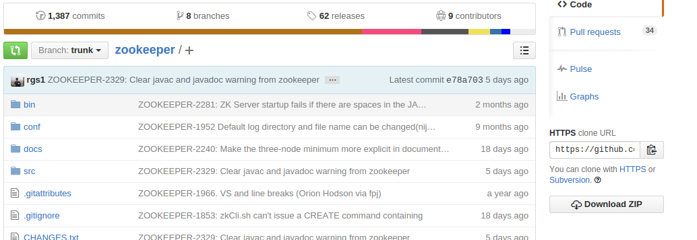
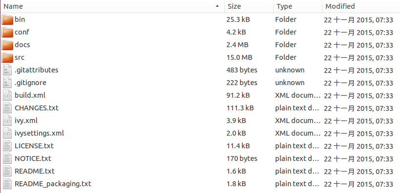
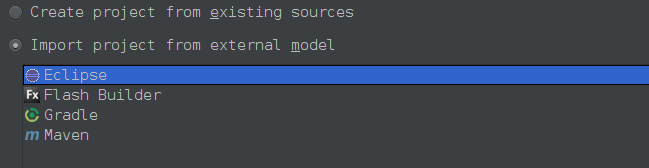
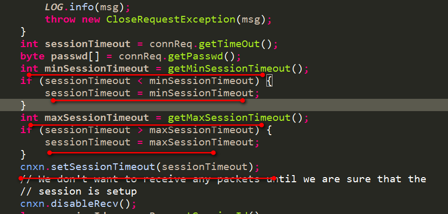
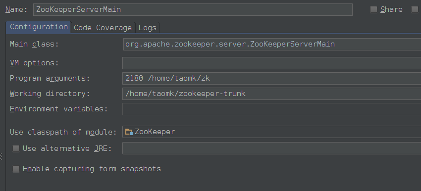
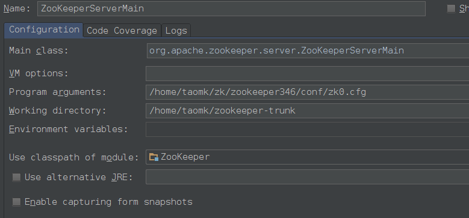

## 【Zookeeper源码一】Zookeeper 源码环境搭建 - 陶邦仁的个人空间 - 开源中国

\#1 搭建步骤# ##1.1 到github中下载该项目## 项目地址 <https://github.com/apache/zookeeper>。下载.zip包到本地解压。



**解压后文件目录：**



\##1.2 使用ant对源码编译成eclipse工程## 上述源码还不是eclipse工程。需要使用ant eclipse命令来转换成eclipse工程。ant就不用再说了，自行网上搜索与配置。

```
cd zookeeper-trunk
ant eclipse
```

**这里来重点说说ant eclipse执行失败的问题：**

1. 上述命令会下载ant-eclipse-1.0.bin.tar.bz2文件，老是下载不成功，无法继续下去，修改源码中build.xml中的配置，将地址：

```
get src="http://downloads.sourceforge.net/project/ant-eclipse/ant-eclipse/1.0/ant-eclipse-1.0.bin.tar.bz2"

更换成如下地址

get src="http://ufpr.dl.sourceforge.net/project/ant-eclipse/ant-eclipse/1.0/ant-eclipse-1.0.bin.tar.bz2"
```

1. 还发现缺少依赖包 commons-collections，在ivy.xml文件中加入如下配置：

```
<dependency org="commons-collections" name="commons-collections" rev="3.0"/>
```

上述两个问题解决后，再重新执行ant eclipse命令。

\##1.3 通过idea导入eclipse工程## 

将idea的编译器版本设置为1.7。然后整个世界就安静了，终于不再报错了。

\#2 运行Zookeeper# 我们首先看下`单机版ZooKeeper的启动类org.apache.zookeeper.server.ZooKeeperServerMain`，它的启动参数有两种情况：

1. 情况1：直接给出相应的参数设置

`有4个参数，前两个参数必填，后两个参数可选`，对客户端暴漏出的端口port，dataDir的目录，tickTime值，maxClientCnxns值（最大的客户端连接数）。下面分别来简单介绍下：

- 对客户端暴漏出的端口port，即如下客户端代码指定的端口：

```
new ZooKeeper("192.168.126.130:2181",5000,this)
```

- dataDir的目录：

ZooKeeper有两类数据要存储。`一种就是事务记录，另一种就是ZooKeeper的内存树中的数据,以快照方式存储`。 所以可以给这两种数据指定不同的目录。`dataDir用来指定内存树快照的存储位置，dataLogDir用来指定事务记录的存储位置`。`只给出了dataDir的目录，则代表两种数据都存储在该目录下`。

- tickTime值，单位ms,默认3000：

**用途1：**用于指定session检查的间隔，服务器会每隔一段时间检查一次连接它的客户端的session是否过期。该间隔就是tickTime。

**用途2：**用于给出默认的minSessionTimeout和maxSessionTimeout，如果没有给出maxSessionTimeout和minSessionTimeout（为-1），则minSessionTimeout和maxSessionTimeout的取值如下：

```
minSessionTimeout == -1 ? tickTime 2 : minSessionTimeout; maxSessionTimeout == -1 ? tickTime 20 : maxSessionTimeout;
```

**分别是tickTime的2倍和20倍**。

`客户端代码在创建ZooKeeper对象的时候会给出一个sessionTimeout时间`，而上述的minSessionTimeout和maxSessionTimeout就是用来约束客户端的sessionTimeout。源码如下：



- maxClientCnxns值，用于指定服务器端最大的连接数。

**参数说完了，我们就来设置一下：**



同时，ZooKeeper采用log4j来作为日志输出，所以`需要将log4j的配置文件（在conf文件夹中）放置到类路径下`。

1. 情况2：给出配置文件地址

`当org.apache.zookeeper.server.ZooKeeperServerMain类的启动参数只有一个时，则代表着配置文件的路径`。也可以修改conf文件夹中的zoo_sample.cfg配置文件，修改下dataDir指定的路径。然后把该配置文件的路径作为参数：

