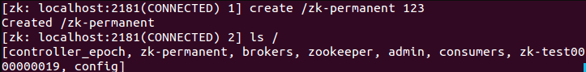
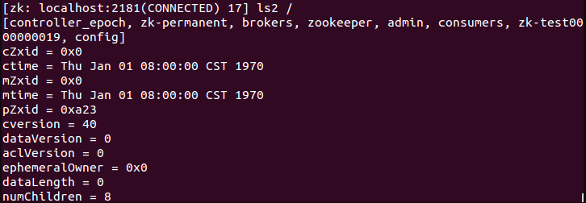

**二、客户端**

**1、打开客户端**

在服务端开启的情况下，运行客户端，使用如下命令连接本机：

```
./zkCli.sh
```

若连接不同的主机，可使用如下命令：

```
./zkCli.sh -server ip:port
```

可以使用帮助命令help来查看客户端的操作

**2、创建节点**

使用create命令，可以创建一个Zookeeper节点， 如

```
create [-s] [-e] path data acl
```

其中，-s或-e分别指定节点特性，顺序或临时节点，若不指定，则表示持久节点；acl用来进行权限控制。

**①、创建顺序节点**

使用

```
create -s /zk-test 123
```

命令创建zk-test顺序节点


可以看到创建的zk-test节点后面添加了一串数字以示区别。

**②、创建临时节点**

使用

```
create -e /zk-temp 123
```

命令创建zk-temp临时节点


临时节点在客户端会话结束后，就会自动删除，下面使用

```
quit
```

命令退出客户端

再次使用客户端连接服务端，并使用

```
ls / 
```

命令查看根目录下的节点

可以看到根目录下已经不存在zk-temp临时节点了。

**③、创建永久节点**

使用

```
create /zk-permanent 123
```

命令创建zk-permanent永久节点



可以看到永久节点不同于顺序节点，不会自动在后面添加一串数字。

**3、读取节点**

与读取相关的命令有ls 命令和get 命令，ls命令可以列出Zookeeper指定节点下的所有子节点，只能查看指定节点下的第一级的所有子节点；get命令可以获取Zookeeper指定节点的数据内容和属性信息。其用法分别如下

```
ls path [watch]
get path [watch]
ls2 path [watch]
```

若获取根节点下面的所有子节点，使用

```
ls / 
```

若想获取根节点数据内容和属性信息，使用

```
get / 
```

也可以使用

```
ls2 / 
```



可以看到其子节点数量为8。

若想获取/zk-permanent的数据内容和属性，可使用如下命令：

```
get /zk-permanent 
```


可以看到其数据内容为123，还有其他的属性，之后会详细介绍。

**4、更新节点**

使用set命令，可以更新指定节点的数据内容，用法如下

```
set path data [version] 
```

其中，data就是要更新的新内容，version表示数据版本，如将/zk-permanent节点的数据更新为456，可以使用如下命令：

```
set /zk-permanent 456
```


现在dataVersion已经变为1了，表示进行了更新。

**5、删除节点**

使用delete命令可以删除Zookeeper上的指定节点，用法如下

```
delete path [version] 
```

其中version也是表示数据版本，使用

```
delete /zk-permanent 
```


可以看到，已经成功删除/zk-permanent节点。值得注意的是，若删除节点存在子节点，那么无法删除该节点，必须先删除子节点，再删除父节点。