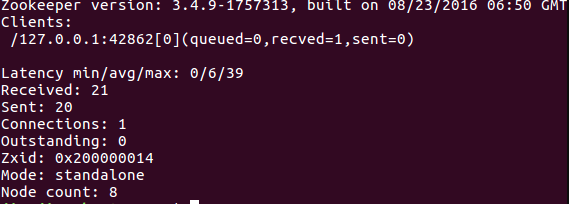
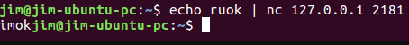
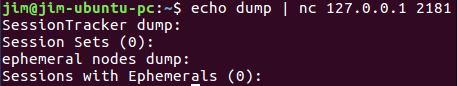
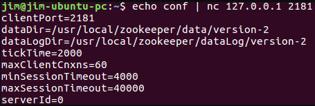
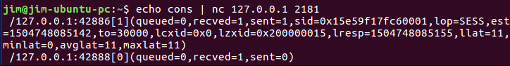
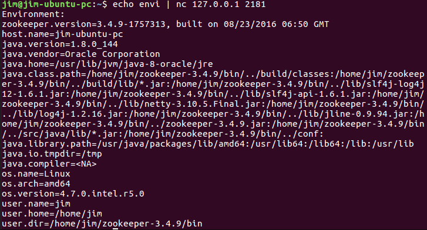
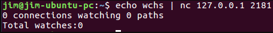

**ZooKeeper常用四字命令：**

传递四个字母的字符串给ZooKeeper，会返回一些有用的信息。

| 命令 | 功能描述                                                     |
| ---- | ------------------------------------------------------------ |
| conf | 输出相关服务配置的详细信息。                                 |
| cons | 列出所有连接到服务器的客户端的完全的连接 /会话的详细信息。包括“接受/发送”的包数量、会话id 、操作延迟、最后的操作执行等等信息。 |
| dump | 列出未经处理的会话和临时节点。                               |
| envi | 输出关于服务环境的详细信息（区别于conf命令）。               |
| reqs | 列出未经处理的请求                                           |
| ruok | 测试服务是否处于正确状态。如果确实如此，那么服务返回“imok ”，否则不做任何相应。 |
| stat | 输出关于性能和连接的客户端的列表。                           |
| wchs | 列出服务器 watch的详细信息。                                 |
| wchc | 通过Session列出服务器watch的详细信息，它的输出是一个与watch相关的会话的列表。 |
| wchp | 通过路径列出服务器watch的详细信息。它输出一个与Session相关的路径。 |

ZooKeeper支持某些特定的四字命令字母与其的交互。它们大多是查询命令，用来获取ZooKeeper服务的当前状态及相关信息。用户在客户端可以通过telnet或nc向ZooKeeper提交相应的命令

①、查看哪个节点被选择作为follower或者leader

```
echo stat | nc 127.0.0.1 2181 
```



②、测试是否启动了该Server，若回复imok表示已经启动

```
echo ruok | nc 127.0.0.1 2181
```



③、列出未经处理的会话和临时节点

```
echo dump | nc 127.0.0.1 2181
```



④、关掉server

```
echo kill | nc 127.0.0.1 2181
```

⑤、输出相关服务配置的详细信息

```
echo conf | nc 127.0.0.1 2181
```



⑥、列出所有连接到服务器的客户端的完全的连接/会话的详细信息

```
echo cons | nc 127.0.0.1 2181
```



⑦、输出关于服务环境的详细信息（区别于 conf 命令）

```
echo envi | nc 127.0.0.1 2181
```



⑧、列出未经处理的请求

```
echo reqs | nc 127.0.0.1 2181
```

⑨、列出服务器watch的详细信息

```
echo wchs | nc 127.0.0.1 2181
```



⑩、通过Session列出服务器watch的详细信息，它的输出是一个与watch相关的会话的列表

```
echo wchc | nc 127.0.0.1 2181
```

⑪、通过路径列出服务器watch 的详细信息，它输出一个与Session相关的路径

```
echo wchp | nc 127.0.0.1 2181 
```