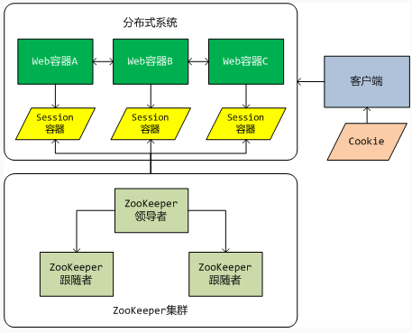
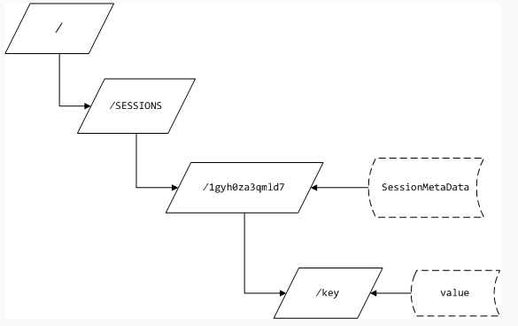

## 基于ZooKeeper的分布式Session实现 - 陶邦仁的个人空间 - 开源中国

\#1 为什么使用ZooKeeper# 目前有关于分布式Session的实现基本上都是基于memcached。memcached本质上是一个内存缓存系统。虽然memcached也可以是分布式集群环境的，但是`对于一份数据来说，它总是存储在某一台memcached服务器上`。`如果发生网络故障或是服务器宕机，则存储在这台服务器上的所有数据都将不可访问`。`由于数据是存储在内存中的，重启服务器，将导致数据全部丢失`。当然你可以自己实现一套机制，用来在分布式memcached之间进行数据的同步和持久化，但是实现这套机制谈何容易！

由上述ZooKeeper的特性可知，ZooKeeper是一个分布式小文件系统，并且被设计为高可用性。`通过选举算法和集群复制可以避免单点故障`，`由于是文件系统，所以即使所有的ZooKeeper节点全部挂掉，数据也不会丢失，重启服务器之后，数据即可恢复`。另外`ZooKeeper的节点更新是原子的，也就是说更新不是成功就是失败`。通过版本号，`ZooKeeper实现了更新的乐观锁`，当版本号不相符时，则表示待更新的节点已经被其他客户端提前更新了，而当前的整个更新操作将全部失败。当然所有的一切ZooKeeper已经为开发者提供了保障，我们需要做的只是调用API。

有人会怀疑ZooKeeper的执行能力，在ZooKeeper诞生的地方——Yahoo!给出了一组数据将打消你的怀疑。它的吞吐量标准已经达到大约`每秒10000基于写操作的工作量`。对于`读操作的工作量来说，它的吞吐量标准还要高几倍`。

\#2 实现分布式Session所面临的挑战# **实现分布式session最大的挑战莫过于如何实现session在分布式系统之间的共享**。`在分布式环境下，每个子系统都是跨网络的独立JVM，在这些JVM之间实现共享数据的方式无非就是TCP/IP通讯`。无论是memcached，还是ZooKeeper，`底层都是基于TCP/IP的`。所以，我认为使用何种工具实现分布式Session都是可行的，没有那种实现优于另外一种实现，在不同的应用场景，各有优缺点。世间万物，无十全十美，不要盲目的崇拜某种技术，唯有适合才是真理。

\##2.1 Session ID的共享## Session ID是一个实例化Session对象的唯一标识，也是它在Web容器中可以被识别的唯一身份标签。Jetty和Tomcat容器会通过一个Hash算法，得到一个唯一的ID字符串，然后赋值给某个实例化的Session，此时，这个Session就可以被放入Web容器的SessionManager中开始它短暂的一生。在Servlet中，我们可以通过HttpSession的getId()方法得到这个值，但是我们无法改变这个值。`当Session走到它一生尽头的时候，Web容器的SessionManager会根据这个ID将其“火化”`。所以Session ID是非常重要的一个属性，并且要保证它的唯一性。在单系统中，Session ID只需要被自身的Web容器读写，但是`在分布式环境中，多个Web容器需要共享同一个Session ID`。因此，**当某个子系统的Web容器产生一个新的ID时，它必须需要一种机制来通知其他子系统，并且告知新ID是什么**。

\##2.2 Session中数据的复制## 和共享Session ID的问题一样，`在分布式环境下，Session中的用户数据也需要在各个子系统中共享`。当用户通过HttpSession的setAttribute()方法在Session中设置了一个用户数据时，它只存在于当前与用户交互的那个Web容器中，而对其他子系统的Web容器来说，这些数据是不可见的。当用户在下一步跳转到另外一个Web容器时，则又会创建一个新的Session对象，而此Session中并不包含上一步骤用户设置的数据。其实`Session在分布式系统之间的复制实现是简单的，但是每次在Session数据发生变化时，都在子系统之间复制一次数据，会大大降低用户的响应速度`。因此我们需要一种机制，**即可以保证Session数据的一致性，又不会降低用户操作的响应度**。

\##2.3 Session的失效## Session是有生命周期的，当Session的空闲时间(maxIdle属性值)超出限制时，Session就失效了，这种设计主要是考虑到了Web容器的可靠性。当一个系统有上万人使用时，就会产生上万个Session对象，由于HTTP的无状态特性，服务器无法确切的知道用户是否真的离开了系统。因此如果没有失效机制，所有被Session占据的内存资源将永远无法被释放，直到系统崩溃为止。`在分布式环境下，Session被简单的创建，并且通过某种机制被复制到了其他系统中。你无法保证每个子系统的时钟都是一致的，可能相差几秒，甚至相差几分钟`。当某个Web容器的Session失效时，可能其他的子系统中的Session并未失效，这时会产生一个有趣的现象，一个用户在各个子系统之间跳转时，有时会提示Session超时，而有时又能正常操作。因此我们需要一种机制，**当某个系统的Session失效时，其他所有系统的与之相关联的Session也要同步失效**。

\##2.4 类装载问题## 在单系统环境下，所有类被装载到“同一个”ClassLoader中。我在同一个上打了引号，因为实际上并非是同一个ClassLoader，只是逻辑上我们认为是同一个。这里涉及到了JVM的类装载机制，由于这个主题不是本文的讨论重点，所以相关详情可以参考相关的JVM文档。因此即使是由memcached或是ZooKeeper返回的字节数组也可以正常的反序列化成相对应的对象类型。但是在分布式环境下，问题就变得异常的复杂。我们通过一个例子来描述这个问题。用户在某个子系统的Session中设置了一个User类型的对象，通过序列化，将User类型的对象转换成字节数组，并通过网络传输到了memcached或是ZooKeeper上。`此时，用户跳转到了另外一个子系统上，需要通过getAttribute方法从memcached或是ZooKeeper上得到先前设置的那个User类型的对象数据`。但是问题出现了，`在这个子系统的ClassLoader中并没有装载User类型。因此在做反序列化时出现了ClassNotFoundException异常`。

当然上面描述的4点挑战只是在实现分布式Session过程中面临的关键问题，并不是全部。其实在我实现分布式Session的整个过程中还遇到了其他的一些挑战。比如，`需要通过filter机制拦截HttpServletRequest，以便覆盖其getSession方法`。但是在不同的Web容器中（例如Jetty或是Tomcat）对HttpServletRequest的实现是不一样的，虽然都是实现了HttpServletRequest接口，但是各自又添加了一些特性在其中。例如，在Jetty容器中，HttpSession的实现类是一个保护内部类，无法从其继承并覆盖相关的方法，只能从其实现类的父类中继承更加抽象的Session实现。这样就会造成一个问题，我必须重新实现对Session整个生命周期管理的SessionManager接口。有人会说，那就放弃它的实现吧，我们自己实现HttpSession接口。很不幸，那是不可能的。`因为在Jetty的HttpServletRequest实现类的一些方法中对Session的类型进行了强制转换（转换成它自定义的HttpSession实现类），如果不从其继承，则会出现ClassCastException异常`。相比之下，Tomcat的对HttpServletRequest和HttpSession接口的实现还是比较标准的。由此可见，`实现分布式Session其实是和某种Web容器紧密耦合的`。并不像网上有些人的轻描淡写，仅仅覆盖setAttribute和getAttribute方法是行不通的。

\#3 算法实现# 从上述的挑战来看，要写一个分布式应用程序是困难的，主要原因是因为局部故障。由于数据需要通过网络传输，而网络是不稳定的，所以如果网络发生故障，则所有的数据通讯都将终止。ZooKeeper并不能解决网络故障的发生，甚至它本身也是基于网络的分布式应用程序。但是它为我们提供了一套工具集合，帮助我们建立安全处理局部故障的分布式应用程序。接下来我们就开始描述如何实现基于ZooKeeper的分布式Session系统。

\##3.1 基于ZooKeeper的分布式Session系统架构##

为了实现高可用性，采用了ZooKeeper集群，`ZooKeeper集群是由一台领导者服务器和若干台跟随者服务器构成（总服务器数要奇数）`。**所有的读操作由跟随者提供，而写操作由领导者提供，并且领导者还负责将写入的数据复制到集群中其他的跟随者**。当领导者服务器由于故障无法访问时，剩下的所有跟随者服务器就开始进行领导者的选举。通过选举算法，最终由一台原本是跟随者的服务器升级为领导者。当然原来的领导者服务器一旦被恢复，它就只能作为跟随者服务器，并在下一次选举中争夺领导者的位置。

Web容器中的Session容器也将发生变化。它不再对用户的Session进行本地管理，而是委托给ZooKeeper和我们自己实现的Session管理器。也就是说，`ZooKeeper负责Session数据的存储，而我们自己实现的Session管理器将负责Session生命周期的管理`。

最后是关于`在分布式环境下共享Session ID的策略`。我们还是通过客户端的Cookie来实现，`我们会自定义一个Cookie，并通过一定的算法在多个子系统之间进行共享`。下面会对此进行详细的描述。

\##3.2 分布式Session的数据模型## Session数据的存储是有一定格式的，下图展示了一个Session ID为”1gyh0za3qmld7”的Session在ZooKeeper上的存储结构：



`“/SESSIONS”是一个组节点，用来在ZooKeeper上划分不同功能组的定义`。你可以把它理解为一个文件夹目录。在这个目录下可以存放0个或N个子节点，`我们就把一个Session的实例作为一个节点，节点的名称就是Session ID`。在ZooKeeper中，每个节点本身也可以存放一个字节数组。因此，`每个节点天然就是一个Key-Value键值对的数据结构`。

我们将Session中的用户数据（本质上就是一个Map）设计成多节点，`节点名称就是Session的key，而节点的数据就是Session的Value`。采用这种设计主要是考虑到性能问题和ZooKeeper对节点大小的限制问题。当然，我们可以将Session中的用户数据保存在一个Map中，然后将Map序列化之后存储在对应的Session节点中。`但是大部分情况下，我们在读取数据时并不需要整个Map，而是Map中的一个或几个值`。这样就可以避免一个非常大的Map在网络间传来传去。`同理，在写Session的时候，也可以最大限度的减少数据流量`。`另外由于ZooKeeper是一个小文件系统，为了性能，每个节点的大小为1MB`。如果Session中的Map大于1MB，就不能单节点的存储了。当然，一个Key的数据量是很少会超过1MB的，如果真的超过1MB，你就应该考虑一下，是否应该将此数据保存在Session中。

最后我们来关注一下Session节点中的数据——SessionMetaData。它是一个Session实例的元数据，保存了一些与Session生命周期控制有关的数据。以下代码就是SessionMetaData的实现：

```
package com.king.distributedSession;

import java.io.Serializable;

public class SessionMetaData implements Serializable {

	private static final long serialVersionUID = -6446174402446690125L;

	/**
	 * Session实例的ID
	 */
	private String id;

	/**
	 * session的创建时间
	 */
	private Long createTm;

	/**
	 * Session的最大空闲时间，默认情况下是30分钟。
	 */
	private Long maxIdle;

	/**
	 * Session的最后一次访问时间，每次调用Request.getSession方法时都会去更新这个值。用来计算当前Session是否超时。
	 * 如果lastAccessTm+maxIdle小于System.currentTimeMillis()，就表示当前Session超时。
	 */
	private Long lastAccessTm;

	/**
	 * 当前Session是否可用，如果超时，则此属性为false。
	 */
	private Boolean validate = false;

	/**
	 * 为了冗余Znode的version值，用来实现乐观锁，对Session节点的元数据进行更新操作。
	 */
	private int version = 0;

	/**
	 * 构造方法
	 */
	public SessionMetaData() {
		this.createTm = System.currentTimeMillis();
		this.lastAccessTm = this.createTm;
		this.validate = true;
	}

	public String getId() {
		return id;
	}

	public void setId(String id) {
		this.id = id;
	}

	public Long getCreateTm() {
		return createTm;
	}

	public void setCreateTm(Long createTm) {
		this.createTm = createTm;
	}

	public Long getMaxIdle() {
		return maxIdle;
	}

	public void setMaxIdle(Long maxIdle) {
		this.maxIdle = maxIdle;
	}

	public Long getLastAccessTm() {
		return lastAccessTm;
	}

	public void setLastAccessTm(Long lastAccessTm) {
		this.lastAccessTm = lastAccessTm;
	}

	public Boolean getValidate() {
		return validate;
	}

	public void setValidate(Boolean validate) {
		this.validate = validate;
	}

	public int getVersion() {
		return version;
	}

	public void setVersion(int version) {
		this.version = version;
	}
}
```

这里有必要提一下一个老生常谈的问题，`就是所有存储在节点上的对象必须是可序列化的，也就是必须实现Serializable接口，否则无法保存`。这个问题在memcached和ZooKeeper上都存在的。

\##3.3 实现过程## 实现分布式Session的`第一步就是要定义一个filter，用来拦截HttpServletRequest对象`。以下代码片段，展现了在Jetty容器下的filter实现。

```
package com.king.distributedSession.jetty;

import javax.servlet.*;

import java.io.IOException;

import org.slf4j.Logger;
import org.slf4j.LoggerFactory;

public class JettyDistributedSessionFilter extends DistributedSessionFilter {

	private Logger log = LoggerFactory.getLogger(getClass());

	@Override
	public void init(FilterConfig filterConfig) throws ServletException {
		super.init(filterConfig);

		// 实例化Jetty容器下的Session管理器
		sessionManager = new JettyDistributedSessionManager(conf);

		try {
			sessionManager.start(); // 启动初始化

			//创建组节点
			ZooKeeperHelper.createGroupNode();
			log.debug("DistributedSessionFilter.init completed.");
		} catch (Exception e) {
			log.error("distributedSessionFilter init ", e);
		}
	}

	@Override
	public void doFilter(ServletRequest request, ServletResponse response, FilterChain chain)
			throws IOException, ServletException {
		// Jetty容器的Request对象包装器，用于重写Session的相关操作
		JettyRequestWrapper req = new JettyRequestWrapper(request, sessionManager);
		chain.doFilter(req, response);
	}
}
```

这个filter是继承自DistributedSessionFilter的，`这个父类主要是负责完成初始化参数设置等通用方法的实现`，代码如下所示：

```
package com.king.distributedSession.jetty;

import javax.servlet.Filter;
import javax.servlet.FilterConfig;
import javax.servlet.ServletException;

import org.apache.commons.lang3.StringUtils;
import org.eclipse.jetty.server.SessionManager;
import org.slf4j.Logger;
import org.slf4j.LoggerFactory;

public abstract class DistributedSessionFilter implements Filter {

	protected Logger log = LoggerFactory.getLogger(getClass());

	/**
	 * 参数配置
	 */
	protected Configuration conf;

	/**
	 * Session管理器
	 */
	protected SessionManager sessionManager;

	/**
	 * 初始化参数名称
	 */
	public static final String SERVERS = "servers";

	public static final String TIMEOUT = "timeout";

	public static final String POOLSIZE = "poolsize";

	/**
	 * 初始化
	 *
	 * @see javax.servlet.Filter#init(javax.servlet.FilterConfig)
	 */
	@Override
	public void init(FilterConfig filterConfig) throws ServletException {

		conf = new Configuration();

		String servers = filterConfig.getInitParameter(SERVERS);

		if (StringUtils.isNotBlank(servers)) {
			conf.setServers(servers);
		}

		String timeout = filterConfig.getInitParameter(TIMEOUT);

		if (StringUtils.isNotBlank(timeout)) {
			try {
				conf.setTimeout(Long.valueOf(timeout));
			} catch (NumberFormatException ex) {
				log.error("timeout parse error[" + timeout + "].");
			}
		}

		String poolSize = filterConfig.getInitParameter(POOLSIZE);

		if (StringUtils.isNotBlank(poolSize)) {
			try {
				conf.setPoolSize(Integer.valueOf(poolSize));
			} catch (NumberFormatException ex) {
				log.error("poolsize parse error[" + poolSize + "].");
			}
		}

		//初始化ZooKeeper配置参数
		ZooKeeperHelper.initialize(conf);
	}

	/**
	 * 销毁
	 *
	 * @see javax.servlet.Filter#destroy()
	 */
	@Override
	public void destroy() {
		if (sessionManager != null) {
			try {
				sessionManager.stop();
			} catch (Exception e) {
				log.error("sessionManager stop : ", e);
			}
		}

		//销毁ZooKeeper
		ZooKeeperHelper.destroy();
		log.debug("DistributedSessionFilter.destroy completed.");
	}
}
```

**在filter中需要关注的重点是doFilter方法：**

```
    @Override
    public void doFilter(ServletRequest request, ServletResponse response, FilterChain chain)
        throws IOException, ServletException {
        // Jetty容器的Request对象包装器，用于重写Session的相关操作
	JettyRequestWrapper req = new JettyRequestWrapper(request, sessionManager);
	chain.doFilter(req, response);
    }
```

`这里实例化了一个包装器（装饰者模式）类，用来包装Jetty容器的Request对象，并覆盖其getSession方法`。另外我们还`自己实现sessionManager接口，用来管理Session的生命周期`。通过filter机制，我们就接管了Session的整个生命周期的管理权。

接下来我们来看看，`Request包装器是如何重写getSession方法，替换成使用ZooKeeper上的Session数据`。关键代码如下所示：

```
    @Override
    public HttpSession getSession(boolean create) {
        // 检查Session管理器
        if (sessionManager == null && create) {
            throw new IllegalStateException("No SessionHandler or SessionManager");
        }
        if (session != null && sessionManager != null) {
            return session;
        }
 
        session = null;
 
        //从客户端cookie中查找Session ID
        String id = sessionManager.getRequestSessionId(request);
        log.debug("获取客户端的Session ID:[" + id + "]");
        if (id != null && sessionManager != null) {
            // 如果存在，则先从管理器中取
            session = sessionManager.getHttpSession(id, request);
            if (session == null && !create) {
                return null;
            }
        }
        // 否则实例化一个新的Session对象
        if (session == null && sessionManager != null && create) {
            session = sessionManager.newHttpSession(request);
        }
        return session;
    }
```

其实实现很简单，大部分工作都委托给了sessionManager来处理。因此，还是让我们来关注sessionManager的相关方法实现：

1. 获取Session ID：

```
    @Override
    public String getRequestSessionId(HttpServletRequest request) {
        return CookieHelper.findSessionId(request);
    }
```

这个方法就是从客户端的Cookies中查找我们的一个自定义的Cookie值，这个Cookie的名称为：`”DISTRIBUTED_SESSION_ID”(Web容器自己也在Cookie中写了一个值，用来在不同的request中传递Session ID，这个Cookie的名称叫“JSESSIONID”)`。如果返回null，则表示客户端从来都没有创建过Session实例。

1. `如果返回的Cookie值不为null，则有3种可能性：`其一，已经实例化过一个Session对象并且可以正常使用；其二，虽然已经实例化过了，但是可能此Session已经超时失效；其三，分布式环境中的其他子系统已经实例化过了，但是本系统中还未实例化过此Session对象。所以先要对已经存在的Session ID进行处理。关键代码如下：

```
    @Override
    public HttpSession getHttpSession(String id, HttpServletRequest request) {
        // 类型检查
        if (!(request instanceof Request)) {
            log.warn("不是Jetty容器下的Request对象");
            return null;
        }

        // 将HttpServletRequest转换成Jetty容器的Request类型
        Request req = (Request) request;
        // ZooKeeper服务器上查找指定节点是否有效
        boolean valid = ZooKeeperHelper.isValid(id);
        // 如果为false，表示服务器上无该Session节点，需要重新创建(返回null)
        if (!valid) {
            // 删除本地的副本
            sessions.remove(id);
            return null;
        } else {
            // 更新Session节点的元数据
            ZooKeeperHelper.updateSessionMetaData(id);
            HttpSession session = sessions.get(id);
            // 如果存在，则直接返回
            if (session != null) {
                return session;
            }
            // 否则创建指定ID的Session并返回(用于同步分布式环境中的其他机器上的Session本地副本)
            session = new JettyDistributedSession((AbstractSessionManager) req.getSessionManager(), System.currentTimeMillis(), id);
            sessions.put(id, session);
            return session;
        }
    }
```

首先根据ID去ZooKeeper上验证此Session是否有效，如果无效了，则直接返回null，表示此Session已经超时不可用，同时需要删除本地的“影子”Session对象（不管存在与否）。如果该节点有效，则首先更新该Session节点的元数据（例如，最后一次访问时间）。然后先到本地的Session容器中查找是否存在该ID的Session对象。本地Session容器中的Session对象并不用来保存用户数据，也不进行生命周期管理，纯粹为了在不同请求中进行传递。唯一有价值的就Session ID，因此，我喜欢把本地Session容器中的Session对象称为“影子”Session，它只是ZooKeeper上真正Session的一个影子而已。

如果Session节点没有失效，但是本地Session容器并没有指定ID的”影子”Session，则表示是第三种可能性，需要进行影子Session的同步。正如代码中所展示的，我们实例化一个指定ID的Session对象，并放入当前系统的Session容器中，这样就完成了Session ID在分布式环境中的共享，以及Session对象在各子系统之间的同步。

1. 如果通过上面的方法返回的Session对象还是null，则真的需要实例化一个Session对象了，代码如下所示：

```
    public HttpSession newHttpSession(HttpServletRequest request) {
        // 类型检查
        if (!(request instanceof Request)) {
            log.warn("不是Jetty容器下的Request对象");
            return null;
        }
        // 将HttpServletRequest转换成Jetty容器的Request类型
        Request req = (Request) request;
        Session session = new JettyDistributedSession(
            (AbstractSessionManager) req.getSessionManager(), request);
        addHttpSession(session, request);
        String id = session.getId();
        // 写cookie
        Cookie cookie = CookieHelper.writeSessionIdToCookie(id, req, req.getConnection()
            .getResponse());
        if (cookie != null) {
            log.debug("Wrote sid to Cookie,name:[" + cookie.getName() + "],value:["
                      + cookie.getValue() + "]");
        }
        // 在ZooKeeper服务器上创建session节点，节点名称为Session ID
        // 创建元数据
        SessionMetaData metadata = new SessionMetaData();
        metadata.setId(id);
        metadata.setMaxIdle(config.getTimeout() * 60 * 1000); //转换成毫秒
        ZooKeeperHelper.createSessionNode(metadata);
        return session;
    }
```

以上代码会实例化一个Session对象，并将Session ID写入客户端Cookie中，最后实例化Session元数据，并在ZooKeeper上新建一个Session节点。

1. 通过上面步骤，我们就将Session的整个生命周期管理与ZooKeeper关联起来了。接下来我们看看Session对象的几个重要方法的重写：

```
    public synchronized Object getAttribute(String name) {
        // 获取session ID
        String id = getId();
        if (StringUtils.isNotBlank(id)) {
            // 返回Session节点下的数据
            return ZooKeeperHelper.getSessionData(id, name);
        }
        return null;
    }
    public synchronized void removeAttribute(String name) {
        //获取session ID
        String id = getId();
        if (StringUtils.isNotBlank(id)) {
            //删除Session节点下的数据
            ZooKeeperHelper.removeSessionData(id, name);
        }
    }
    public synchronized void setAttribute(String name, Object value) {
        //获取session ID
        String id = getId();
        if (StringUtils.isNotBlank(id)) {
            //将数据添加到ZooKeeper服务器上
            ZooKeeperHelper.setSessionData(id, name, value);
        }
    }
    public void invalidate() throws IllegalStateException {
        //获取session ID
        String id = getId();
        if (StringUtils.isNotBlank(id)) {
            //删除Session节点
            ZooKeeperHelper.deleteSessionNode(id);
        }
    }
```

这些方法中都是直接和ZooKeeper上对应的Session进行数据交换。本来我是想在本地Session对象上创建一个ZooKeeper的缓冲，当用户调用Session的读方法时，先到本地缓冲中读数据，读不到再到ZooKeeper上去取，这样可以减少网络的通讯开销。但在分布式环境下，这种策略所带来的数据同步开销更加的可观。因为每次一个子系统的Session数据更新，都将触发所有其他子系统与之关联的Session数据同步操作，否则Session中数据的一致性将无法得到保障。

1. 看到这里，大家可能已经发觉了，所有与ZooKeeper交互的代码都被封装到ZooKeeperHelper类中，接下来就来看看这个类的实现：

```
public class ZooKeeperHelper {

	private static Logger log = LoggerFactory.getLogger(ZooKeeperHelper.class);

	private static String hosts;

	private static ExecutorService pool = Executors.newCachedThreadPool();

	private static final String GROUP_NAME = "/SESSIONS";

	/**
	 * 初始化
	 */
	public static void initialize(Configuration config) {
		hosts = config.getServers();
	}

	/**
	 * 销毁
	 */
	public static void destroy() {
		if (pool != null) {
			pool.shutdown();
		}
	}

	/**
	 * 连接服务器
	 *
	 * @return
	 */
	public static ZooKeeper connect() {
		ConnectionWatcher cw = new ConnectionWatcher();
		return cw.connection(hosts);
	}

	/**
	 * 关闭一个会话
	 */
	public static void close(ZooKeeper zk) {
		if (zk != null) {
			try {
				zk.close();
			} catch (InterruptedException e) {
				log.error("close zk session : ", e);
			}
		}
	}

	/**
	 * 验证指定ID的节点是否有效
	 *
	 * @param id
	 * @return
	 */
	public static boolean isValid(String id) {
		ZooKeeper zk = connect();
		if (zk != null) {
			try {
				return isValid(id, zk);
			} finally {
				close(zk);
			}
		}
		return false;
	}

	/**
	 * 验证指定ID的节点是否有效
	 *
	 * @param id
	 * @param zk
	 * @return
	 */
	public static boolean isValid(String id, ZooKeeper zk) {
		if (zk != null) {
			//获取元数据
			SessionMetaData metadata = getSessionMetaData(id, zk);
			//如果不存在或是无效，则直接返回null
			if (metadata == null) {
				return false;
			}
			return metadata.getValidate();
		}
		return false;
	}

	/**
	 * 返回指定ID的Session元数据
	 */
	public static SessionMetaData getSessionMetaData(String id, ZooKeeper zk) {
		if (zk != null) {
			String path = GROUP_NAME + "/" + id;
			try {
				// 检查节点是否存在
				Stat stat = zk.exists(path, false);
				// stat为null表示无此节点
				if (stat == null) {
					return null;
				}
				// 获取节点上的数据
				byte[] data = zk.getData(path, false, null);
				if (data != null) {
					// 反序列化
					Object obj = SerializationUtils.deserialize(data);
					// 转换类型
					if (obj instanceof SessionMetaData) {
						SessionMetaData metadata = (SessionMetaData) obj;
						// 设置当前版本号
						metadata.setVersion(stat.getVersion());
						return metadata;
					}
				}
			} catch (KeeperException e) {
				log.error("getSessionMetaData for " + path + " : ", e);
			} catch (InterruptedException e) {
				log.error("getSessionMetaData for " + path + " : ", e);
			}
		}
		return null;
	}

	/**
	 * 更新Session节点的元数据
	 *
	 * @param id Session ID
	 */
	public static void updateSessionMetaData(String id) {
		ZooKeeper zk = connect();
		try {
			//获取元数据
			SessionMetaData metadata = getSessionMetaData(id, zk);
			if (metadata != null) {
				updateSessionMetaData(metadata, zk);
			}
		} finally {
			close(zk);
		}
	}

	/**
	 * 更新Session节点的元数据
	 *
	 * @param zk
	 */
	public static void updateSessionMetaData(SessionMetaData metadata, ZooKeeper zk) {
		try {
			if (metadata != null) {
				String id = metadata.getId();
				Long now = System.currentTimeMillis(); //当前时间
				// 检查是否过期
				Long timeout = metadata.getLastAccessTm() + metadata.getMaxIdle(); //空闲时间
				// 如果空闲时间小于当前时间，则表示Session超时
				if (timeout < now) {
					metadata.setValidate(false);
					log.debug("Session节点已超时[" + id + "]");
				}
				// 设置最后一次访问时间
				metadata.setLastAccessTm(now);
				// 更新节点数据
				String path = GROUP_NAME + "/" + id;
				byte[] data = SerializationUtils.serialize(metadata);
				zk.setData(path, data, metadata.getVersion());
				log.debug("更新Session节点的元数据完成[" + path + "]");
			}
		} catch (KeeperException e) {
			log.error("updateSessionMetaData : ", e);
		} catch (InterruptedException e) {
			log.error("updateSessionMetaData : ", e);
		}
	}

	/**
	 * 返回ZooKeeper服务器上的Session节点的所有数据，并装载为Map
	 *
	 * @param id
	 * @return
	 */
	public static Map getSessionMap(String id) {
		ZooKeeper zk = connect();
		if (zk != null) {
			String path = GROUP_NAME + "/" + id;
			try {
				// 获取元数据
				SessionMetaData metadata = getSessionMetaData(path, zk);
				// 如果不存在或是无效，则直接返回null
				if (metadata == null || !metadata.getValidate()) {
					return null;
				}
				// 获取所有子节点
				List<String> nodes = zk.getChildren(path, false);
				// 存放数据
				Map<String, Object> sessionMap = new HashMap<>();
				for (String node : nodes) {
					String dataPath = path + "/" + node;
					Stat stat = zk.exists(dataPath, false);
					// 节点存在
					if (stat != null) {
						// 提取数据
						byte[] data = zk.getData(dataPath, false, null);
						if (data != null) {
							sessionMap.put(node, SerializationUtils.deserialize(data));
						} else {
							sessionMap.put(node, null);
						}
					}
				}
				return sessionMap;
			} catch (KeeperException e) {
				log.error("getSessionMap for " + path + " : ", e);
			} catch (InterruptedException e) {
				log.error("getSessionMap for " + path + " : ", e);
			} finally {
				close(zk);
			}
		}
		return null;
	}

	/**
	 * 创建一个组节点
	 */
	public static void createGroupNode() {
		ZooKeeper zk = connect();
		if (zk != null) {
			try {
				// 检查节点是否存在
				Stat stat = zk.exists(GROUP_NAME, false);
				//stat为null表示无此节点，需要创建
				if (stat == null) {
					// 创建组件点
					String createPath = zk.create(GROUP_NAME, null, ZooDefs.Ids.OPEN_ACL_UNSAFE,
							CreateMode.PERSISTENT);
					log.debug("创建节点完成:[" + createPath + "]");
				} else {
					log.debug("组节点已存在，无需创建[" + GROUP_NAME + "]");
				}
			} catch (KeeperException e) {
				log.error("createGroupNode for " + GROUP_NAME + " : ", e);
			} catch (InterruptedException e) {
				log.error("createGroupNode for " + GROUP_NAME + " : ", e);
			} finally {
				close(zk);
			}
		}
	}

	/**
	 * 创建指定Session ID的节点
	 */
	public static String createSessionNode(SessionMetaData metadata) {
		if (metadata == null) {
			return null;
		}
		ZooKeeper zk = connect(); //连接服务期
		if (zk != null) {
			String path = GROUP_NAME + "/" + metadata.getId();
			try {
				// 检查节点是否存在
				Stat stat = zk.exists(path, false);
				//stat为null表示无此节点，需要创建
				if (stat == null) {
					// 创建组件点
					String createPath = zk.create(path, null, ZooDefs.Ids.OPEN_ACL_UNSAFE,
							CreateMode.PERSISTENT);
					log.debug("创建Session节点完成:[" + createPath + "]");
					//写入节点数据
					zk.setData(path, SerializationUtils.serialize(metadata), -1);
					return createPath;
				}
			} catch (KeeperException e) {
				log.error("createSessionNode for " + path + " : ", e);
			} catch (InterruptedException e) {
				log.error("createSessionNode for " + path + " : ", e);
			} finally {
				close(zk);
			}
		}
		return null;
	}

	/**
	 * 创建指定Session ID的节点(异步操作)
	 *
	 * @return
	 */
	public static String asynCreateSessionNode(final SessionMetaData metadata, boolean waitFor) {
		Callable<String> task = new Callable<String>() {
			@Override
			public String call() throws Exception {
				return createSessionNode(metadata);
			}
		};
		try {
			Future<String> result = pool.submit(task);
			// 如果需要等待执行结果
			if (waitFor) {
				while (true) {
					if (result.isDone()) {
						return result.get();
					}
				}
			}
		} catch (Exception e) {
			log.error("asynCreateSessionNode : ", e);
		}
		return null;
	}

	/**
	 * 删除指定Session ID的节点
	 *
	 * @param sid Session ID
	 * @return
	 */
	public static boolean deleteSessionNode(String sid) {
		ZooKeeper zk = connect(); //连接服务期
		if (zk != null) {
			String path = GROUP_NAME + "/" + sid;
			try {
				// 检查节点是否存在
				Stat stat = zk.exists(path, false);
				//如果节点存在则删除之
				if (stat != null) {
					//先删除子节点
					List<String> nodes = zk.getChildren(path, false);
					if (nodes != null) {
						for (String node : nodes) {
							zk.delete(path + "/" + node, -1);
						}
					}
					//删除父节点
					zk.delete(path, -1);
					log.debug("删除Session节点完成:[" + path + "]");
					return true;
				}
			} catch (KeeperException e) {
				log.error("deleteSessionNode for " + path + " : ", e);
			} catch (InterruptedException e) {
				log.error("deleteSessionNode for " + path + " : ", e);
			} finally {
				close(zk);
			}
		}
		return false;
	}

	/**
	 * 删除指定Session ID的节点(异步操作)
	 *
	 * @param sid
	 * @param waitFor 是否等待执行结果
	 * @return
	 */
	public static boolean asynDeleteSessionNode(final String sid, boolean waitFor) {
		Callable<Boolean> task = new Callable<Boolean>() {
			@Override
			public Boolean call() throws Exception {
				return deleteSessionNode(sid);
			}
		};
		try {
			Future<Boolean> result = pool.submit(task);
			//如果需要等待执行结果
			if (waitFor) {
				while (true) {
					if (result.isDone()) {
						return result.get();
					}
				}
			}
		} catch (Exception e) {
			log.error("asynDeleteSessionNode : ", e);
		}
		return false;
	}

	/**
	 * 在指定Session ID的节点下添加数据节点
	 *
	 * @param sid   Session ID
	 * @param name  数据节点的名称
	 * @param value 数据
	 * @return
	 */
	public static boolean setSessionData(String sid, String name, Object value) {
		boolean result = false;
		ZooKeeper zk = connect(); //连接服务器
		if (zk != null) {
			String path = GROUP_NAME + "/" + sid;
			try {
				// 检查指定的Session节点是否存在
				Stat stat = zk.exists(path, false);
				//如果节点存在则删除之
				if (stat != null) {
					//查找数据节点是否存在，不存在就创建一个
					String dataPath = path + "/" + name;
					stat = zk.exists(dataPath, false);
					if (stat == null) {
						//创建数据节点
						zk.create(dataPath, null, ZooDefs.Ids.OPEN_ACL_UNSAFE, CreateMode.PERSISTENT);
						log.debug("创建数据节点完成[" + dataPath + "]");
					}

					//在节点上设置数据，所有数据必须可序列化
					if (value instanceof Serializable) {
						int dataNodeVer = -1;
						if (stat != null) {
							//记录数据节点的版本
							dataNodeVer = stat.getVersion();
						}
						byte[] data = SerializationUtils.serialize((Serializable) value);
						stat = zk.setData(dataPath, data, dataNodeVer);
						log.debug("更新数据节点数据完成[" + dataPath + "][" + value + "]");
						result = true;
					}
				}
			} catch (KeeperException e) {
				log.error("setSessionData for " + path + " : ", e);
			} catch (InterruptedException e) {
				log.error("setSessionData for " + path + " : ", e);
			} finally {
				close(zk);
			}
		}
		return result;
	}

	/**
	 * 删除指定Session ID的节点(异步操作)
	 *
	 * @param sid
	 * @param waitFor 是否等待执行结果
	 * @return
	 */
	public static boolean asynSetSessionData(final String sid, final String name,
											 final Object value, boolean waitFor) {
		Callable<Boolean> task = new Callable<Boolean>() {
			@Override
			public Boolean call() throws Exception {
				return setSessionData(sid, name, value);
			}
		};
		try {
			Future<Boolean> result = pool.submit(task);
			// 如果需要等待执行结果
			if (waitFor) {
				while (true) {
					if (result.isDone()) {
						return result.get();
					}
				}
			}
		} catch (Exception e) {
			log.error("asynSetSessionData : ", e);
		}
		return false;
	}

	/**
	 * 返回指定Session ID的节点下数据
	 *
	 * @param sid  Session ID
	 * @param name 数据节点的名称
	 * @return
	 */
	public static Object getSessionData(String sid, String name) {
		ZooKeeper zk = connect(); //连接服务器
		if (zk != null) {
			String path = GROUP_NAME + "/" + sid;
			try {
				// 检查指定的Session节点是否存在
				Stat stat = zk.exists(path, false);
				if (stat != null) {
					//查找数据节点是否存在
					String dataPath = path + "/" + name;
					stat = zk.exists(dataPath, false);
					Object obj = null;
					if (stat != null) {
						//获取节点数据
						byte[] data = zk.getData(dataPath, false, null);
						if (data != null) {
							//反序列化
							obj = SerializationUtils.deserialize(data);
						}
					}
					return obj;
				}
			} catch (KeeperException e) {
				log.error("getSessionData for " + path + " : ", e);
			} catch (InterruptedException e) {
				log.error("getSessionData for " + path + " : ", e);
			} finally {
				close(zk);
			}
		}
		return null;
	}

	/**
	 * 删除指定Session ID的节点下数据
	 *
	 * @param sid  Session ID
	 * @param name 数据节点的名称
	 * @return
	 */
	public static void removeSessionData(String sid, String name) {
		ZooKeeper zk = connect(); //连接服务器
		if (zk != null) {
			String path = GROUP_NAME + "/" + sid;
			try {
				// 检查指定的Session节点是否存在
				Stat stat = zk.exists(path, false);
				if (stat != null) {
					//查找数据节点是否存在
					String dataPath = path + "/" + name;
					stat = zk.exists(dataPath, false);
					if (stat != null) {
						//删除节点
						zk.delete(dataPath, -1);
					}
				}
			} catch (KeeperException e) {
				log.error("removeSessionData for " + path + " : ", e);
			} catch (InterruptedException e) {
				log.error("removeSessionData for " + path + " : ", e);
			} finally {
				close(zk);
			}
		}
	}
}
```

从这个类的实现中我们可以发现，与ZooKeeper交互的API非常的友好，基本上就是对文件系统的管理——创建文件、删除文件、检查文件是否存在，更新文件等等。并且对节点的查找就是对文件绝对路径的搜索，效率非常的高。例如，用户调用Session的getAttribute(String key)方法，则根据当前Session可以拼装成一个搜索节点的路径：/SESSIONS/ / 。这样可以快速的定位，并获取该节点的数据。

另外，在这个类中，我还实现类一些操作的异步版本。原来是想为了提高用户响应度，在创建、修改Session节点的时候使用异步调用，但是实际测试下来还是有问题的。所以目前放弃了所有操作的异步版本。

1. 最后让我们来看看连接ZooKeeper服务器的实现类，代码如下所示：

```
public class ConnectionWatcher implements Watcher {

	private Logger log = LoggerFactory.getLogger(getClass());

	private static final int SESSION_TIMEOUT = 5000;

	private CountDownLatch signal = new CountDownLatch(1);

	/**
	 * @throws IOException
	 * @throws InterruptedException
	 */
	public ZooKeeper connection(String servers) {
		ZooKeeper zk;
		try {
			zk = new ZooKeeper(servers, SESSION_TIMEOUT, this);
			signal.await();
			return zk;
		} catch (IOException e) {
			log.error("", e);
		} catch (InterruptedException e) {
			log.error("", e);
		}
		return null;
	}

	public void process(WatchedEvent event) {
		Event.KeeperState state = event.getState();
		if (state == Event.KeeperState.SyncConnected) {
			signal.countDown();
		}
	}
}
```

这个类需要关注的是实现Watcher接口，在上面描述ZooKeeper特性的时候曾经提到过，ZooKeeper通过Watcher机制实现客户端与服务器之间的松耦合交互，在process方法中，通过对各种事件的监听，可以进行异步的回调处理。

这里的SESSION_TIMEOUT并不是Web容器中Session的超时。这是ZooKeeper对一个客户端的连接，即一个连接会话的超时设置。该值一般设置在2～5秒之间。

\#4 总结# 目前基于ZooKeeper的分布式Session系统的实现还是比较初步的。还有很多功能有待完善，`比如要添加Session监听事件的支持、对ZooKeeper上被标记为不可用的Session节点的删除、对Session进行监控和管理的控制台以及非常难解决的ClassLoader问题等`。另外，前文也提到了，分布式Session的实现是和某个Web容器紧密耦合的，这一点让我很不爽。因为需要针对不同的Web容器各自实现一套Session的管理机制。不过我相信通过良好的设计，可以实现通用的组件。目前我已经实现了在Jetty和Tomcat容器下的分布式Session。

在文章的最后，我们讨论一下如何解决ClassLoader问题。其实，在OSGi框架下，这个问题并不是很麻烦。因为，我们可以将所有领域对象类打包成一个单独的Bundle。同时将分布式Session的Filter实现也打包成一个Bundle。通过动态引用的方式，就可以引入所有领域对象的类型了。但在非OSGi环境下，只能将领域对象的类文件在每个子系统中都包含一份来解决ClassLoader问题。这样会造成一个问题，就是当领域对象发生变化时，我需要重启所有的子系统，来装载更新后的领域对象类，而不像在OSGi下，只需要重启这个领域对象Bundle就可以了。