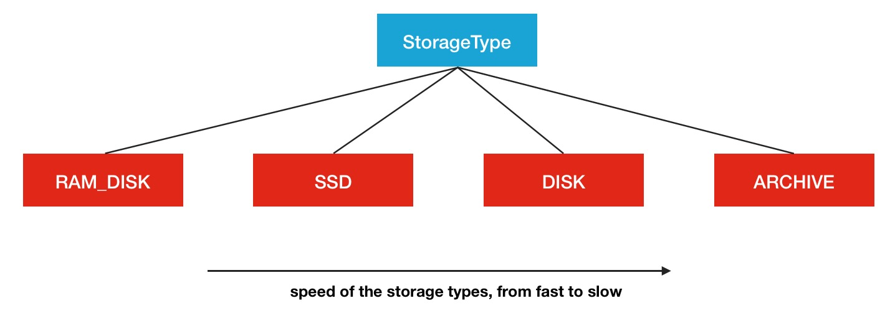
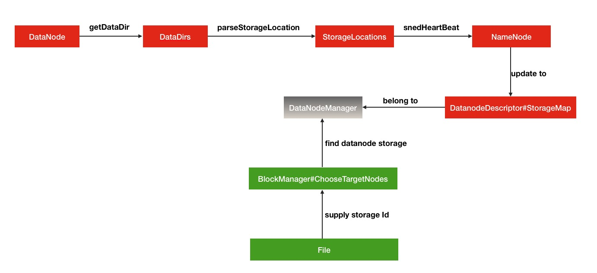
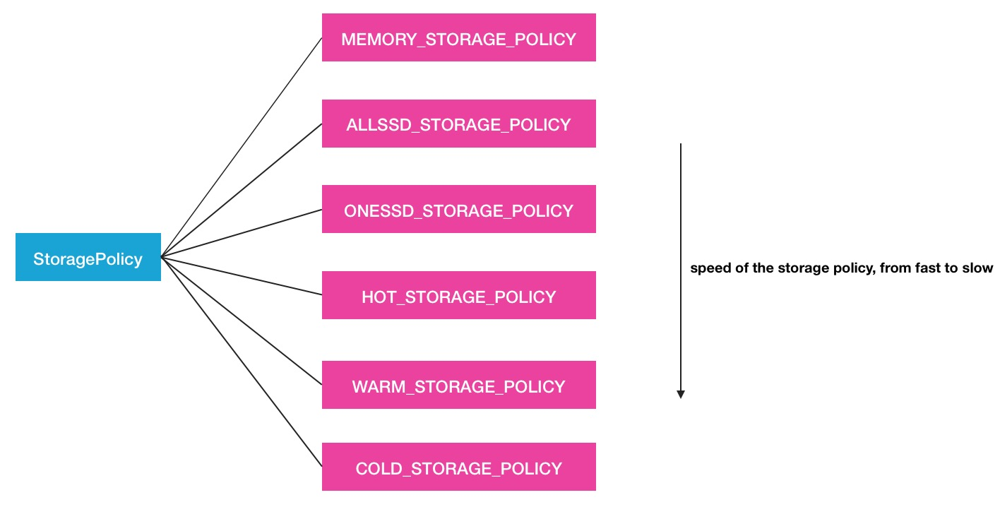
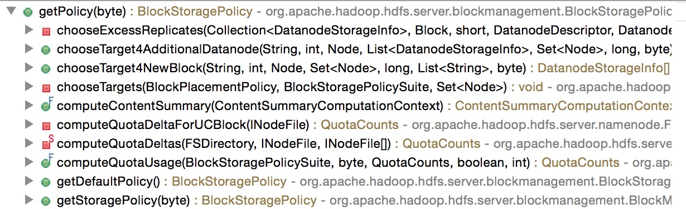
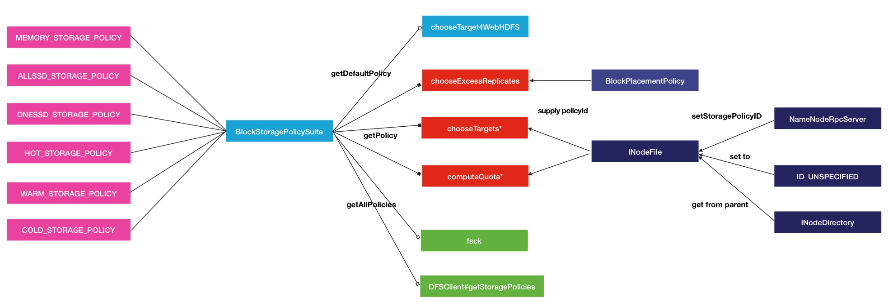

# HDFS异构存储

2016年04月11日 19:29:36 [Android路上的人](https://me.csdn.net/Androidlushangderen) 阅读数：15997


 版权声明：本文为博主原创文章，未经博主允许不得转载。	https://blog.csdn.net/Androidlushangderen/article/details/51105876

# 前言

------

Hadoop在2.6.0版本中引入了一个新特性*异构存储*.异构存储关键在于异构2个字.异构存储可以根据各个存储介质读写特性的不同发挥各自的优势.一个很适用的场景就是上篇文章提到的冷热数据的存储.针对冷数据,采用容量大的,读写性能不高的存储介质存储,比如最普通的Disk磁盘.而对于热数据而言,可以采用SSD的方式进行存储,这样就能保证高效的读性能,在速率上甚至能做到十倍于或百倍于普通磁盘读写的速度.换句话说,HDFS的异构存储特性的出现使得我们不需要搭建2套独立的集群来存放冷热2类数据,在一套集群内就能完成.所以这个功能特性还是有非常大的实用意义的.本文就带大家了解HDFS的异构存储分为哪几种类型,存储策略如何,HDFS如何做到智能化的异构存储.

# 异构存储类型

------

上文提到了多次的异构这个名词,那么到底异构存储分为了种类型呢,这里列举一下HDFS中所声明的Storage Type.

- RAM_DISK
- SSD
- DISK
- ARCHIVE

HDFS中是定义了这4种类型,SSD,DISK一看就知道是什么意思,这里看一下其余的2个,RAM_DISK,其实就是Memory内存,而ARCHIVE并没有特指哪种存储介质,主要的指的是高密度存储数据的介质来解决数据量的容量扩增的问题.这4类是被定义在了StorageType类中:

```java
public enum StorageType {
  // sorted by the speed of the storage types, from fast to slow
  RAM_DISK(true),
  SSD(false),
  DISK(false),
  ARCHIVE(false);
  ...1234567
```

旁边的true或者false代表的是此类存储类型是否是*transient*特性的.transient的意思是指转瞬即逝的,并非持久化的.在HDFS中,如果没有主动声明数据目录存储类型的,默认都是DISK.

```
 Defines the types of supported storage media. The default storage
 medium is assumed to be DISK.12
```

这4类存储介质之间一个很多的性能区别就在于读写速度,从上到下依次减慢,所以从冷热数据的处理来看,将数据存在内存中或是SSD中会是不错的选择,而冷数据则存放与DISK和ARCHIVE类型的介质中会更好.所以HDFS中冷热数据文件目录的StorageType的设定将会显得非常的重要.那么如何让HDFS知道集群中哪些数据存储目录是具体哪种类型的存储介质呢,这里需要配置的主动声明,HDFS可没有做自动检测识别的功能.在配置属性dfs.datanode.data.dir中进行本地对应存储目录的设置,同时带上一个存储类型标签,声明此目录用的是哪种类型的存储介质,例子如下:

```
[SSD]file:///grid/dn/ssd01
```

如果目录前没有带上[SSD]/[DISK]/[ARCHIVE]/[RAM_DISK]这4种中的任何一种,则默认是DISK类型.下面是一张存储介质结构图 


# 异构存储原理

------

了解完了异构存储的多种存储介质之后,我们有必要了解一下HDFS的异构存储的实现原理.在这里会结合部分HDFS源码进行阐述.概况性的总结为3小点:

- DataNode通过心跳汇报自身数据存储目录的StorageType给NameNode,
- 随后NameNode进行汇总并更新集群内各个节点的存储类型情况
- 待复制文件根据自身设定的存储策略信息向NameNode请求拥有此类型存储介质的DataNode作为候选节点

从以上3点来看,本质原理并不复杂.下面结合部分源码,来一步步追踪内部的过程细节.

## DataNode存储目录汇报

------

首先是数据存储目录的解析与心跳汇报过程.在FsDatasetImpl的构造函数中对dataDir进行了存储目录的解析,生成了StorageType的List列表.

```java
  /**
   * An FSDataset has a directory where it loads its data files.
   */
  FsDatasetImpl(DataNode datanode, DataStorage storage, Configuration conf
      ) throws IOException {
    ...
    String[] dataDirs = conf.getTrimmedStrings(DFSConfigKeys.DFS_DATANODE_DATA_DIR_KEY);
    Collection<StorageLocation> dataLocations = DataNode.getStorageLocations(conf);
    List<VolumeFailureInfo> volumeFailureInfos = getInitialVolumeFailureInfos(
        dataLocations, storage);
```

真正调用的是DataNode的getStorageLocations方法.

```java
  public static List<StorageLocation> getStorageLocations(Configuration conf) {
    // 获取dfs.datanode.data.dir配置中多个目录地址字符串
    Collection<String> rawLocations =
        conf.getTrimmedStringCollection(DFS_DATANODE_DATA_DIR_KEY);
    List<StorageLocation> locations =
        new ArrayList<StorageLocation>(rawLocations.size());

    for(String locationString : rawLocations) {
      final StorageLocation location;
      try {
        // 解析为对应的StorageLocation
        location = StorageLocation.parse(locationString);
      } catch (IOException ioe) {
        LOG.error("Failed to initialize storage directory " + locationString
            + ". Exception details: " + ioe);
        // Ignore the exception.
        continue;
      } catch (SecurityException se) {
        LOG.error("Failed to initialize storage directory " + locationString
                     + ". Exception details: " + se);
        // Ignore the exception.
        continue;
      }
      // 将解析好的StorageLocation加入到列表中
      locations.add(location);
    }

    return locations;
  }
```

当然我们最关心的过程就是如何解析配置并最终得到对应存储类型的过程,就是下面这行操作所执行的内容

```java
location = StorageLocation.parse(locationString);1
```

进入到StorageLocation方法,查阅解析方法

```java
  public static StorageLocation parse(String rawLocation)
      throws IOException, SecurityException {
    // 采用正则匹配的方式的方式进行解析
    Matcher matcher = regex.matcher(rawLocation);
    StorageType storageType = StorageType.DEFAULT;
    String location = rawLocation;

    if (matcher.matches()) {
      String classString = matcher.group(1);
      location = matcher.group(2);
      if (!classString.isEmpty()) {
        storageType =
            StorageType.valueOf(StringUtils.toUpperCase(classString));
      }
    }

    return new StorageLocation(storageType, new Path(location).toUri());
  }
```

这里的StorageType.DEFAULT就是DISK,在StorageType中定义的

```
public static final StorageType DEFAULT = DISK;1
```

后续这些解析好的存储目录以及对应的存储介质类型会被加入到storageMap中.

```java
  private void addVolume(Collection<StorageLocation> dataLocations,
      Storage.StorageDirectory sd) throws IOException {
    final File dir = sd.getCurrentDir();
    final StorageType storageType =
        getStorageTypeFromLocations(dataLocations, sd.getRoot());

    ...

    synchronized (this) {
      volumeMap.addAll(tempVolumeMap);
      storageMap.put(sd.getStorageUuid(),
          new DatanodeStorage(sd.getStorageUuid(),
              DatanodeStorage.State.NORMAL,
              storageType));
      ...
  }
```

这个storageMap存储了具体存储目录到具体存储类型的映射关系,可以说是非常细粒度的.更重要的是,这个信息会被DataNode组织成StorageReport通过心跳的形式上报给NameNode.于是就来到了第一阶段的下半过程.

```java
  public StorageReport[] getStorageReports(String bpid)
      throws IOException {
    List<StorageReport> reports;
    synchronized (statsLock) {
      List<FsVolumeImpl> curVolumes = getVolumes();
      reports = new ArrayList<>(curVolumes.size());
      for (FsVolumeImpl volume : curVolumes) {
        try (FsVolumeReference ref = volume.obtainReference()) {
          StorageReport sr = new StorageReport(volume.toDatanodeStorage(),
              false,
              volume.getCapacity(),
              volume.getDfsUsed(),
              volume.getAvailable(),
              volume.getBlockPoolUsed(bpid));
          reports.add(sr);
        } catch (ClosedChannelException e) {
          continue;
        }
      }
    }

    return reports.toArray(new StorageReport[reports.size()]);
  }
```

以上是StorageReport的组织过程.最终被BPServiceActor的sendHeartBeat调用,发送给了NameNode.

```java
  HeartbeatResponse sendHeartBeat() throws IOException {
    // 获取存储类型情况报告信息
    StorageReport[] reports =
        dn.getFSDataset().getStorageReports(bpos.getBlockPoolId());
    if (LOG.isDebugEnabled()) {
      LOG.debug("Sending heartbeat with " + reports.length +
                " storage reports from service actor: " + this);
    }
    // 获取坏磁盘数据信息
    VolumeFailureSummary volumeFailureSummary = dn.getFSDataset()
        .getVolumeFailureSummary();
    int numFailedVolumes = volumeFailureSummary != null ?
        volumeFailureSummary.getFailedStorageLocations().length : 0;
    // 还有DataNode自身的存储容量信息,最后发送给了NameNode
    return bpNamenode.sendHeartbeat(bpRegistration,
        reports,
        dn.getFSDataset().getCacheCapacity(),
        dn.getFSDataset().getCacheUsed(),
        dn.getXmitsInProgress(),
        dn.getXceiverCount(),
        numFailedVolumes,
        volumeFailureSummary);
  }
```

## 存储心跳信息的更新处理

------

在这里来到了第二阶段的心跳处理过程.在DatanodeManager的handleHeartbeat中进行了处理

```java
  /** Handle heartbeat from datanodes. */
  public DatanodeCommand[] handleHeartbeat(DatanodeRegistration nodeReg,
      StorageReport[] reports, final String blockPoolId,
      long cacheCapacity, long cacheUsed, int xceiverCount, 
      int maxTransfers, int failedVolumes,
      VolumeFailureSummary volumeFailureSummary) throws IOException {
    synchronized (heartbeatManager) {
      synchronized (datanodeMap) {
        DatanodeDescriptor nodeinfo = null;
        ...

        heartbeatManager.updateHeartbeat(nodeinfo, reports,
                                         cacheCapacity, cacheUsed,
                                         xceiverCount, failedVolumes,
                                         volumeFailureSummary);
        ...
```

最终在heartbeatManager中会更新到具体的DatanodeDescription的updateHeartbeatState方法,里面就会更新Storage的信息

```java
  /**
   * process datanode heartbeat or stats initialization.
   */
  public void updateHeartbeatState(StorageReport[] reports, long cacheCapacity,
      long cacheUsed, int xceiverCount, int volFailures,
      VolumeFailureSummary volumeFailureSummary) {
    ...
    for (StorageReport report : reports) {
      DatanodeStorageInfo storage = updateStorage(report.getStorage());
      if (checkFailedStorages) {
        failedStorageInfos.remove(storage);
      }

      storage.receivedHeartbeat(report);
      totalCapacity += report.getCapacity();
      totalRemaining += report.getRemaining();
      totalBlockPoolUsed += report.getBlockPoolUsed();
      totalDfsUsed += report.getDfsUsed();
    }
    rollBlocksScheduled(getLastUpdateMonotonic());
    ...
```

## 目标存储介质类型节点的请求

------

各个DataNode心跳信息都更新完毕之后,就会有目标存储介质需求的待复制文件块向NameNode进行请求.比如在FSNamesystem的getAdditionDatanode中就有这里的处理

```java
  /** @see ClientProtocol#getAdditionalDatanode */
  LocatedBlock getAdditionalDatanode(String src, long fileId,
      final ExtendedBlock blk, final DatanodeInfo[] existings,
      final String[] storageIDs,
      final Set<Node> excludes,
      final int numAdditionalNodes, final String clientName
      ) throws IOException {
      ...
      final INodeFile file = checkLease(src, clientName, inode, fileId);
      clientMachine = file.getFileUnderConstructionFeature().getClientMachine();
      clientnode = blockManager.getDatanodeManager().getDatanodeByHost(clientMachine);
      preferredblocksize = file.getPreferredBlockSize();
      // 获取待复制文件的存储策略Id,对应的就是存储策略信息类型
      storagePolicyID = file.getStoragePolicyID();

      //find datanode storages
      final DatanodeManager dm = blockManager.getDatanodeManager();
      // 获取已存在的节点中存储目录列表信息
      chosen = Arrays.asList(dm.getDatanodeStorageInfos(existings, storageIDs));
    } finally {
      readUnlock();
    }

    ...
    // choose new datanodes.
    // 然后进行满足需求节点的选择
    final DatanodeStorageInfo[] targets = blockManager.chooseTarget4AdditionalDatanode(
        src, numAdditionalNodes, clientnode, chosen, 
        excludes, preferredblocksize, storagePolicyID);
    final LocatedBlock lb = new LocatedBlock(blk, targets);
    blockManager.setBlockToken(lb, AccessMode.COPY);
    return lb;
  }
```

然后目标存储节点信息就被设到了具体Block块的信息中了.这里的一个target也就是DatanodeStorageInfo,代表的就是DataNode中的一个dataDir存储目录.上述代码中具体blockManager如何根据给定的候选DatanodeStorageInfo存储目录和存储策略来选择出目标节点,那就是下一节将要重点阐述的StoragePolicy存储介质选择策略的内容了.本节最后给出HDFS的异构存储过程调用的简单的流程图 


# BlockStoragePolicy存储类型选择策略

------

与Block放置策略类似,对于数据的介质存储同样有对应若干种的策略选择.对于一个完整的存储类型选择策略,有如下的基本信息定义:

```java
/**
 * A block storage policy describes how to select the storage types
 * for the replicas of a block.
 */
@InterfaceAudience.Private
public class BlockStoragePolicy {
  public static final Logger LOG = LoggerFactory.getLogger(BlockStoragePolicy
      .class);

  /** A 4-bit policy ID 策略唯一标识Id*/
  private final byte id;
  /** Policy name 策略名称 */
  private final String name;

  /** The storage types to store the replicas of a new block. */
  /** 对于一个新的block的一系列的存储副本块的可选存储类型信息组 **/
  private final StorageType[] storageTypes;
  /** The fallback storage type for block creation. */
  /** 对于第一个创建的block块的fallback情况时的可选存储类型 **/
  private final StorageType[] creationFallbacks;
  /** The fallback storage type for replication. */
  /** 对于的block块的其余副本的fallback情况时的可选存储类型 **/
  private final StorageType[] replicationFallbacks;
  /**
   * Whether the policy is inherited during file creation.
   * If set then the policy cannot be changed after file creation.
   */
  // 是否继承祖先目录信息的策略信息当创建文件的时候,用于主动设置  Policy的时候
  private boolean copyOnCreateFile;
  ...
```

这里出现了**fallback** 的情况,什么叫做fallback的情况呢

```
当前存储类型不可用的时候,退一级所选择使用的存储类型1
```

相应的逻辑代码

```java
  public List<StorageType> chooseStorageTypes(final short replication,
      final Iterable<StorageType> chosen,
      final EnumSet<StorageType> unavailables,
      final boolean isNewBlock) {
    ...
    for(int i = storageTypes.size() - 1; i >= 0; i--) {
      // replace/remove unavailable storage types.
      // 获取当前徐亚的存储类型
      final StorageType t = storageTypes.get(i);
      // 如果当前的存储类型是在不可用的存储类型列表中,选择fallback的情况
      if (unavailables.contains(t)) {
        // 根据是否是新的block块还是普通的replica选择相应的fallBack的storage type
        final StorageType fallback = isNewBlock?
            getCreationFallback(unavailables)
            : getReplicationFallback(unavailables);
        if (fallback == null) {
          removed.add(storageTypes.remove(i));
        } else {
          storageTypes.set(i, fallback);
        }
      }
    }
    ...1234567891011121314151617181920212223
```

在getFallback方法中会选取第一个满足条件的fallback的storage type.

```java
  private static StorageType getFallback(EnumSet<StorageType> unavailables,
      StorageType[] fallbacks) {
    for(StorageType fb : fallbacks) {
      // 如果找到满足条件的storage type,立即返回
      if (!unavailables.contains(fb)) {
        return fb;
      }
    }
    return null;
  }12345678910
```

当然这些都只是单一的存储类型选择策略.HDFS在使用的时候也不是直接new一个StoragePolicy对象的方式直接调用,而是从**BlockStoragePolicySuite**策略集合中进行获取的.

# BlockStoragePolicySuite存储类型策略集合

------

BlockStoragePolicySuite的官方定义就是

```
A collection of block storage policies.1
```

在此类内部,定义了6种策略,不仅仅分为冷热数据2种.

- **Hot** - for both storage and compute. The data that is popular and still being used for processing will stay in this policy. When a block is hot, all replicas are stored in DISK.
- **Cold** - only for storage with limited compute. The data that is no longer being used, or data that needs to be archived is moved from hot storage to cold storage. When a block is cold, all replicas are stored in ARCHIVE.
- **Warm** - partially hot and partially cold. When a block is warm, some of its replicas are stored in DISK and the remaining replicas are stored in ARCHIVE.
- **All_SSD** - for storing all replicas in SSD.
- **One_SSD** - for storing one of the replicas in SSD. The remaining replicas are stored in DISK.
- **Lazy_Persist** - for writing blocks with single replica in memory. The replica is first written in RAM_DISK and then it is lazily persisted in DISK.

在这6种策略中,前3类策略和后3种策略可以看作是2大类.前者从冷热数据的角度划分出了3小类的Policy.而后面3者则根据SSD盘的和内存存放作为区别特征策略被单独划分了出来.策略倒是划分出来了,但是这些不同的策略之间的主要区别在于哪里呢,答案就是候选存储类型组. 
在创建BlockStoragePolicySuite的时候,对这些策略都进行了构造

```java
  public static BlockStoragePolicySuite createDefaultSuite() {
    final BlockStoragePolicy[] policies =
        new BlockStoragePolicy[1 << ID_BIT_LENGTH];
    final byte lazyPersistId = HdfsConstants.MEMORY_STORAGE_POLICY_ID;
    policies[lazyPersistId] = new BlockStoragePolicy(lazyPersistId, 
        HdfsConstants.MEMORY_STORAGE_POLICY_NAME,
        new StorageType[]{StorageType.RAM_DISK, StorageType.DISK},
        new StorageType[]{StorageType.DISK},
        new StorageType[]{StorageType.DISK},
        true);    // Cannot be changed on regular files, but inherited.
    final byte allssdId = HdfsConstants.ALLSSD_STORAGE_POLICY_ID;
    policies[allssdId] = new BlockStoragePolicy(allssdId,
        HdfsConstants.ALLSSD_STORAGE_POLICY_NAME,
        new StorageType[]{StorageType.SSD},
        new StorageType[]{StorageType.DISK},
        new StorageType[]{StorageType.DISK});
    final byte onessdId = HdfsConstants.ONESSD_STORAGE_POLICY_ID;
    policies[onessdId] = new BlockStoragePolicy(onessdId,
        HdfsConstants.ONESSD_STORAGE_POLICY_NAME,
        new StorageType[]{StorageType.SSD, StorageType.DISK},
        new StorageType[]{StorageType.SSD, StorageType.DISK},
        new StorageType[]{StorageType.SSD, StorageType.DISK});
    final byte hotId = HdfsConstants.HOT_STORAGE_POLICY_ID;
    policies[hotId] = new BlockStoragePolicy(hotId,
        HdfsConstants.HOT_STORAGE_POLICY_NAME,
        new StorageType[]{StorageType.DISK}, StorageType.EMPTY_ARRAY,
        new StorageType[]{StorageType.ARCHIVE});
    final byte warmId = HdfsConstants.WARM_STORAGE_POLICY_ID;
    policies[warmId] = new BlockStoragePolicy(warmId,
        HdfsConstants.WARM_STORAGE_POLICY_NAME,
        new StorageType[]{StorageType.DISK, StorageType.ARCHIVE},
        new StorageType[]{StorageType.DISK, StorageType.ARCHIVE},
        new StorageType[]{StorageType.DISK, StorageType.ARCHIVE});
    final byte coldId = HdfsConstants.COLD_STORAGE_POLICY_ID;
    policies[coldId] = new BlockStoragePolicy(coldId,
        HdfsConstants.COLD_STORAGE_POLICY_NAME,
        new StorageType[]{StorageType.ARCHIVE}, StorageType.EMPTY_ARRAY,
        StorageType.EMPTY_ARRAY);
    return new BlockStoragePolicySuite(hotId, policies);
  }12345678910111213141516171819202122232425262728293031323334353637383940
```

在这些策略对象的参数中,第三个参数是最起决定性作用的,因为第三个参数会被用来返回给副本block作为候选存储类型.在storageTypes参数中,有时可能只有1个参数,例如**ALLSSD**策略只有

```java
new StorageType[]{StorageType.SSD}1
```

而**ONESSD**却有2个

```java
new StorageType[]{StorageType.SSD, StorageType.DISK}1
```

这里面其实是有一定原因的.因为block有多副本的机制,每个策略要为所有的副本都返回相应的Storage Type,如果副本数超过候选Storage Type数组怎么处理,答案在下面这个方法中

```java
  public List<StorageType> chooseStorageTypes(final short replication) {
    final List<StorageType> types = new LinkedList<StorageType>();
    int i = 0, j = 0;

    // Do not return transient storage types. We will not have accurate
    // usage information for transient types.
    // 从前往后依次匹配存储类型到对应的副本下标中
    for (;i < replication && j < storageTypes.length; ++j) {
      if (!storageTypes[j].isTransient()) {
        types.add(storageTypes[j]);
        ++i;
      }
    }

    // 获取最后一个存储类型,统一作为多余副本的存储类型
    final StorageType last = storageTypes[storageTypes.length - 1];
    if (!last.isTransient()) {
      for (; i < replication; i++) {
        types.add(last);
      }
    }
    return types;
  }1234567891011121314151617181920212223
```

这样的话,**ONESSD**就必然只有1个block副本是此类型的,而**ALLSSD**则将会全部是SSD的存储.下面给出存储策略集合的结构图 

上述策略中有一个策略比较有意思的是**LAZY_PERSIST**,先将数据写到内存中,然后在持久化,不知道性能如何,大家可以试试此策略.

# BlockStoragePolicy存储策略的调用

------

分析完BlockStoragePolicy的种类之后,我们看看HDFS在哪些地方设置了这些策略. 
首先,我们要知道HDFS的默认Policy是哪种

```java
  @VisibleForTesting
  public static BlockStoragePolicySuite   createDefaultSuite() {
    ...
    return new BlockStoragePolicySuite(hotId, policies);
  }
  ...

  public BlockStoragePolicySuite(byte defaultPolicyID,
      BlockStoragePolicy[] policies) {
    this.defaultPolicyID = defaultPolicyID;
    this.policies = policies;
  }123456789101112
```

**如上所示,就是HOT的策略,把集群中的数据都看成是经常访问的数据**.然后进一步查看getPolicy的方法调用,如下图 

我们以方法chooseTarget4NewBlock为例子,追踪一下上游的调用过程.

```java
  public DatanodeStorageInfo[] chooseTarget4NewBlock(final String src,
      final int numOfReplicas, final Node client,
      final Set<Node> excludedNodes,
      final long blocksize,
      final List<String> favoredNodes,
      final byte storagePolicyID) throws IOException {
    List<DatanodeDescriptor> favoredDatanodeDescriptors = 
        getDatanodeDescriptors(favoredNodes);
    final BlockStoragePolicy storagePolicy = storagePolicySuite.getPolicy(storagePolicyID);
    ...12345678910
```

在父方法中获取了storagePolicyID策略ID,往上追踪,来到了FSNamesystem的getNewBlockTargets方法

```java
  DatanodeStorageInfo[] getNewBlockTargets(String src, long fileId,
      String clientName, ExtendedBlock previous, Set<Node> excludedNodes,
      List<String> favoredNodes, LocatedBlock[] onRetryBlock) throws IOException {
      ...
      replication = pendingFile.getFileReplication();
      storagePolicyID = pendingFile.getStoragePolicyID();
    } finally {
      readUnlock();
    }

    if (clientNode == null) {
      clientNode = getClientNode(clientMachine);
    }

    // choose targets for the new block to be allocated.
    return getBlockManager().chooseTarget4NewBlock( 
        src, replication, clientNode, excludedNodes, blockSize, favoredNodes,
        storagePolicyID);
  }12345678910111213141516171819
```

于是我们看到storagePolicyID是从INodeFile中获取而来的.这与上文中目标节点请求的过程类似,都有从File中获取策略Id的动作.那么新的问题又来了,INodeFile中的StoragePolicyID从何而来呢,有一下2种途径

- 通过RPC接口主动设置

- 没有主动设置的ID会继承父目录的策略,如果父目录还是没有,则会设置ID_UNSPECIFIED,继而会用DEFAULT Storage Policy进行替代,源码如下:

  ```java
    public byte getStoragePolicyID() {
  byte id = getLocalStoragePolicyID();
  if (id == ID_UNSPECIFIED) {
    return this.getParent() != null ?
        this.getParent().getStoragePolicyID() : id;
  }
  return id;
  }12345678
  ```

  总的过程调用图如下 
  

# HDFS Storagepolicies策略的使用

------

在文章的最后介绍几个关于Storage Policy的几个使用命令,帮助大家真正学会运用这个强大的特性.输入*hdfs storagepolicies -help*,你会得到一下3大操作命令

```
$ hdfs storagepolicies -help
[-listPolicies]

List all the existing block storage policies.

[-setStoragePolicy -path <path> -policy <policy>]

Set the storage policy to a file/directory.

<path>    The path of the file/directory to set storage policy 
<policy>  The name of the block storage policy                 

[-getStoragePolicy -path <path>]

Get the storage policy of a file/directory.

<path>  The path of the file/directory for getting the storage policy 1234567891011121314151617
```

1个设置命令,2个获取命令,**最简单的使用方法是事先划分好冷热数据存储目录,设置好对应的Storage Policy,然后后续相应的程序在对应分类目录下写数据,自动继承父目录的存储策略**.在较新版的Hadoop发布版本中增加了数据迁移工具.此工具的重要用途在于**他会扫描HDFS上的文件,判断文件是否满足其内部设置的存储策略,如果不满足,就会重新迁移数据到目标存储类型节点上**.使用方式如下

```
$ hdfs mover -help
Usage: hdfs mover [-p <files/dirs> | -f <local file>]
    -p <files/dirs> a space separated list of HDFS files/dirs to migrate.
    -f <local file> a local file containing a list of HDFS files/dirs to migrate.1234
```

其中1个参数针对的HDFS上的文件目录,另1个是本地的文件.

# 总结

------

HDFS异构存储功能的出现绝对是解决冷热数据存储问题的一把利器,希望通过本文能给大家带来全新的认识和了解.

# 参考链接

------

1.<http://hadoop.apache.org/docs/stable/hadoop-project-dist/hadoop-hdfs/ArchivalStorage.html> 
2.<http://www.shopbrodart.com/archival-storage/>

